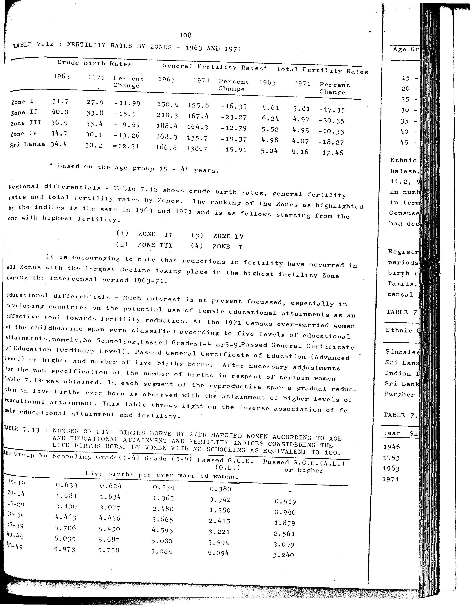

# 7.12: Fertility rates by zones - 1963 and 1971


- 📜 Original Table PDF - [data/tables/table-7/table-7-12/original.pdf (94.5 kB)](../../../../data/tables/table-7/table-7-12/original.pdf)
- 📜 Original Table Image - [data/tables/table-7/table-7-12/original.images/image-01.png (241.6 kB)](../../../../data/tables/table-7/table-7-12/original.images/image-01.png)
- 📄 Extracted JSON Data - [data/tables/table-7/table-7-12/data.json (3.1 kB)](../../../../data/tables/table-7/table-7-12/data.json)
- 📄 Extracted TSV Data - [data/tables/table-7/table-7-12/data.tsv (601 B)](../../../../data/tables/table-7/table-7-12/data.tsv)

## Original Table [Image](../../../../data/tables/table-7/table-7-12/original.images/image-01.png)



## Extracted [JSON Data](../../../../data/tables/table-7/table-7-12/data.json)

```json
{
    "found": true,
    "table_no": "7.12",
    "table_name": "Fertility rates by zones - 1963 and 1971",
    "primary_keys": [
        "Zone"
    ],
    "field_keys": [
        "Crude Birth Rates - 1963",
        "Crude Birth Rates - 1971",
        "Crude Birth Rates - Percent Change",
        "General Fertility Rates - 1963",
        "General Fertility Rates - 1971",
        "General Fertility Rates - Percent Change",
        "Total Fertility Rates - 1963",
        "Total Fertility Rates - 1971",
        "Total Fertility Rates - Percent Change"
    ],
    "rows": [
        {
            "Zone": "Zone I",
            "values": {
                "Crude Birth Rates - 1963": 31.7,
                "Crude Birth Rates - 1971": 27.9,
                "Crude Birth Rates - Percent Change": -11.99,
                "General Fertility Rates - 1963": 150.4,
                "General Fertility Rates - 1971": 125.8,
                "General Fertility Rates - Percent Change": -16.35,
                "Total Fertility Rates - 1963": 4.61,
                "Total Fertility Rates - 1971": 3.81,
                "Total Fertility Rates - Percent Change": -17.35
            }
        },
        {
            "Zone": "Zone II",
            "values": {
                "Crude Birth Rates - 1963": 40.0,
                "Crude Birth Rates - 1971": 33.8,
                "Crude Birth Rates - Percent Change": -15.5,
                "General Fertility Rates - 1963": 218.3,
                "General Fertility Rates - 1971": 167.4,
                "General Fertility Rates - Percent Change": -23.27,
                "Total Fertility Rates - 1963": 6.24,
                "Total Fertility Rates - 1971": 4.97,
                "Total Fertility Rates - Percent Change": -20.35
            }
        },
        {
            "Zone": "Zone III",
            "values": {
                "Crude Birth Rates - 1963": 36.9,
                "Crude Birth Rates - 1971": 33.4,
                "Crude Birth Rates - Percent Change": -9.49,
                "General Fertility Rates - 1963": 188.4,
                "General Fertility Rates - 1971": 164.3,
                "General Fertility Rates - Percent Change": -12.79,
                "Total Fertility Rates - 1963": 5.52,
                "Total Fertility Rates - 1971": 4.95,
                "Total Fertility Rates - Percent Change": -10.33
            }
        },
        {
            "Zone": "Zone IV",
            "values": {
                "Crude Birth Rates - 1963": 34.7,
                "Crude Birth Rates - 1971": 30.1,
                "Crude Birth Rates - Percent Change": -13.26,
                "General Fertility Rates - 1963": 168.3,
                "General Fertility Rates - 1971": 135.7,
                "General Fertility Rates - Percent Change": -19.37,
                "Total Fertility Rates - 1963": 4.98,
                "Total Fertility Rates - 1971": 4.07,
                "Total Fertility Rates - Percent Change": -18.27
            }
        },
        {
            "Zone": "Sri Lanka",
            "values": {
                "Crude Birth Rates - 1963": 34.4,
                "Crude Birth Rates - 1971": 30.2,
                "Crude Birth Rates - Percent Change": -12.21,
                "General Fertility Rates - 1963": 166.8,
                "General Fertility Rates - 1971": 138.7,
                "General Fertility Rates - Percent Change": -15.91,
                "Total Fertility Rates - 1963": 5.04,
                "Total Fertility Rates - 1971": 4.16,
                "Total Fertility Rates - Percent Change": -17.46
            }
        }
    ],
    "notes": [
        "Based on the age group 15 - 44 years."
    ]
}
```

## Extracted [TSV Data](../../../../data/tables/table-7/table-7-12/data.tsv)

| Zone | Crude Birth Rates - 1963 | Crude Birth Rates - 1971 | Crude Birth Rates - Percent Change | General Fertility Rates - 1963 | General Fertility Rates - 1971 | General Fertility Rates - Percent Change | Total Fertility Rates - 1963 | Total Fertility Rates - 1971 | Total Fertility Rates - Percent Change |
| --- | --- | --- | --- | --- | --- | --- | --- | --- | --- |
| Zone I | 31.7 | 27.9 | -11.99 | 150.4 | 125.8 | -16.35 | 4.61 | 3.81 | -17.35 |
| Zone II | 40.0 | 33.8 | -15.5 | 218.3 | 167.4 | -23.27 | 6.24 | 4.97 | -20.35 |
| Zone III | 36.9 | 33.4 | -9.49 | 188.4 | 164.3 | -12.79 | 5.52 | 4.95 | -10.33 |
| Zone IV | 34.7 | 30.1 | -13.26 | 168.3 | 135.7 | -19.37 | 4.98 | 4.07 | -18.27 |
| Sri Lanka | 34.4 | 30.2 | -12.21 | 166.8 | 138.7 | -15.91 | 5.04 | 4.16 | -17.46 |


[](https://opensource.org/licenses/MIT)
