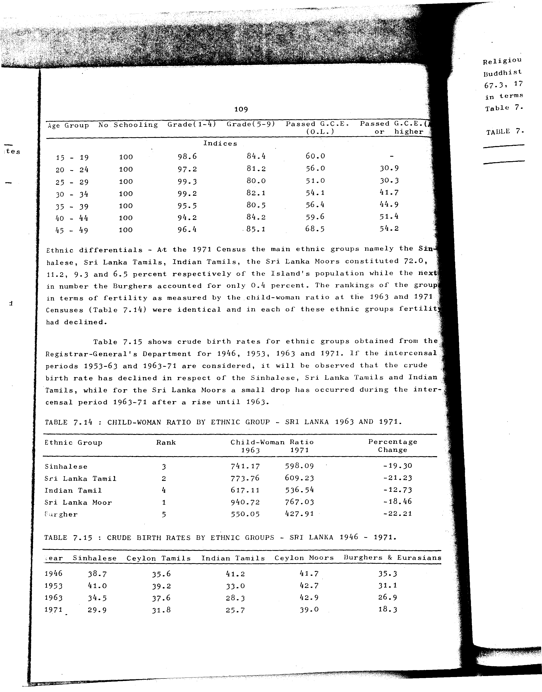

# 7.15: Crude birth rates by ethnic groups - Sri Lanka 1946-1971


- 📜 Original Table PDF - [data/tables/table-7/table-7-15/original.pdf (106.0 kB)](../../../../data/tables/table-7/table-7-15/original.pdf)
- 📜 Original Table Image - [data/tables/table-7/table-7-15/original.images/image-01.png (218.7 kB)](../../../../data/tables/table-7/table-7-15/original.images/image-01.png)
- 📄 Extracted JSON Data - [data/tables/table-7/table-7-15/data.json (1.2 kB)](../../../../data/tables/table-7/table-7-15/data.json)

## Extracted [JSON Data](../../../../data/tables/table-7/table-7-15/data.json)

```json
{
    "found": true,
    "table_no": "7.15",
    "table_name": "Crude birth rates by ethnic groups - Sri Lanka 1946-1971",
    "primary_keys": [
        "Year"
    ],
    "field_keys": [
        "Sinhalese",
        "Ceylon Tamils",
        "Indian Tamils",
        "Ceylon Moors",
        "Burghers & Eurasians"
    ],
    "rows": [
        {
            "Year": 1946,
            "values": {
                "Sinhalese": 38.7,
                "Ceylon Tamils": 35.6,
                "Indian Tamils": 41.2,
                "Ceylon Moors": 41.7,
                "Burghers & Eurasians": 35.3
            }
        },
        {
            "Year": 1953,
            "values": {
                "Sinhalese": 41.0,
                "Ceylon Tamils": 39.2,
                "Indian Tamils": 33.0,
                "Ceylon Moors": 42.7,
                "Burghers & Eurasians": 31.1
            }
        },
        {
            "Year": 1963,
            "values": {
                "Sinhalese": 34.5,
                "Ceylon Tamils": 37.6,
                "Indian Tamils": 28.3,
                "Ceylon Moors": 42.9,
                "Burghers & Eurasians": 26.9
            }
        },
        {
            "Year": 1971,
            "values": {
                "Sinhalese": 29.9,
                "Ceylon Tamils": 31.8,
                "Indian Tamils": 25.7,
                "Ceylon Moors": 39.0,
                "Burghers & Eurasians": 18.3
            }
        }
    ],
    "notes": []
}
```

## Original Table [Image](../../../../data/tables/table-7/table-7-15/original.images/image-01.png)




[](https://opensource.org/licenses/MIT)
