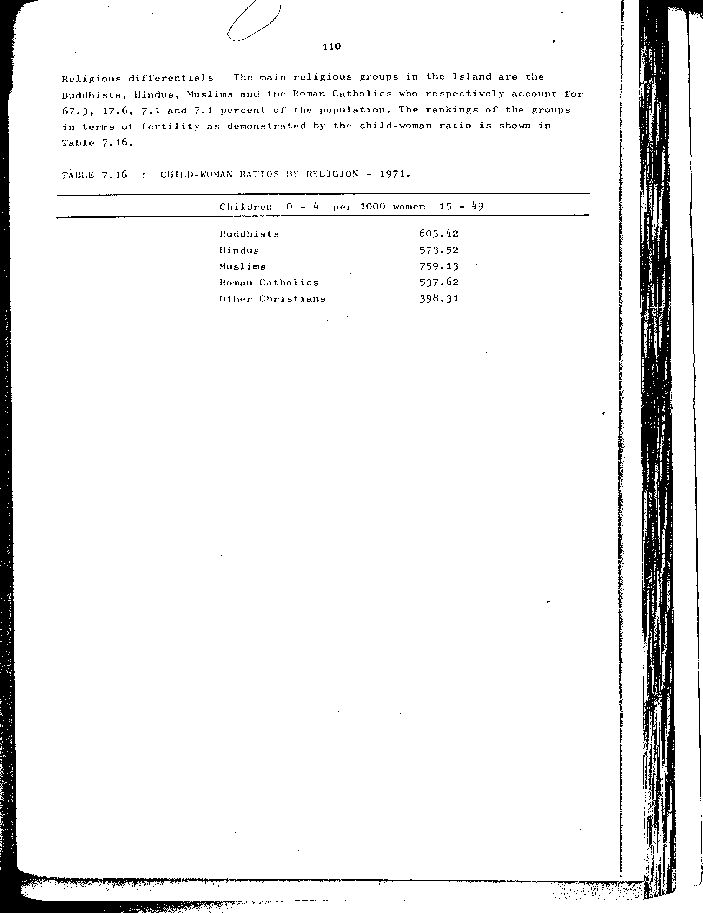

# 7.16: Child-woman ratios by religion - 1971


- 📜 Original Table PDF - [data/tables/table-7/table-7-16/original.pdf (52.2 kB)](../../../../data/tables/table-7/table-7-16/original.pdf)
- 📜 Original Table Image - [data/tables/table-7/table-7-16/original.images/image-01.png (139.8 kB)](../../../../data/tables/table-7/table-7-16/original.images/image-01.png)
- 📄 Extracted JSON Data - [data/tables/table-7/table-7-16/data.json (874 B)](../../../../data/tables/table-7/table-7-16/data.json)
- 📄 Extracted TSV Data - [data/tables/table-7/table-7-16/data.tsv (146 B)](../../../../data/tables/table-7/table-7-16/data.tsv)

## Original Table [Image](../../../../data/tables/table-7/table-7-16/original.images/image-01.png)



## Extracted [JSON Data](../../../../data/tables/table-7/table-7-16/data.json)

```json
{
    "found": true,
    "table_no": "7.16",
    "table_name": "Child-woman ratios by religion - 1971",
    "primary_keys": [
        "Religion"
    ],
    "field_keys": [
        "Children 0 - 4 per 1000 women 15 - 49"
    ],
    "rows": [
        {
            "Religion": "Buddhists",
            "values": {
                "Children 0 - 4 per 1000 women 15 - 49": 605.42
            }
        },
        {
            "Religion": "Hindus",
            "values": {
                "Children 0 - 4 per 1000 women 15 - 49": 573.52
            }
        },
        {
            "Religion": "Muslims",
            "values": {
                "Children 0 - 4 per 1000 women 15 - 49": 759.13
            }
        },
        {
            "Religion": "Roman Catholics",
            "values": {
                "Children 0 - 4 per 1000 women 15 - 49": 537.62
            }
        },
        {
            "Religion": "Other Christians",
            "values": {
                "Children 0 - 4 per 1000 women 15 - 49": 398.31
            }
        }
    ],
    "notes": []
}
```

## Extracted [TSV Data](../../../../data/tables/table-7/table-7-16/data.tsv)

| Religion | Children 0 - 4 per 1000 women 15 - 49 |
| --- | --- |
| Buddhists | 605.42 |
| Hindus | 573.52 |
| Muslims | 759.13 |
| Roman Catholics | 537.62 |
| Other Christians | 398.31 |


[](https://opensource.org/licenses/MIT)
