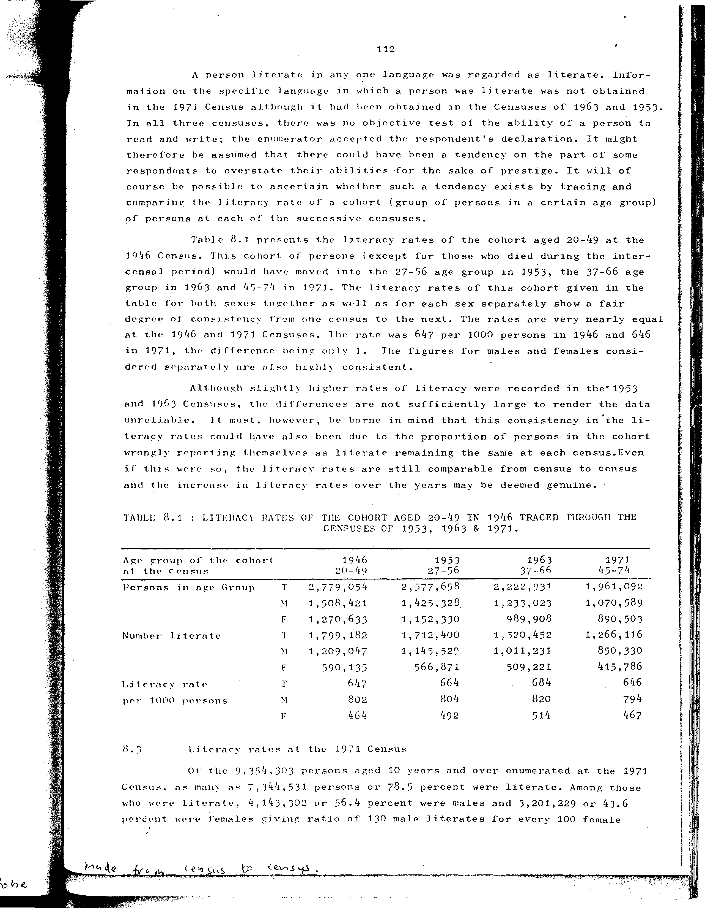

# 8.1: Literacy rates of the cohort aged 20-49 in 1946 traced through the censuses of 1953, 1963 and 1971


- 📜 Original Table PDF - [data/tables/table-8/table-8-01/original.pdf (88.7 kB)](../../../../data/tables/table-8/table-8-01/original.pdf)
- 📜 Original Table Image - [data/tables/table-8/table-8-01/original.images/image-01.png (218.8 kB)](../../../../data/tables/table-8/table-8-01/original.images/image-01.png)
- 📄 Extracted JSON Data - [data/tables/table-8/table-8-01/data.json (2.6 kB)](../../../../data/tables/table-8/table-8-01/data.json)
- 📄 Extracted TSV Data - [data/tables/table-8/table-8-01/data.tsv (551 B)](../../../../data/tables/table-8/table-8-01/data.tsv)

## Extracted [JSON Data](../../../../data/tables/table-8/table-8-01/data.json)

```json
{
    "found": true,
    "table_no": "8.1",
    "table_name": "Literacy rates of the cohort aged 20-49 in 1946 traced through the censuses of 1953, 1963 and 1971",
    "primary_keys": [
        "Age group of the cohort at the census",
        "Sex"
    ],
    "field_keys": [
        "1946 20-49",
        "1953 27-56",
        "1963 37-66",
        "1971 45-74"
    ],
    "rows": [
        {
            "Age group of the cohort at the census": "Persons in age Group",
            "Sex": "T",
            "values": {
                "1946 20-49": 2779054,
                "1953 27-56": 2577658,
                "1963 37-66": 2222931,
                "1971 45-74": 1961092
            }
        },
        {
            "Age group of the cohort at the census": "Persons in age Group",
            "Sex": "M",
            "values": {
                "1946 20-49": 1508421,
                "1953 27-56": 1425328,
                "1963 37-66": 1233023,
                "1971 45-74": 1070589
            }
        },
        {
            "Age group of the cohort at the census": "Persons in age Group",
            "Sex": "F",
            "values": {
                "1946 20-49": 1270633,
                "1953 27-56": 1152330,
                "1963 37-66": 989908,
                "1971 45-74": 890503
            }
        },
        {
            "Age group of the cohort at the census": "Number literate",
            "Sex": "T",
            "values": {
                "1946 20-49": 1799182,
                "1953 27-56": 1712400,
                "1963 37-66": 1520452,
                "1971 45-74": 1266116
            }
        },
        {
            "Age group of the cohort at the census": "Number literate",
            "Sex": "M",
            "values": {
                "1946 20-49": 1209047,
                "1953 27-56": 1145529,
                "1963 37-66": 1011231,
                "1971 45-74": 850330
            }
        },
        {
            "Age group of the cohort at the census": "Number literate",
            "Sex": "F",
            "values": {
                "1946 20-49": 590135,
                "1953 27-56": 566871,
                "1963 37-66": 509221,
                "1971 45-74": 415786
            }
        },
        {
            "Age group of the cohort at the census": "Literacy rate per 1000 persons",
            "Sex": "T",
            "values": {
                "1946 20-49": 647,
                "1953 27-56": 664,
                "1963 37-66": 684,
                "1971 45-74": 646
            }
        },
        {
            "Age group of the cohort at the census": "Literacy rate per 1000 persons",
            "Sex": "M",
            "values": {
                "1946 20-49": 802,
                "1953 27-56": 804,
                "1963 37-66": 820,
                "1971 45-74": 794
            }
        },
        {
            "Age group of the cohort at the census": "Literacy rate per 1000 persons",
            "Sex": "F",
            "values": {
                "1946 20-49": 464,
                "1953 27-56": 492,
                "1963 37-66": 514,
                "1971 45-74": 467
            }
        }
    ],
    "notes": []
}
```

## Original Table [Image](../../../../data/tables/table-8/table-8-01/original.images/image-01.png)




[](https://opensource.org/licenses/MIT)
