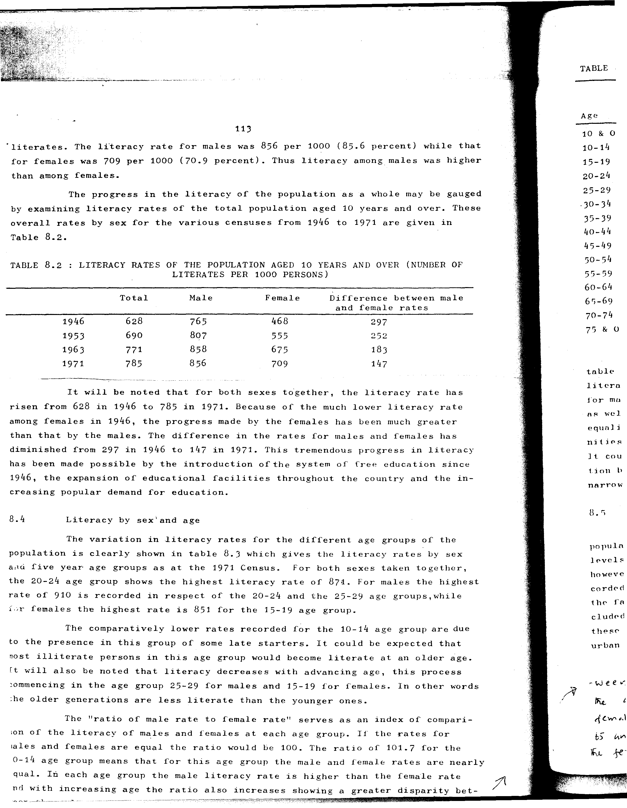

# 8.2: Literacy rates of the population aged 10 years and over (number of literates per 1000 persons)


- 📜 Original Table PDF - [data/tables/table-8/table-8-02/original.pdf (77.6 kB)](../../../../data/tables/table-8/table-8-02/original.pdf)
- 📜 Original Table Image - [data/tables/table-8/table-8-02/original.images/image-01.png (187.7 kB)](../../../../data/tables/table-8/table-8-02/original.images/image-01.png)
- 📄 Extracted JSON Data - [data/tables/table-8/table-8-02/data.json (1.1 kB)](../../../../data/tables/table-8/table-8-02/data.json)
- 📄 Extracted Normalized JSON Data - [data/tables/table-8/table-8-02/normalized_data.json (654 B)](../../../../data/tables/table-8/table-8-02/normalized_data.json)
- 📄 Extracted TSV Data - [data/tables/table-8/table-8-02/data.tsv (153 B)](../../../../data/tables/table-8/table-8-02/data.tsv)

## Original Table [Image](../../../../data/tables/table-8/table-8-02/original.images/image-01.png)



## Extracted [TSV Data](../../../../data/tables/table-8/table-8-02/data.tsv)

| Year | Total | Male | Female | Difference between male and female rates |
| --- | --- | --- | --- | --- |
| 1946 | 628 | 765 | 468 | 297 |
| 1953 | 690 | 807 | 555 | 252 |
| 1963 | 771 | 858 | 675 | 183 |
| 1971 | 785 | 856 | 709 | 147 |

## Extracted [JSON Data](../../../../data/tables/table-8/table-8-02/data.json)

```json
{
    "found": true,
    "table_no": "8.2",
    "table_name": "Literacy rates of the population aged 10 years and over (number of literates per 1000 persons)",
    "primary_keys": [
        "Year"
    ],
    "field_keys": [
        "Total",
        "Male",
        "Female",
        "Difference between male and female rates"
    ],
    "rows": [
        {
            "Year": 1946,
            "values": {
                "Total": 628,
                "Male": 765,
                "Female": 468,
                "Difference between male and female rates": 297
            }
        },
        {
            "Year": 1953,
            "values": {
                "Total": 690,
                "Male": 807,
                "Female": 555,
                "Difference between male and female rates": 252
            }
        },
        {
            "Year": 1963,
            "values": {
                "Total": 771,
                "Male": 858,
                "Female": 675,
                "Difference between male and female rates": 183
            }
        },
        {
            "Year": 1971,
            "values": {
                "Total": 785,
                "Male": 856,
                "Female": 709,
                "Difference between male and female rates": 147
            }
        }
    ],
    "notes": []
}
```

## Extracted [Normalized JSON Data](../../../../data/tables/table-8/table-8-02/normalized_data.json)

```json
[
    {
        "Year": 1946,
        "values": {
            "Total": 628,
            "Male": 765,
            "Female": 468,
            "Difference between male and female rates": 297
        }
    },
    {
        "Year": 1953,
        "values": {
            "Total": 690,
            "Male": 807,
            "Female": 555,
            "Difference between male and female rates": 252
        }
    },
    {
        "Year": 1963,
        "values": {
            "Total": 771,
            "Male": 858,
            "Female": 675,
            "Difference between male and female rates": 183
        }
    },
    {
        "Year": 1971,
        "values": {
            "Total": 785,
            "Male": 856,
            "Female": 709,
            "Difference between male and female rates": 147
        }
    }
]
```


[](https://opensource.org/licenses/MIT)
