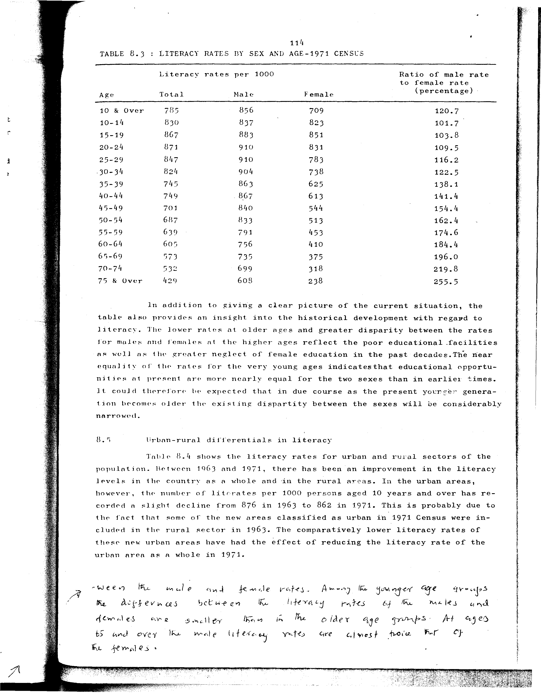

# 8.3: Literacy rates by sex and age - 1971 Census


- 📜 Original Table PDF - [data/tables/table-8/table-8-03/original.pdf (81.8 kB)](../../../../data/tables/table-8/table-8-03/original.pdf)
- 📜 Original Table Image - [data/tables/table-8/table-8-03/original.images/image-01.png (192.8 kB)](../../../../data/tables/table-8/table-8-03/original.images/image-01.png)
- 📄 Extracted JSON Data - [data/tables/table-8/table-8-03/data.json (3.2 kB)](../../../../data/tables/table-8/table-8-03/data.json)

## Extracted [JSON Data](../../../../data/tables/table-8/table-8-03/data.json)

```json
{
    "found": true,
    "table_no": "8.3",
    "table_name": "Literacy rates by sex and age - 1971 Census",
    "primary_keys": [
        "Age"
    ],
    "field_keys": [
        "Total",
        "Male",
        "Female",
        "Ratio of male rate to female rate (percentage)"
    ],
    "rows": [
        {
            "Age": "10 & Over",
            "values": {
                "Total": 785,
                "Male": 856,
                "Female": 709,
                "Ratio of male rate to female rate (percentage)": 120.7
            }
        },
        {
            "Age": "10-14",
            "values": {
                "Total": 830,
                "Male": 837,
                "Female": 823,
                "Ratio of male rate to female rate (percentage)": 101.7
            }
        },
        {
            "Age": "15-19",
            "values": {
                "Total": 867,
                "Male": 883,
                "Female": 851,
                "Ratio of male rate to female rate (percentage)": 103.8
            }
        },
        {
            "Age": "20-24",
            "values": {
                "Total": 871,
                "Male": 910,
                "Female": 831,
                "Ratio of male rate to female rate (percentage)": 109.5
            }
        },
        {
            "Age": "25-29",
            "values": {
                "Total": 847,
                "Male": 910,
                "Female": 783,
                "Ratio of male rate to female rate (percentage)": 116.2
            }
        },
        {
            "Age": "30-34",
            "values": {
                "Total": 824,
                "Male": 904,
                "Female": 738,
                "Ratio of male rate to female rate (percentage)": 122.5
            }
        },
        {
            "Age": "35-39",
            "values": {
                "Total": 745,
                "Male": 863,
                "Female": 625,
                "Ratio of male rate to female rate (percentage)": 138.1
            }
        },
        {
            "Age": "40-44",
            "values": {
                "Total": 749,
                "Male": 867,
                "Female": 613,
                "Ratio of male rate to female rate (percentage)": 141.4
            }
        },
        {
            "Age": "45-49",
            "values": {
                "Total": 701,
                "Male": 840,
                "Female": 544,
                "Ratio of male rate to female rate (percentage)": 154.4
            }
        },
        {
            "Age": "50-54",
            "values": {
                "Total": 687,
                "Male": 833,
                "Female": 513,
                "Ratio of male rate to female rate (percentage)": 162.4
            }
        },
        {
            "Age": "55-59",
            "values": {
                "Total": 639,
                "Male": 791,
                "Female": 453,
                "Ratio of male rate to female rate (percentage)": 174.6
            }
        },
        {
            "Age": "60-64",
            "values": {
                "Total": 605,
                "Male": 756,
                "Female": 410,
                "Ratio of male rate to female rate (percentage)": 184.4
            }
        },
        {
            "Age": "65-69",
            "values": {
                "Total": 573,
                "Male": 735,
                "Female": 375,
                "Ratio of male rate to female rate (percentage)": 196.0
            }
        },
        {
            "Age": "70-74",
            "values": {
                "Total": 532,
                "Male": 699,
                "Female": 318,
                "Ratio of male rate to female rate (percentage)": 219.8
            }
        },
        {
            "Age": "75 & Over",
            "values": {
                "Total": 429,
                "Male": 608,
                "Female": 238,
                "Ratio of male rate to female rate (percentage)": 255.5
            }
        }
    ],
    "notes": []
}
```

## Original Table [Image](../../../../data/tables/table-8/table-8-03/original.images/image-01.png)




[](https://opensource.org/licenses/MIT)
