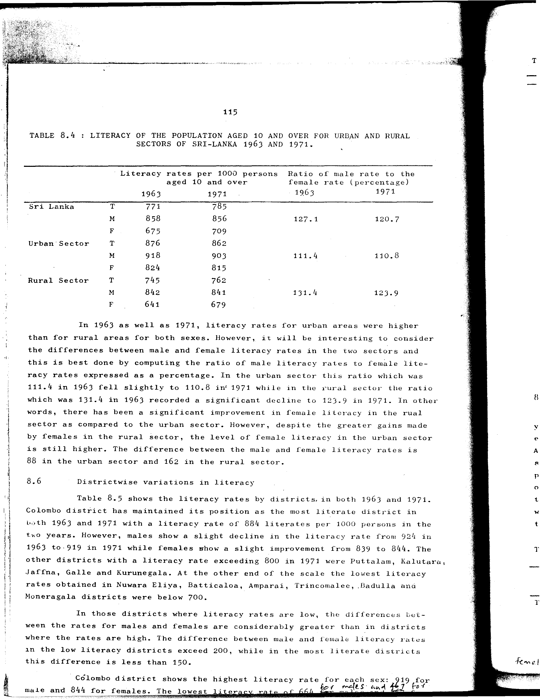

# 8.4: Literacy of the population aged 10 and over for urban and rural sectors of Sri Lanka 1963 and 1971

---

- 📜 Original PDF - [data/tables/table-8/table-8-04/original.pdf (73.0 kB)](../../../../data/tables/table-8/table-8-04/original.pdf)
- 📜 Original Image - [data/tables/table-8/table-8-04/original.image-01.png (175.3 kB)](../../../../data/tables/table-8/table-8-04/original.image-01.png)
- 📄 README - [data/tables/table-8/table-8-04/README.md (962 B)](../../../../data/tables/table-8/table-8-04/README.md)

## Extracted [JSON Data](../../../../data/tables/table-8/table-8-04/data.json)

*⚠️ No data extracted yet.*
## Original Table [Image](../../../../data/tables/table-8/table-8-04/original.image-01.png)

---

