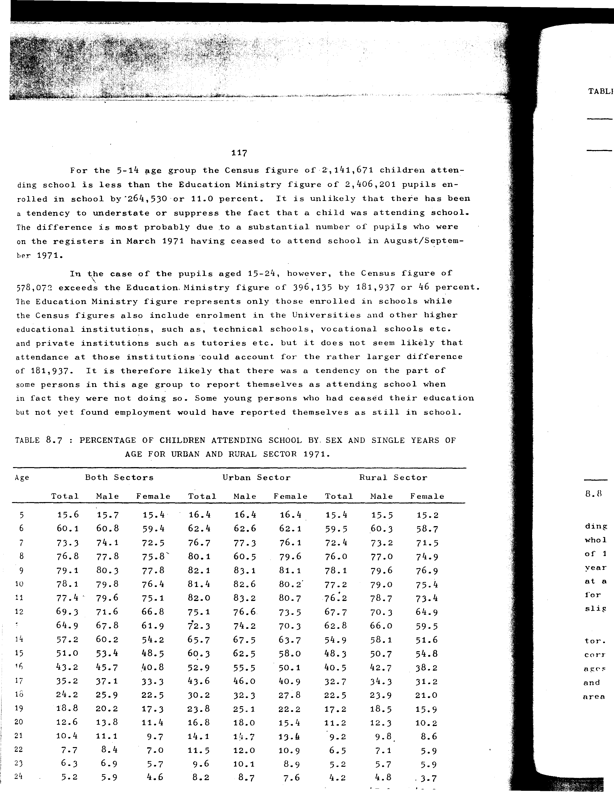

# 8.7: Percentage of children attending school by sex and single years of age for urban and rural sector 1971


- 📜 Original Table PDF - [data/tables/table-8/table-8-07/original.pdf (88.0 kB)](../../../../data/tables/table-8/table-8-07/original.pdf)
- 📜 Original Table Image - [data/tables/table-8/table-8-07/original.images/image-01.png (204.1 kB)](../../../../data/tables/table-8/table-8-07/original.images/image-01.png)
- 📄 Extracted JSON Data - [data/tables/table-8/table-8-07/data.json (8.4 kB)](../../../../data/tables/table-8/table-8-07/data.json)
- 📄 Extracted Normalized JSON Data - [data/tables/table-8/table-8-07/normalized_data.json (7.3 kB)](../../../../data/tables/table-8/table-8-07/normalized_data.json)
- 📄 Extracted TSV Data - [data/tables/table-8/table-8-07/data.tsv (1.1 kB)](../../../../data/tables/table-8/table-8-07/data.tsv)

## Original Table [Image](../../../../data/tables/table-8/table-8-07/original.images/image-01.png)



## Extracted [TSV Data](../../../../data/tables/table-8/table-8-07/data.tsv)

| Age | Both Sectors - Total | Both Sectors - Male | Both Sectors - Female | Urban Sector - Total | Urban Sector - Male | Urban Sector - Female | Rural Sector - Total | Rural Sector - Male | Rural Sector - Female |
| --- | --- | --- | --- | --- | --- | --- | --- | --- | --- |
| 5 | 15.6 | 15.7 | 15.4 | 16.4 | 16.4 | 16.4 | 15.4 | 15.5 | 15.2 |
| 6 | 60.1 | 60.8 | 59.4 | 62.4 | 62.6 | 62.1 | 59.5 | 60.3 | 58.7 |
| 7 | 73.3 | 74.1 | 72.5 | 76.7 | 77.3 | 76.1 | 72.4 | 73.2 | 71.5 |
| 8 | 76.8 | 77.8 | 75.8 | 80.1 | 60.5 | 79.6 | 76.0 | 77.0 | 74.9 |
| 9 | 79.1 | 80.3 | 77.8 | 82.1 | 83.1 | 81.1 | 78.1 | 79.6 | 76.9 |
| 10 | 78.1 | 79.8 | 76.4 | 81.4 | 82.6 | 80.2 | 77.2 | 79.0 | 75.4 |
| 11 | 77.4 | 79.6 | 75.1 | 82.0 | 83.2 | 80.7 | 76.2 | 78.7 | 73.4 |
| 12 | 69.3 | 71.6 | 66.8 | 75.1 | 76.6 | 73.5 | 67.7 | 70.3 | 64.9 |
| 13 | 64.9 | 67.8 | 61.9 | 72.3 | 74.2 | 70.3 | 62.8 | 66.0 | 59.5 |
| 14 | 57.2 | 60.2 | 54.2 | 65.7 | 67.5 | 63.7 | 54.9 | 58.1 | 51.6 |
| 15 | 51.0 | 53.4 | 48.5 | 60.3 | 62.5 | 58.0 | 48.3 | 50.7 | 54.8 |
| 16 | 43.2 | 45.7 | 40.8 | 52.9 | 55.5 | 50.1 | 40.5 | 42.7 | 38.2 |
| 17 | 35.2 | 37.1 | 33.3 | 43.6 | 46.0 | 40.9 | 32.7 | 34.3 | 31.2 |
| 18 | 24.2 | 25.9 | 22.5 | 30.2 | 32.3 | 27.8 | 22.5 | 23.9 | 21.0 |
| 19 | 18.8 | 20.2 | 17.3 | 23.8 | 25.1 | 22.2 | 17.2 | 18.5 | 15.9 |
| 20 | 12.6 | 13.8 | 11.4 | 16.8 | 18.0 | 15.4 | 11.2 | 12.3 | 10.2 |
| 21 | 10.4 | 11.1 | 9.7 | 14.1 | 14.7 | 13.4 | 9.2 | 9.8 | 8.6 |
| 22 | 7.7 | 8.4 | 7.0 | 11.5 | 12.0 | 10.9 | 6.5 | 7.1 | 5.9 |
| 23 | 6.3 | 6.9 | 5.7 | 9.6 | 10.1 | 8.9 | 5.2 | 5.7 | 5.9 |
| 24 | 5.2 | 5.9 | 4.6 | 8.2 | 8.7 | 7.6 | 4.2 | 4.8 | 3.7 |

## Extracted [JSON Data](../../../../data/tables/table-8/table-8-07/data.json)

```json
{
    "found": true,
    "table_no": "8.7",
    "table_name": "Percentage of children attending school by sex and single years of age for urban and rural sector 1971",
    "primary_keys": [
        "Age"
    ],
    "field_keys": [
        "Both Sectors - Total",
        "Both Sectors - Male",
        "Both Sectors - Female",
        "Urban Sector - Total",
        "Urban Sector - Male",
        "Urban Sector - Female",
        "Rural Sector - Total",
        "Rural Sector - Male",
        "Rural Sector - Female"
    ],
    "rows": [
        {
            "Age": 5,
            "values": {
                "Both Sectors - Total": 15.6,
                "Both Sectors - Male": 15.7,
                "Both Sectors - Female": 15.4,
                "Urban Sector - Total": 16.4,
                "Urban Sector - Male": 16.4,
                "Urban Sector - Female": 16.4,
                "Rural Sector - Total": 15.4,
                "Rural Sector - Male": 15.5,
                "Rural Sector - Female": 15.2
            }
        },
        {
            "Age": 6,
            "values": {
                "Both Sectors - Total": 60.1,
                "Both Sectors - Male": 60.8,
                "Both Sectors - Female": 59.4,
                "Urban Sector - Total": 62.4,
                "Urban Sector - Male": 62.6,
                "Urban Sector - Female": 62.1,
                "Rural Sector - Total": 59.5,
                "Rural Sector - Male": 60.3,
                "Rural Sector - Female": 58.7
            }
        },
        {
            "Age": 7,
            "values": {
                "Both Sectors - Total": 73.3,
                "Both Sectors - Male": 74.1,
                "Both Sectors - Female": 72.5,
                "Urban Sector - Total": 76.7,
                "Urban Sector - Male": 77.3,
                "Urban Sector - Female": 76.1,
                "Rural Sector - Total": 72.4,
                "Rural Sector - Male": 73.2,
                "Rural Sector - Female": 71.5
            }
        },
        {
            "Age": 8,
            "values": {
                "Both Sectors - Total": 76.8,
                "Both Sectors - Male": 77.8,
                "Both Sectors - Female": 75.8,
                "Urban Sector - Total": 80.1,
                "Urban Sector - Male": 60.5,
                "Urban Sector - Female": 79.6,
                "Rural Sector - Total": 76.0,
                "Rural Sector - Male": 77.0,
                "Rural Sector - Female": 74.9
            }
        },
        {
            "Age": 9,
            "values": {
                "Both Sectors - Total": 79.1,
                "Both Sectors - Male": 80.3,
                "Both Sectors - Female": 77.8,
                "Urban Sector - Total": 82.1,
                "Urban Sector - Male": 83.1,
                "Urban Sector - Female": 81.1,
                "Rural Sector - Total": 78.1,
                "Rural Sector - Male": 79.6,
                "Rural Sector - Female": 76.9
            }
        },
        {
            "Age": 10,
            "values": {
                "Both Sectors - Total": 78.1,
                "Both Sectors - Male": 79.8,
                "Both Sectors - Female": 76.4,
                "Urban Sector - Total": 81.4,
                "Urban Sector - Male": 82.6,
                "Urban Sector - Female": 80.2,
                "Rural Sector - Total": 77.2,
                "Rural Sector - Male": 79.0,
                "Rural Sector - Female": 75.4
            }
        },
        {
            "Age": 11,
            "values": {
                "Both Sectors - Total": 77.4,
                "Both Sectors - Male": 79.6,
                "Both Sectors - Female": 75.1,
                "Urban Sector - Total": 82.0,
                "Urban Sector - Male": 83.2,
                "Urban Sector - Female": 80.7,
                "Rural Sector - Total": 76.2,
                "Rural Sector - Male": 78.7,
                "Rural Sector - Female": 73.4
            }
        },
        {
            "Age": 12,
            "values": {
                "Both Sectors - Total": 69.3,
                "Both Sectors - Male": 71.6,
                "Both Sectors - Female": 66.8,
                "Urban Sector - Total": 75.1,
                "Urban Sector - Male": 76.6,
                "Urban Sector - Female": 73.5,
                "Rural Sector - Total": 67.7,
                "Rural Sector - Male": 70.3,
                "Rural Sector - Female": 64.9
            }
        },
        {
            "Age": 13,
            "values": {
                "Both Sectors - Total": 64.9,
                "Both Sectors - Male": 67.8,
                "Both Sectors - Female": 61.9,
                "Urban Sector - Total": 72.3,
                "Urban Sector - Male": 74.2,
                "Urban Sector - Female": 70.3,
                "Rural Sector - Total": 62.8,
                "Rural Sector - Male": 66.0,
                "Rural Sector - Female": 59.5
            }
        },
        {
            "Age": 14,
            "values": {
                "Both Sectors - Total": 57.2,
                "Both Sectors - Male": 60.2,
                "Both Sectors - Female": 54.2,
                "Urban Sector - Total": 65.7,
                "Urban Sector - Male": 67.5,
                "Urban Sector - Female": 63.7,
                "Rural Sector - Total": 54.9,
                "Rural Sector - Male": 58.1,
                "Rural Sector - Female": 51.6
            }
        },
        {
            "Age": 15,
            "values": {
                "Both Sectors - Total": 51.0,
                "Both Sectors - Male": 53.4,
                "Both Sectors - Female": 48.5,
                "Urban Sector - Total": 60.3,
                "Urban Sector - Male": 62.5,
                "Urban Sector - Female": 58.0,
                "Rural Sector - Total": 48.3,
                "Rural Sector - Male": 50.7,
                "Rural Sector - Female": 54.8
            }
        },
        {
            "Age": 16,
            "values": {
                "Both Sectors - Total": 43.2,
                "Both Sectors - Male": 45.7,
                "Both Sectors - Female": 40.8,
                "Urban Sector - Total": 52.9,
                "Urban Sector - Male": 55.5,
                "Urban Sector - Female": 50.1,
                "Rural Sector - Total": 40.5,
                "Rural Sector - Male": 42.7,
                "Rural Sector - Female": 38.2
            }
        },
        {
            "Age": 17,
            "values": {
                "Both Sectors - Total": 35.2,
                "Both Sectors - Male": 37.1,
                "Both Sectors - Female": 33.3,
                "Urban Sector - Total": 43.6,
                "Urban Sector - Male": 46.0,
                "Urban Sector - Female": 40.9,
                "Rural Sector - Total": 32.7,
                "Rural Sector - Male": 34.3,
                "Rural Sector - Female": 31.2
            }
        },
        {
            "Age": 18,
            "values": {
                "Both Sectors - Total": 24.2,
                "Both Sectors - Male": 25.9,
                "Both Sectors - Female": 22.5,
                "Urban Sector - Total": 30.2,
                "Urban Sector - Male": 32.3,
                "Urban Sector - Female": 27.8,
                "Rural Sector - Total": 22.5,
                "Rural Sector - Male": 23.9,
                "Rural Sector - Female": 21.0
            }
        },
        {
            "Age": 19,
            "values": {
                "Both Sectors - Total": 18.8,
                "Both Sectors - Male": 20.2,
                "Both Sectors - Female": 17.3,
                "Urban Sector - Total": 23.8,
                "Urban Sector - Male": 25.1,
                "Urban Sector - Female": 22.2,
                "Rural Sector - Total": 17.2,
                "Rural Sector - Male": 18.5,
                "Rural Sector - Female": 15.9
            }
        },
        {
            "Age": 20,
            "values": {
                "Both Sectors - Total": 12.6,
                "Both Sectors - Male": 13.8,
                "Both Sectors - Female": 11.4,
                "Urban Sector - Total": 16.8,
                "Urban Sector - Male": 18.0,
                "Urban Sector - Female": 15.4,
                "Rural Sector - Total": 11.2,
                "Rural Sector - Male": 12.3,
                "Rural Sector - Female": 10.2
            }
        },
        {
            "Age": 21,
            "values": {
                "Both Sectors - Total": 10.4,
                "Both Sectors - Male": 11.1,
                "Both Sectors - Female": 9.7,
                "Urban Sector - Total": 14.1,
                "Urban Sector - Male": 14.7,
                "Urban Sector - Female": 13.4,
                "Rural Sector - Total": 9.2,
                "Rural Sector - Male": 9.8,
                "Rural Sector - Female": 8.6
            }
        },
        {
            "Age": 22,
            "values": {
                "Both Sectors - Total": 7.7,
                "Both Sectors - Male": 8.4,
                "Both Sectors - Female": 7.0,
                "Urban Sector - Total": 11.5,
                "Urban Sector - Male": 12.0,
                "Urban Sector - Female": 10.9,
                "Rural Sector - Total": 6.5,
                "Rural Sector - Male": 7.1,
                "Rural Sector - Female": 5.9
            }
        },
        {
            "Age": 23,
            "values": {
                "Both Sectors - Total": 6.3,
                "Both Sectors - Male": 6.9,
                "Both Sectors - Female": 5.7,
                "Urban Sector - Total": 9.6,
                "Urban Sector - Male": 10.1,
                "Urban Sector - Female": 8.9,
                "Rural Sector - Total": 5.2,
                "Rural Sector - Male": 5.7,
                "Rural Sector - Female": 5.9
            }
        },
        {
            "Age": 24,
            "values": {
                "Both Sectors - Total": 5.2,
                "Both Sectors - Male": 5.9,
                "Both Sectors - Female": 4.6,
                "Urban Sector - Total": 8.2,
                "Urban Sector - Male": 8.7,
                "Urban Sector - Female": 7.6,
                "Rural Sector - Total": 4.2,
                "Rural Sector - Male": 4.8,
                "Rural Sector - Female": 3.7
            }
        }
    ],
    "notes": []
}
```

## Extracted [Normalized JSON Data](../../../../data/tables/table-8/table-8-07/normalized_data.json)

```json
[
    {
        "Age": 5,
        "values": {
            "Both Sectors - Total": 15.6,
            "Both Sectors - Male": 15.7,
            "Both Sectors - Female": 15.4,
            "Urban Sector - Total": 16.4,
            "Urban Sector - Male": 16.4,
            "Urban Sector - Female": 16.4,
            "Rural Sector - Total": 15.4,
            "Rural Sector - Male": 15.5,
            "Rural Sector - Female": 15.2
        }
    },
    {
        "Age": 6,
        "values": {
            "Both Sectors - Total": 60.1,
            "Both Sectors - Male": 60.8,
            "Both Sectors - Female": 59.4,
            "Urban Sector - Total": 62.4,
            "Urban Sector - Male": 62.6,
            "Urban Sector - Female": 62.1,
            "Rural Sector - Total": 59.5,
            "Rural Sector - Male": 60.3,
            "Rural Sector - Female": 58.7
        }
    },
    {
        "Age": 7,
        "values": {
            "Both Sectors - Total": 73.3,
            "Both Sectors - Male": 74.1,
            "Both Sectors - Female": 72.5,
            "Urban Sector - Total": 76.7,
            "Urban Sector - Male": 77.3,
            "Urban Sector - Female": 76.1,
            "Rural Sector - Total": 72.4,
            "Rural Sector - Male": 73.2,
            "Rural Sector - Female": 71.5
        }
    },
    {
        "Age": 8,
        "values": {
            "Both Sectors - Total": 76.8,
            "Both Sectors - Male": 77.8,
            "Both Sectors - Female": 75.8,
            "Urban Sector - Total": 80.1,
            "Urban Sector - Male": 60.5,
            "Urban Sector - Female": 79.6,
            "Rural Sector - Total": 76.0,
            "Rural Sector - Male": 77.0,
            "Rural Sector - Female": 74.9
        }
    },
    {
        "Age": 9,
        "values": {
            "Both Sectors - Total": 79.1,
            "Both Sectors - Male": 80.3,
            "Both Sectors - Female": 77.8,
            "Urban Sector - Total": 82.1,
            "Urban Sector - Male": 83.1,
            "Urban Sector - Female": 81.1,
            "Rural Sector - Total": 78.1,
            "Rural Sector - Male": 79.6,
            "Rural Sector - Female": 76.9
        }
    },
    {
        "Age": 10,
        "values": {
            "Both Sectors - Total": 78.1,
            "Both Sectors - Male": 79.8,
            "Both Sectors - Female": 76.4,
            "Urban Sector - Total": 81.4,
            "Urban Sector - Male": 82.6,
            "Urban Sector - Female": 80.2,
            "Rural Sector - Total": 77.2,
            "Rural Sector - Male": 79.0,
            "Rural Sector - Female": 75.4
        }
    },
    {
        "Age": 11,
        "values": {
            "Both Sectors - Total": 77.4,
            "Both Sectors - Male": 79.6,
            "Both Sectors - Female": 75.1,
            "Urban Sector - Total": 82.0,
            "Urban Sector - Male": 83.2,
            "Urban Sector - Female": 80.7,
            "Rural Sector - Total": 76.2,
            "Rural Sector - Male": 78.7,
            "Rural Sector - Female": 73.4
        }
    },
    {
        "Age": 12,
        "values": {
            "Both Sectors - Total": 69.3,
            "Both Sectors - Male": 71.6,
            "Both Sectors - Female": 66.8,
            "Urban Sector - Total": 75.1,
            "Urban Sector - Male": 76.6,
            "Urban Sector - Female": 73.5,
            "Rural Sector - Total": 67.7,
            "Rural Sector - Male": 70.3,
            "Rural Sector - Female": 64.9
        }
    },
    {
        "Age": 13,
        "values": {
            "Both Sectors - Total": 64.9,
            "Both Sectors - Male": 67.8,
            "Both Sectors - Female": 61.9,
            "Urban Sector - Total": 72.3,
            "Urban Sector - Male": 74.2,
            "Urban Sector - Female": 70.3,
            "Rural Sector - Total": 62.8,
            "Rural Sector - Male": 66.0,
            "Rural Sector - Female": 59.5
        }
    },
    {
        "Age": 14,
        "values": {
            "Both Sectors - Total": 57.2,
            "Both Sectors - Male": 60.2,
            "Both Sectors - Female": 54.2,
            "Urban Sector - Total": 65.7,
            "Urban Sector - Male": 67.5,
            "Urban Sector - Female": 63.7,
            "Rural Sector - Total": 54.9,
            "Rural Sector - Male": 58.1,
            "Rural Sector - Female": 51.6
        }
    },
    {
        "Age": 15,
        "values": {
            "Both Sectors - Total": 51.0,
            "Both Sectors - Male": 53.4,
            "Both Sectors - Female": 48.5,
            "Urban Sector - Total": 60.3,
            "Urban Sector - Male": 62.5,
            "Urban Sector - Female": 58.0,
            "Rural Sector - Total": 48.3,
            "Rural Sector - Male": 50.7,
            "Rural Sector - Female": 54.8
        }
    },
    {
        "Age": 16,
        "values": {
            "Both Sectors - Total": 43.2,
            "Both Sectors - Male": 45.7,
            "Both Sectors - Female": 40.8,
            "Urban Sector - Total": 52.9,
            "Urban Sector - Male": 55.5,
            "Urban Sector - Female": 50.1,
            "Rural Sector - Total": 40.5,
            "Rural Sector - Male": 42.7,
            "Rural Sector - Female": 38.2
        }
    },
    {
        "Age": 17,
        "values": {
            "Both Sectors - Total": 35.2,
            "Both Sectors - Male": 37.1,
            "Both Sectors - Female": 33.3,
            "Urban Sector - Total": 43.6,
            "Urban Sector - Male": 46.0,
            "Urban Sector - Female": 40.9,
            "Rural Sector - Total": 32.7,
            "Rural Sector - Male": 34.3,
            "Rural Sector - Female": 31.2
        }
    },
    {
        "Age": 18,
        "values": {
            "Both Sectors - Total": 24.2,
            "Both Sectors - Male": 25.9,
            "Both Sectors - Female": 22.5,
            "Urban Sector - Total": 30.2,
            "Urban Sector - Male": 32.3,
            "Urban Sector - Female": 27.8,
            "Rural Sector - Total": 22.5,
            "Rural Sector - Male": 23.9,
            "Rural Sector - Female": 21.0
        }
    },
    {
        "Age": 19,
        "values": {
            "Both Sectors - Total": 18.8,
            "Both Sectors - Male": 20.2,
            "Both Sectors - Female": 17.3,
            "Urban Sector - Total": 23.8,
            "Urban Sector - Male": 25.1,
            "Urban Sector - Female": 22.2,
            "Rural Sector - Total": 17.2,
            "Rural Sector - Male": 18.5,
            "Rural Sector - Female": 15.9
        }
    },
    {
        "Age": 20,
        "values": {
            "Both Sectors - Total": 12.6,
            "Both Sectors - Male": 13.8,
            "Both Sectors - Female": 11.4,
            "Urban Sector - Total": 16.8,
            "Urban Sector - Male": 18.0,
            "Urban Sector - Female": 15.4,
            "Rural Sector - Total": 11.2,
            "Rural Sector - Male": 12.3,
            "Rural Sector - Female": 10.2
        }
    },
    {
        "Age": 21,
        "values": {
            "Both Sectors - Total": 10.4,
            "Both Sectors - Male": 11.1,
            "Both Sectors - Female": 9.7,
            "Urban Sector - Total": 14.1,
            "Urban Sector - Male": 14.7,
            "Urban Sector - Female": 13.4,
            "Rural Sector - Total": 9.2,
            "Rural Sector - Male": 9.8,
            "Rural Sector - Female": 8.6
        }
    },
    {
        "Age": 22,
        "values": {
            "Both Sectors - Total": 7.7,
            "Both Sectors - Male": 8.4,
            "Both Sectors - Female": 7.0,
            "Urban Sector - Total": 11.5,
            "Urban Sector - Male": 12.0,
            "Urban Sector - Female": 10.9,
            "Rural Sector - Total": 6.5,
            "Rural Sector - Male": 7.1,
            "Rural Sector - Female": 5.9
        }
    },
    {
        "Age": 23,
        "values": {
            "Both Sectors - Total": 6.3,
            "Both Sectors - Male": 6.9,
            "Both Sectors - Female": 5.7,
            "Urban Sector - Total": 9.6,
            "Urban Sector - Male": 10.1,
            "Urban Sector - Female": 8.9,
            "Rural Sector - Total": 5.2,
            "Rural Sector - Male": 5.7,
            "Rural Sector - Female": 5.9
        }
    },
    {
        "Age": 24,
        "values": {
            "Both Sectors - Total": 5.2,
            "Both Sectors - Male": 5.9,
            "Both Sectors - Female": 4.6,
            "Urban Sector - Total": 8.2,
            "Urban Sector - Male": 8.7,
            "Urban Sector - Female": 7.6,
            "Rural Sector - Total": 4.2,
            "Rural Sector - Male": 4.8,
            "Rural Sector - Female": 3.7
        }
    }
]
```


[](https://opensource.org/licenses/MIT)
