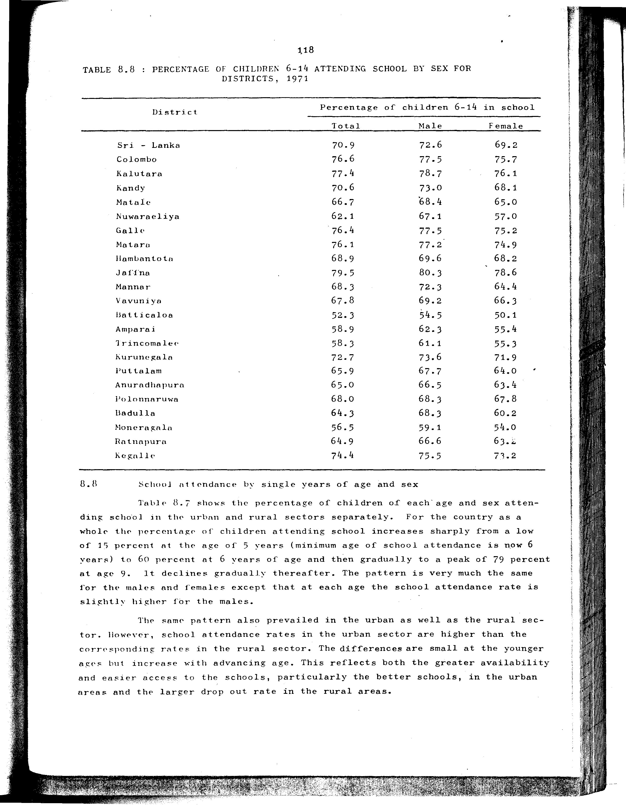

# 8.8: Percentage of children 6-14 attending school by sex for districts 1971

- 📜 Original Table PDF - [data/tables/table-8/table-8-08/original.pdf (96.5 kB)](../../../../data/tables/table-8/table-8-08/original.pdf)
- 📜 Original Table Image - [data/tables/table-8/table-8-08/original.image-01.png (222.3 kB)](../../../../data/tables/table-8/table-8-08/original.image-01.png)

## Extracted [JSON Data](../../../../data/tables/table-8/table-8-08/data.json)

*⚠️ No data extracted yet.*
## Original Table [Image](../../../../data/tables/table-8/table-8-08/original.image-01.png)

