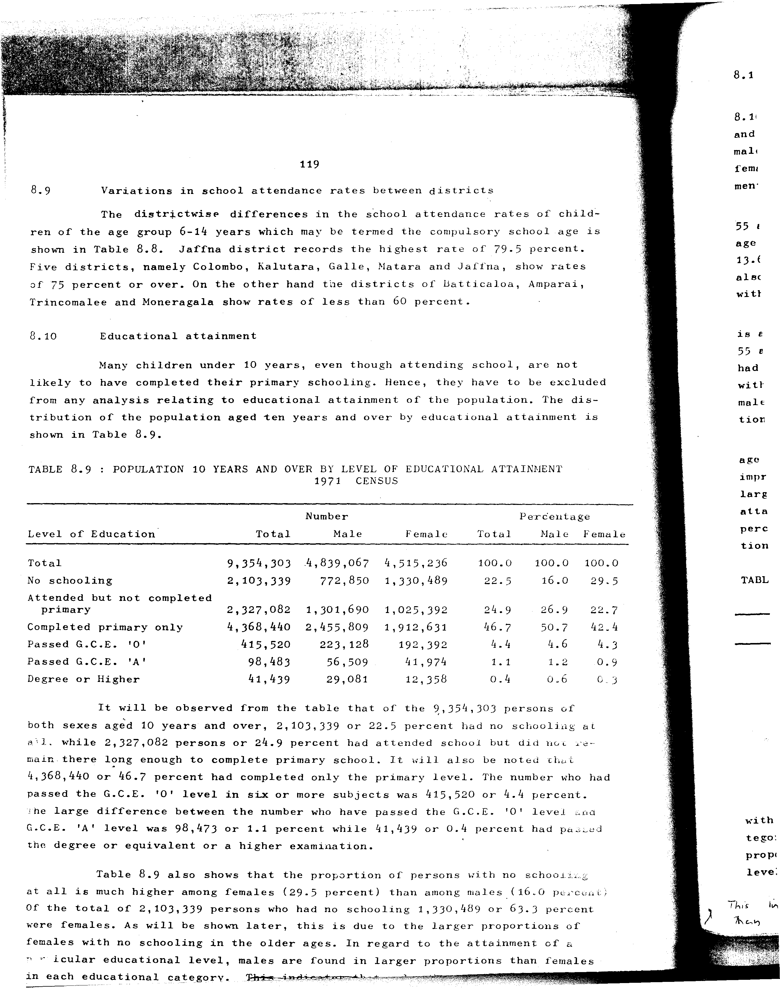

# 8.9: Population 10 years and over by level of educational attainment 1971 Census


- 📜 Original Table PDF - [data/tables/table-8/table-8-09/original.pdf (103.7 kB)](../../../../data/tables/table-8/table-8-09/original.pdf)
- 📜 Original Table Image - [data/tables/table-8/table-8-09/original.images/image-01.png (225.1 kB)](../../../../data/tables/table-8/table-8-09/original.images/image-01.png)
- 📄 Extracted JSON Data - [data/tables/table-8/table-8-09/data.json (2.5 kB)](../../../../data/tables/table-8/table-8-09/data.json)

## Extracted [JSON Data](../../../../data/tables/table-8/table-8-09/data.json)

```json
{
    "found": true,
    "table_no": "8.9",
    "table_name": "Population 10 years and over by level of educational attainment 1971 Census",
    "primary_keys": [
        "Level of Education"
    ],
    "field_keys": [
        "Number - Total",
        "Number - Male",
        "Number - Female",
        "Percentage - Total",
        "Percentage - Male",
        "Percentage - Female"
    ],
    "rows": [
        {
            "Level of Education": "Total",
            "values": {
                "Number - Total": 9354303,
                "Number - Male": 4839067,
                "Number - Female": 4515236,
                "Percentage - Total": 100.0,
                "Percentage - Male": 100.0,
                "Percentage - Female": 100.0
            }
        },
        {
            "Level of Education": "No schooling",
            "values": {
                "Number - Total": 2103339,
                "Number - Male": 772850,
                "Number - Female": 1330489,
                "Percentage - Total": 22.5,
                "Percentage - Male": 16.0,
                "Percentage - Female": 29.5
            }
        },
        {
            "Level of Education": "Attended but not completed primary",
            "values": {
                "Number - Total": 2327082,
                "Number - Male": 1301690,
                "Number - Female": 1025392,
                "Percentage - Total": 24.9,
                "Percentage - Male": 26.9,
                "Percentage - Female": 22.7
            }
        },
        {
            "Level of Education": "Completed primary only",
            "values": {
                "Number - Total": 4368440,
                "Number - Male": 2455809,
                "Number - Female": 1912631,
                "Percentage - Total": 46.7,
                "Percentage - Male": 50.7,
                "Percentage - Female": 42.4
            }
        },
        {
            "Level of Education": "Passed G.C.E. 'O'",
            "values": {
                "Number - Total": 415520,
                "Number - Male": 223128,
                "Number - Female": 192392,
                "Percentage - Total": 4.4,
                "Percentage - Male": 4.6,
                "Percentage - Female": 4.3
            }
        },
        {
            "Level of Education": "Passed G.C.E. 'A'",
            "values": {
                "Number - Total": 98483,
                "Number - Male": 56509,
                "Number - Female": 41974,
                "Percentage - Total": 1.1,
                "Percentage - Male": 1.2,
                "Percentage - Female": 0.9
            }
        },
        {
            "Level of Education": "Degree or Higher",
            "values": {
                "Number - Total": 41439,
                "Number - Male": 29081,
                "Number - Female": 12358,
                "Percentage - Total": 0.4,
                "Percentage - Male": 0.6,
                "Percentage - Female": 0.3
            }
        }
    ],
    "notes": []
}
```

## Original Table [Image](../../../../data/tables/table-8/table-8-09/original.images/image-01.png)




[](https://opensource.org/licenses/MIT)
