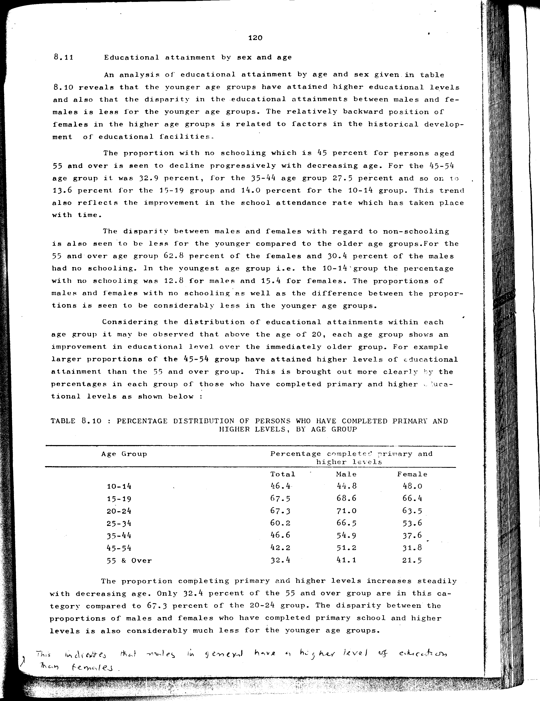

# 8.10: Percentage distribution of persons who have completed primary and higher levels, by age group


- 📜 Original Table PDF - [data/tables/table-8/table-8-10/original.pdf (101.9 kB)](../../../../data/tables/table-8/table-8-10/original.pdf)
- 📜 Original Table Image - [data/tables/table-8/table-8-10/original.images/image-01.png (253.5 kB)](../../../../data/tables/table-8/table-8-10/original.images/image-01.png)
- 📄 Extracted JSON Data - [data/tables/table-8/table-8-10/data.json (2.4 kB)](../../../../data/tables/table-8/table-8-10/data.json)

## Extracted [JSON Data](../../../../data/tables/table-8/table-8-10/data.json)

```json
{
    "found": true,
    "table_no": "8.10",
    "table_name": "Percentage distribution of persons who have completed primary and higher levels, by age group",
    "primary_keys": [
        "Age Group"
    ],
    "field_keys": [
        "Percentage completed primary and higher levels - Total",
        "Percentage completed primary and higher levels - Male",
        "Percentage completed primary and higher levels - Female"
    ],
    "rows": [
        {
            "Age Group": "10-14",
            "values": {
                "Percentage completed primary and higher levels - Total": 46.4,
                "Percentage completed primary and higher levels - Male": 44.8,
                "Percentage completed primary and higher levels - Female": 48.0
            }
        },
        {
            "Age Group": "15-19",
            "values": {
                "Percentage completed primary and higher levels - Total": 67.5,
                "Percentage completed primary and higher levels - Male": 68.6,
                "Percentage completed primary and higher levels - Female": 66.4
            }
        },
        {
            "Age Group": "20-24",
            "values": {
                "Percentage completed primary and higher levels - Total": 67.3,
                "Percentage completed primary and higher levels - Male": 71.0,
                "Percentage completed primary and higher levels - Female": 63.5
            }
        },
        {
            "Age Group": "25-34",
            "values": {
                "Percentage completed primary and higher levels - Total": 60.2,
                "Percentage completed primary and higher levels - Male": 66.5,
                "Percentage completed primary and higher levels - Female": 53.6
            }
        },
        {
            "Age Group": "35-44",
            "values": {
                "Percentage completed primary and higher levels - Total": 46.6,
                "Percentage completed primary and higher levels - Male": 54.9,
                "Percentage completed primary and higher levels - Female": 37.6
            }
        },
        {
            "Age Group": "45-54",
            "values": {
                "Percentage completed primary and higher levels - Total": 42.2,
                "Percentage completed primary and higher levels - Male": 51.2,
                "Percentage completed primary and higher levels - Female": 31.8
            }
        },
        {
            "Age Group": "55 & Over",
            "values": {
                "Percentage completed primary and higher levels - Total": 32.4,
                "Percentage completed primary and higher levels - Male": 41.1,
                "Percentage completed primary and higher levels - Female": 21.5
            }
        }
    ],
    "notes": []
}
```

## Original Table [Image](../../../../data/tables/table-8/table-8-10/original.images/image-01.png)




[](https://opensource.org/licenses/MIT)
