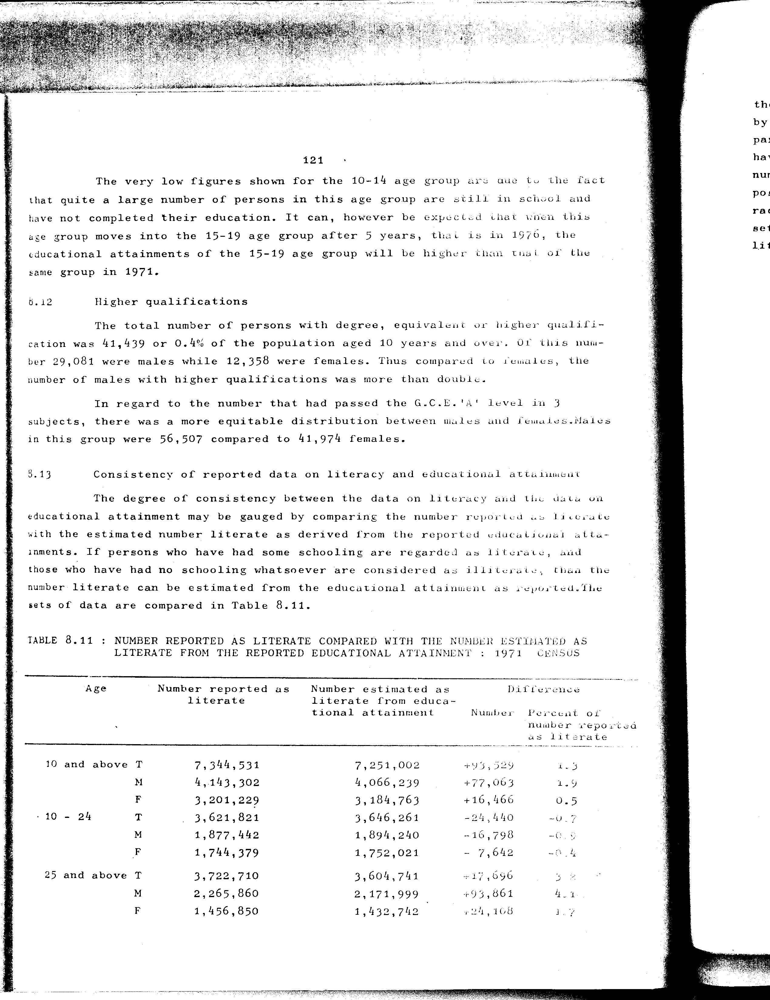

# 8.11: Number reported as literate compared with the number estimated as literate from the reported educational attainment 1971 Census

---

- 📜 Original PDF - [data/tables/table-8/table-8-11/original.pdf (100.9 kB)](../../../../data/tables/table-8/table-8-11/original.pdf)
- 📜 Original Image - [data/tables/table-8/table-8-11/original.image-01.png (208.8 kB)](../../../../data/tables/table-8/table-8-11/original.image-01.png)
- 📄 README - [data/tables/table-8/table-8-11/README.md (993 B)](../../../../data/tables/table-8/table-8-11/README.md)

## Extracted [JSON Data](../../../../data/tables/table-8/table-8-11/data.json)

*⚠️ No data extracted yet.*
## Original Table [Image](../../../../data/tables/table-8/table-8-11/original.image-01.png)

---

