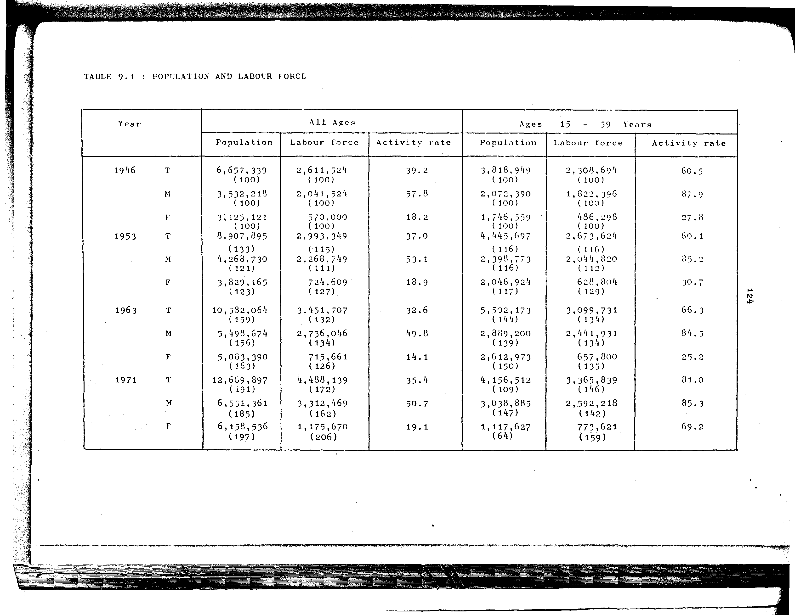

# 9.1: Population and labour force


- 📜 Original Table PDF - [data/tables/table-9/table-9-01/original.pdf (73.7 kB)](../../../../data/tables/table-9/table-9-01/original.pdf)
- 📜 Original Table Image - [data/tables/table-9/table-9-01/original.images/image-01.png (174.3 kB)](../../../../data/tables/table-9/table-9-01/original.images/image-01.png)
- 📄 Extracted JSON Data - [data/tables/table-9/table-9-01/data.json (5.2 kB)](../../../../data/tables/table-9/table-9-01/data.json)
- 📄 Extracted TSV Data - [data/tables/table-9/table-9-01/data.tsv (1.2 kB)](../../../../data/tables/table-9/table-9-01/data.tsv)

## Extracted [JSON Data](../../../../data/tables/table-9/table-9-01/data.json)

```json
{
    "found": true,
    "table_no": "9.1",
    "table_name": "Population and labour force",
    "primary_keys": [
        "Year",
        "Sex"
    ],
    "field_keys": [
        "All Ages - Population",
        "All Ages - Labour force",
        "All Ages - Activity rate",
        "Ages 15 - 59 Years - Population",
        "Ages 15 - 59 Years - Labour force",
        "Ages 15 - 59 Years - Activity rate"
    ],
    "rows": [
        {
            "Year": 1946,
            "Sex": "T",
            "values": {
                "All Ages - Population": "6,657,339 (100)",
                "All Ages - Labour force": "2,611,524 (100)",
                "All Ages - Activity rate": 39.2,
                "Ages 15 - 59 Years - Population": "3,818,949 (100)",
                "Ages 15 - 59 Years - Labour force": "2,308,694 (100)",
                "Ages 15 - 59 Years - Activity rate": 60.5
            }
        },
        {
            "Year": 1946,
            "Sex": "M",
            "values": {
                "All Ages - Population": "3,532,218 (100)",
                "All Ages - Labour force": "2,041,524 (100)",
                "All Ages - Activity rate": 57.8,
                "Ages 15 - 59 Years - Population": "2,072,390 (100)",
                "Ages 15 - 59 Years - Labour force": "1,822,396 (100)",
                "Ages 15 - 59 Years - Activity rate": 87.9
            }
        },
        {
            "Year": 1946,
            "Sex": "F",
            "values": {
                "All Ages - Population": "3,125,121 (100)",
                "All Ages - Labour force": "570,000 (100)",
                "All Ages - Activity rate": 18.2,
                "Ages 15 - 59 Years - Population": "1,746,559 (100)",
                "Ages 15 - 59 Years - Labour force": "486,298 (100)",
                "Ages 15 - 59 Years - Activity rate": 27.8
            }
        },
        {
            "Year": 1953,
            "Sex": "T",
            "values": {
                "All Ages - Population": "8,907,895 (133)",
                "All Ages - Labour force": "2,993,349 (115)",
                "All Ages - Activity rate": 37.0,
                "Ages 15 - 59 Years - Population": "4,445,697 (116)",
                "Ages 15 - 59 Years - Labour force": "2,673,624 (116)",
                "Ages 15 - 59 Years - Activity rate": 60.1
            }
        },
        {
            "Year": 1953,
            "Sex": "M",
            "values": {
                "All Ages - Population": "4,268,730 (121)",
                "All Ages - Labour force": "2,268,749 (111)",
                "All Ages - Activity rate": 53.1,
                "Ages 15 - 59 Years - Population": "2,398,773 (116)",
                "Ages 15 - 59 Years - Labour force": "2,044,820 (112)",
                "Ages 15 - 59 Years - Activity rate": 85.2
            }
        },
        {
            "Year": 1953,
            "Sex": "F",
            "values": {
                "All Ages - Population": "3,829,165 (123)",
                "All Ages - Labour force": "724,609 (127)",
                "All Ages - Activity rate": 18.9,
                "Ages 15 - 59 Years - Population": "2,046,924 (117)",
                "Ages 15 - 59 Years - Labour force": "628,804 (129)",
                "Ages 15 - 59 Years - Activity rate": 30.7
            }
        },
        {
            "Year": 1963,
            "Sex": "T",
            "values": {
                "All Ages - Population": "10,582,064 (159)",
                "All Ages - Labour force": "3,451,707 (132)",
                "All Ages - Activity rate": 32.6,
                "Ages 15 - 59 Years - Population": "5,502,173 (144)",
                "Ages 15 - 59 Years - Labour force": "3,099,731 (134)",
                "Ages 15 - 59 Years - Activity rate": 66.3
            }
        },
        {
            "Year": 1963,
            "Sex": "M",
            "values": {
                "All Ages - Population": "5,498,674 (156)",
                "All Ages - Labour force": "2,736,046 (134)",
                "All Ages - Activity rate": 49.8,
                "Ages 15 - 59 Years - Population": "2,889,200 (139)",
                "Ages 15 - 59 Years - Labour force": "2,441,931 (134)",
                "Ages 15 - 59 Years - Activity rate": 84.5
            }
        },
        {
            "Year": 1963,
            "Sex": "F",
            "values": {
                "All Ages - Population": "5,083,390 (163)",
                "All Ages - Labour force": "715,661 (126)",
                "All Ages - Activity rate": 14.1,
                "Ages 15 - 59 Years - Population": "2,612,973 (150)",
                "Ages 15 - 59 Years - Labour force": "657,800 (135)",
                "Ages 15 - 59 Years - Activity rate": 25.2
            }
        },
        {
            "Year": 1971,
            "Sex": "T",
            "values": {
                "All Ages - Population": "12,609,897 (191)",
                "All Ages - Labour force": "4,488,139 (172)",
                "All Ages - Activity rate": 35.4,
                "Ages 15 - 59 Years - Population": "4,156,512 (109)",
                "Ages 15 - 59 Years - Labour force": "3,365,839 (146)",
                "Ages 15 - 59 Years - Activity rate": 81.0
            }
        },
        {
            "Year": 1971,
            "Sex": "M",
            "values": {
                "All Ages - Population": "6,531,361 (185)",
                "All Ages - Labour force": "3,312,469 (162)",
                "All Ages - Activity rate": 50.7,
                "Ages 15 - 59 Years - Population": "3,038,885 (147)",
                "Ages 15 - 59 Years - Labour force": "2,592,218 (142)",
                "Ages 15 - 59 Years - Activity rate": 85.3
            }
        },
        {
            "Year": 1971,
            "Sex": "F",
            "values": {
                "All Ages - Population": "6,158,536 (197)",
                "All Ages - Labour force": "1,175,670 (206)",
                "All Ages - Activity rate": 19.1,
                "Ages 15 - 59 Years - Population": "1,117,627 (64)",
                "Ages 15 - 59 Years - Labour force": "773,621 (159)",
                "Ages 15 - 59 Years - Activity rate": 69.2
            }
        }
    ],
    "notes": []
}
```

## Original Table [Image](../../../../data/tables/table-9/table-9-01/original.images/image-01.png)




[](https://opensource.org/licenses/MIT)
