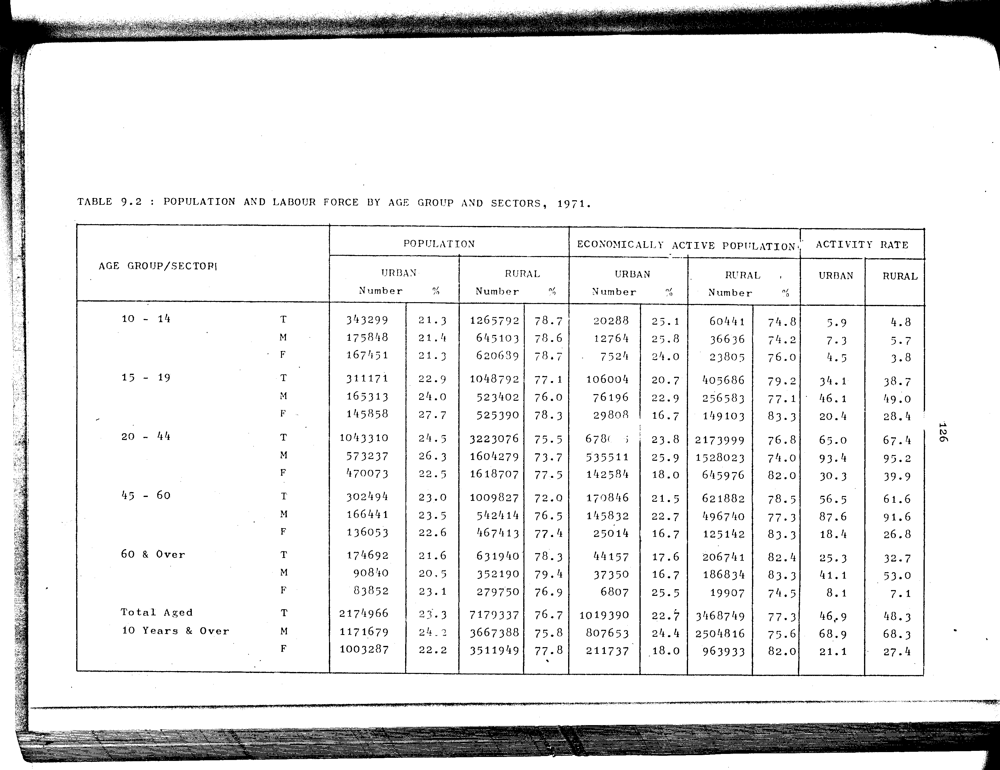

# 9.2: Population and labour force by age group and sectors, 1971


- 📜 Original Table PDF - [data/tables/table-9/table-9-02/original.pdf (86.5 kB)](../../../../data/tables/table-9/table-9-02/original.pdf)
- 📜 Original Table Image - [data/tables/table-9/table-9-02/original.images/image-01.png (208.2 kB)](../../../../data/tables/table-9/table-9-02/original.images/image-01.png)
- 📄 Extracted JSON Data - [data/tables/table-9/table-9-02/data.json (11.4 kB)](../../../../data/tables/table-9/table-9-02/data.json)
- 📄 Extracted Normalized JSON Data - [data/tables/table-9/table-9-02/normalized_data.json (10.2 kB)](../../../../data/tables/table-9/table-9-02/normalized_data.json)
- 📄 Extracted TSV Data - [data/tables/table-9/table-9-02/data.tsv (1.6 kB)](../../../../data/tables/table-9/table-9-02/data.tsv)

## Original Table [Image](../../../../data/tables/table-9/table-9-02/original.images/image-01.png)



## Extracted [JSON Data](../../../../data/tables/table-9/table-9-02/data.json)

```json
{
    "found": true,
    "table_no": "9.2",
    "table_name": "Population and labour force by age group and sectors, 1971",
    "primary_keys": [
        "AGE GROUP",
        "SECTOR"
    ],
    "field_keys": [
        "POPULATION - URBAN - Number",
        "POPULATION - URBAN - %",
        "POPULATION - RURAL - Number",
        "POPULATION - RURAL - %",
        "ECONOMICALLY ACTIVE POPULATION - URBAN - Number",
        "ECONOMICALLY ACTIVE POPULATION - URBAN - %",
        "ECONOMICALLY ACTIVE POPULATION - RURAL - Number",
        "ECONOMICALLY ACTIVE POPULATION - RURAL - %",
        "ACTIVITY RATE - URBAN",
        "ACTIVITY RATE - RURAL"
    ],
    "rows": [
        {
            "AGE GROUP": "10 - 14",
            "SECTOR": "T",
            "values": {
                "POPULATION - URBAN - Number": 343299,
                "POPULATION - URBAN - %": 21.3,
                "POPULATION - RURAL - Number": 1265792,
                "POPULATION - RURAL - %": 78.7,
                "ECONOMICALLY ACTIVE POPULATION - URBAN - Number": 20288,
                "ECONOMICALLY ACTIVE POPULATION - URBAN - %": 25.1,
                "ECONOMICALLY ACTIVE POPULATION - RURAL - Number": 60441,
                "ECONOMICALLY ACTIVE POPULATION - RURAL - %": 74.8,
                "ACTIVITY RATE - URBAN": 5.9,
                "ACTIVITY RATE - RURAL": 4.8
            }
        },
        {
            "AGE GROUP": "10 - 14",
            "SECTOR": "M",
            "values": {
                "POPULATION - URBAN - Number": 175848,
                "POPULATION - URBAN - %": 21.4,
                "POPULATION - RURAL - Number": 645103,
                "POPULATION - RURAL - %": 78.6,
                "ECONOMICALLY ACTIVE POPULATION - URBAN - Number": 12764,
                "ECONOMICALLY ACTIVE POPULATION - URBAN - %": 25.8,
                "ECONOMICALLY ACTIVE POPULATION - RURAL - Number": 36636,
                "ECONOMICALLY ACTIVE POPULATION - RURAL - %": 74.2,
                "ACTIVITY RATE - URBAN": 7.3,
                "ACTIVITY RATE - RURAL": 5.7
            }
        },
        {
            "AGE GROUP": "10 - 14",
            "SECTOR": "F",
            "values": {
                "POPULATION - URBAN - Number": 167451,
                "POPULATION - URBAN - %": 21.3,
                "POPULATION - RURAL - Number": 620689,
                "POPULATION - RURAL - %": 78.7,
                "ECONOMICALLY ACTIVE POPULATION - URBAN - Number": 7524,
                "ECONOMICALLY ACTIVE POPULATION - URBAN - %": 24.0,
                "ECONOMICALLY ACTIVE POPULATION - RURAL - Number": 23805,
                "ECONOMICALLY ACTIVE POPULATION - RURAL - %": 76.0,
                "ACTIVITY RATE - URBAN": 4.5,
                "ACTIVITY RATE - RURAL": 3.8
            }
        },
        {
            "AGE GROUP": "15 - 19",
            "SECTOR": "T",
            "values": {
                "POPULATION - URBAN - Number": 311171,
                "POPULATION - URBAN - %": 22.9,
                "POPULATION - RURAL - Number": 1048792,
                "POPULATION - RURAL - %": 77.1,
                "ECONOMICALLY ACTIVE POPULATION - URBAN - Number": 106004,
                "ECONOMICALLY ACTIVE POPULATION - URBAN - %": 20.7,
                "ECONOMICALLY ACTIVE POPULATION - RURAL - Number": 405686,
                "ECONOMICALLY ACTIVE POPULATION - RURAL - %": 79.2,
                "ACTIVITY RATE - URBAN": 34.1,
                "ACTIVITY RATE - RURAL": 38.7
            }
        },
        {
            "AGE GROUP": "15 - 19",
            "SECTOR": "M",
            "values": {
                "POPULATION - URBAN - Number": 165313,
                "POPULATION - URBAN - %": 24.0,
                "POPULATION - RURAL - Number": 523402,
                "POPULATION - RURAL - %": 76.0,
                "ECONOMICALLY ACTIVE POPULATION - URBAN - Number": 76196,
                "ECONOMICALLY ACTIVE POPULATION - URBAN - %": 22.9,
                "ECONOMICALLY ACTIVE POPULATION - RURAL - Number": 256583,
                "ECONOMICALLY ACTIVE POPULATION - RURAL - %": 77.1,
                "ACTIVITY RATE - URBAN": 46.1,
                "ACTIVITY RATE - RURAL": 49.0
            }
        },
        {
            "AGE GROUP": "15 - 19",
            "SECTOR": "F",
            "values": {
                "POPULATION - URBAN - Number": 145858,
                "POPULATION - URBAN - %": 27.7,
                "POPULATION - RURAL - Number": 525390,
                "POPULATION - RURAL - %": 78.3,
                "ECONOMICALLY ACTIVE POPULATION - URBAN - Number": 29808,
                "ECONOMICALLY ACTIVE POPULATION - URBAN - %": 16.7,
                "ECONOMICALLY ACTIVE POPULATION - RURAL - Number": 149103,
                "ECONOMICALLY ACTIVE POPULATION - RURAL - %": 83.3,
                "ACTIVITY RATE - URBAN": 20.4,
                "ACTIVITY RATE - RURAL": 28.4
            }
        },
        {
            "AGE GROUP": "20 - 44",
            "SECTOR": "T",
            "values": {
                "POPULATION - URBAN - Number": 1043310,
                "POPULATION - URBAN - %": 24.5,
                "POPULATION - RURAL - Number": 3223076,
                "POPULATION - RURAL - %": 75.5,
                "ECONOMICALLY ACTIVE POPULATION - URBAN - Number": 678006,
                "ECONOMICALLY ACTIVE POPULATION - URBAN - %": 23.8,
                "ECONOMICALLY ACTIVE POPULATION - RURAL - Number": 2173999,
                "ECONOMICALLY ACTIVE POPULATION - RURAL - %": 76.8,
                "ACTIVITY RATE - URBAN": 65.0,
                "ACTIVITY RATE - RURAL": 67.4
            }
        },
        {
            "AGE GROUP": "20 - 44",
            "SECTOR": "M",
            "values": {
                "POPULATION - URBAN - Number": 573237,
                "POPULATION - URBAN - %": 26.3,
                "POPULATION - RURAL - Number": 1604279,
                "POPULATION - RURAL - %": 73.7,
                "ECONOMICALLY ACTIVE POPULATION - URBAN - Number": 535511,
                "ECONOMICALLY ACTIVE POPULATION - URBAN - %": 25.9,
                "ECONOMICALLY ACTIVE POPULATION - RURAL - Number": 1528023,
                "ECONOMICALLY ACTIVE POPULATION - RURAL - %": 74.0,
                "ACTIVITY RATE - URBAN": 93.4,
                "ACTIVITY RATE - RURAL": 95.2
            }
        },
        {
            "AGE GROUP": "20 - 44",
            "SECTOR": "F",
            "values": {
                "POPULATION - URBAN - Number": 470073,
                "POPULATION - URBAN - %": 22.5,
                "POPULATION - RURAL - Number": 1618707,
                "POPULATION - RURAL - %": 77.5,
                "ECONOMICALLY ACTIVE POPULATION - URBAN - Number": 142584,
                "ECONOMICALLY ACTIVE POPULATION - URBAN - %": 18.0,
                "ECONOMICALLY ACTIVE POPULATION - RURAL - Number": 645976,
                "ECONOMICALLY ACTIVE POPULATION - RURAL - %": 82.0,
                "ACTIVITY RATE - URBAN": 30.3,
                "ACTIVITY RATE - RURAL": 39.9
            }
        },
        {
            "AGE GROUP": "45 - 60",
            "SECTOR": "T",
            "values": {
                "POPULATION - URBAN - Number": 302494,
                "POPULATION - URBAN - %": 23.0,
                "POPULATION - RURAL - Number": 1009827,
                "POPULATION - RURAL - %": 72.0,
                "ECONOMICALLY ACTIVE POPULATION - URBAN - Number": 170846,
                "ECONOMICALLY ACTIVE POPULATION - URBAN - %": 21.5,
                "ECONOMICALLY ACTIVE POPULATION - RURAL - Number": 621882,
                "ECONOMICALLY ACTIVE POPULATION - RURAL - %": 78.5,
                "ACTIVITY RATE - URBAN": 56.5,
                "ACTIVITY RATE - RURAL": 61.6
            }
        },
        {
            "AGE GROUP": "45 - 60",
            "SECTOR": "M",
            "values": {
                "POPULATION - URBAN - Number": 166441,
                "POPULATION - URBAN - %": 23.5,
                "POPULATION - RURAL - Number": 542414,
                "POPULATION - RURAL - %": 76.5,
                "ECONOMICALLY ACTIVE POPULATION - URBAN - Number": 145832,
                "ECONOMICALLY ACTIVE POPULATION - URBAN - %": 22.7,
                "ECONOMICALLY ACTIVE POPULATION - RURAL - Number": 496740,
                "ECONOMICALLY ACTIVE POPULATION - RURAL - %": 77.3,
                "ACTIVITY RATE - URBAN": 87.6,
                "ACTIVITY RATE - RURAL": 91.6
            }
        },
        {
            "AGE GROUP": "45 - 60",
            "SECTOR": "F",
            "values": {
                "POPULATION - URBAN - Number": 136053,
                "POPULATION - URBAN - %": 22.6,
                "POPULATION - RURAL - Number": 467413,
                "POPULATION - RURAL - %": 77.4,
                "ECONOMICALLY ACTIVE POPULATION - URBAN - Number": 25014,
                "ECONOMICALLY ACTIVE POPULATION - URBAN - %": 16.7,
                "ECONOMICALLY ACTIVE POPULATION - RURAL - Number": 125142,
                "ECONOMICALLY ACTIVE POPULATION - RURAL - %": 83.3,
                "ACTIVITY RATE - URBAN": 18.4,
                "ACTIVITY RATE - RURAL": 26.8
            }
        },
        {
            "AGE GROUP": "60 & Over",
            "SECTOR": "T",
            "values": {
                "POPULATION - URBAN - Number": 174692,
                "POPULATION - URBAN - %": 21.6,
                "POPULATION - RURAL - Number": 631940,
                "POPULATION - RURAL - %": 78.3,
                "ECONOMICALLY ACTIVE POPULATION - URBAN - Number": 44157,
                "ECONOMICALLY ACTIVE POPULATION - URBAN - %": 17.6,
                "ECONOMICALLY ACTIVE POPULATION - RURAL - Number": 206741,
                "ECONOMICALLY ACTIVE POPULATION - RURAL - %": 82.4,
                "ACTIVITY RATE - URBAN": 25.3,
                "ACTIVITY RATE - RURAL": 32.7
            }
        },
        {
            "AGE GROUP": "60 & Over",
            "SECTOR": "M",
            "values": {
                "POPULATION - URBAN - Number": 90840,
                "POPULATION - URBAN - %": 20.5,
                "POPULATION - RURAL - Number": 352190,
                "POPULATION - RURAL - %": 79.4,
                "ECONOMICALLY ACTIVE POPULATION - URBAN - Number": 37350,
                "ECONOMICALLY ACTIVE POPULATION - URBAN - %": 16.7,
                "ECONOMICALLY ACTIVE POPULATION - RURAL - Number": 186834,
                "ECONOMICALLY ACTIVE POPULATION - RURAL - %": 83.3,
                "ACTIVITY RATE - URBAN": 41.1,
                "ACTIVITY RATE - RURAL": 53.0
            }
        },
        {
            "AGE GROUP": "60 & Over",
            "SECTOR": "F",
            "values": {
                "POPULATION - URBAN - Number": 83852,
                "POPULATION - URBAN - %": 23.1,
                "POPULATION - RURAL - Number": 279750,
                "POPULATION - RURAL - %": 76.9,
                "ECONOMICALLY ACTIVE POPULATION - URBAN - Number": 6807,
                "ECONOMICALLY ACTIVE POPULATION - URBAN - %": 25.5,
                "ECONOMICALLY ACTIVE POPULATION - RURAL - Number": 19907,
                "ECONOMICALLY ACTIVE POPULATION - RURAL - %": 74.5,
                "ACTIVITY RATE - URBAN": 8.1,
                "ACTIVITY RATE - RURAL": 7.1
            }
        },
        {
            "AGE GROUP": "Total Aged 10 Years & Over",
            "SECTOR": "T",
            "values": {
                "POPULATION - URBAN - Number": 2174966,
                "POPULATION - URBAN - %": 23.3,
                "POPULATION - RURAL - Number": 7179337,
                "POPULATION - RURAL - %": 76.7,
                "ECONOMICALLY ACTIVE POPULATION - URBAN - Number": 1019390,
                "ECONOMICALLY ACTIVE POPULATION - URBAN - %": 22.7,
                "ECONOMICALLY ACTIVE POPULATION - RURAL - Number": 3468749,
                "ECONOMICALLY ACTIVE POPULATION - RURAL - %": 77.3,
                "ACTIVITY RATE - URBAN": 46.9,
                "ACTIVITY RATE - RURAL": 48.3
            }
        },
        {
            "AGE GROUP": "Total Aged 10 Years & Over",
            "SECTOR": "M",
            "values": {
                "POPULATION - URBAN - Number": 1171679,
                "POPULATION - URBAN - %": 24.2,
                "POPULATION - RURAL - Number": 3667388,
                "POPULATION - RURAL - %": 75.8,
                "ECONOMICALLY ACTIVE POPULATION - URBAN - Number": 807653,
                "ECONOMICALLY ACTIVE POPULATION - URBAN - %": 24.4,
                "ECONOMICALLY ACTIVE POPULATION - RURAL - Number": 2504816,
                "ECONOMICALLY ACTIVE POPULATION - RURAL - %": 75.6,
                "ACTIVITY RATE - URBAN": 68.9,
                "ACTIVITY RATE - RURAL": 68.3
            }
        },
        {
            "AGE GROUP": "Total Aged 10 Years & Over",
            "SECTOR": "F",
            "values": {
                "POPULATION - URBAN - Number": 1003287,
                "POPULATION - URBAN - %": 22.2,
                "POPULATION - RURAL - Number": 3511949,
                "POPULATION - RURAL - %": 77.8,
                "ECONOMICALLY ACTIVE POPULATION - URBAN - Number": 211737,
                "ECONOMICALLY ACTIVE POPULATION - URBAN - %": 18.0,
                "ECONOMICALLY ACTIVE POPULATION - RURAL - Number": 963933,
                "ECONOMICALLY ACTIVE POPULATION - RURAL - %": 82.0,
                "ACTIVITY RATE - URBAN": 21.1,
                "ACTIVITY RATE - RURAL": 27.4
            }
        }
    ],
    "notes": []
}
```

## Extracted [Normalized JSON Data](../../../../data/tables/table-9/table-9-02/normalized_data.json)

```json
[
    {
        "AGE GROUP": "10 - 14",
        "SECTOR": "T",
        "values": {
            "POPULATION - URBAN - Number": 343299,
            "POPULATION - URBAN - %": 21.3,
            "POPULATION - RURAL - Number": 1265792,
            "POPULATION - RURAL - %": 78.7,
            "ECONOMICALLY ACTIVE POPULATION - URBAN - Number": 20288,
            "ECONOMICALLY ACTIVE POPULATION - URBAN - %": 25.1,
            "ECONOMICALLY ACTIVE POPULATION - RURAL - Number": 60441,
            "ECONOMICALLY ACTIVE POPULATION - RURAL - %": 74.8,
            "ACTIVITY RATE - URBAN": 5.9,
            "ACTIVITY RATE - RURAL": 4.8
        }
    },
    {
        "AGE GROUP": "10 - 14",
        "SECTOR": "M",
        "values": {
            "POPULATION - URBAN - Number": 175848,
            "POPULATION - URBAN - %": 21.4,
            "POPULATION - RURAL - Number": 645103,
            "POPULATION - RURAL - %": 78.6,
            "ECONOMICALLY ACTIVE POPULATION - URBAN - Number": 12764,
            "ECONOMICALLY ACTIVE POPULATION - URBAN - %": 25.8,
            "ECONOMICALLY ACTIVE POPULATION - RURAL - Number": 36636,
            "ECONOMICALLY ACTIVE POPULATION - RURAL - %": 74.2,
            "ACTIVITY RATE - URBAN": 7.3,
            "ACTIVITY RATE - RURAL": 5.7
        }
    },
    {
        "AGE GROUP": "10 - 14",
        "SECTOR": "F",
        "values": {
            "POPULATION - URBAN - Number": 167451,
            "POPULATION - URBAN - %": 21.3,
            "POPULATION - RURAL - Number": 620689,
            "POPULATION - RURAL - %": 78.7,
            "ECONOMICALLY ACTIVE POPULATION - URBAN - Number": 7524,
            "ECONOMICALLY ACTIVE POPULATION - URBAN - %": 24.0,
            "ECONOMICALLY ACTIVE POPULATION - RURAL - Number": 23805,
            "ECONOMICALLY ACTIVE POPULATION - RURAL - %": 76.0,
            "ACTIVITY RATE - URBAN": 4.5,
            "ACTIVITY RATE - RURAL": 3.8
        }
    },
    {
        "AGE GROUP": "15 - 19",
        "SECTOR": "T",
        "values": {
            "POPULATION - URBAN - Number": 311171,
            "POPULATION - URBAN - %": 22.9,
            "POPULATION - RURAL - Number": 1048792,
            "POPULATION - RURAL - %": 77.1,
            "ECONOMICALLY ACTIVE POPULATION - URBAN - Number": 106004,
            "ECONOMICALLY ACTIVE POPULATION - URBAN - %": 20.7,
            "ECONOMICALLY ACTIVE POPULATION - RURAL - Number": 405686,
            "ECONOMICALLY ACTIVE POPULATION - RURAL - %": 79.2,
            "ACTIVITY RATE - URBAN": 34.1,
            "ACTIVITY RATE - RURAL": 38.7
        }
    },
    {
        "AGE GROUP": "15 - 19",
        "SECTOR": "M",
        "values": {
            "POPULATION - URBAN - Number": 165313,
            "POPULATION - URBAN - %": 24.0,
            "POPULATION - RURAL - Number": 523402,
            "POPULATION - RURAL - %": 76.0,
            "ECONOMICALLY ACTIVE POPULATION - URBAN - Number": 76196,
            "ECONOMICALLY ACTIVE POPULATION - URBAN - %": 22.9,
            "ECONOMICALLY ACTIVE POPULATION - RURAL - Number": 256583,
            "ECONOMICALLY ACTIVE POPULATION - RURAL - %": 77.1,
            "ACTIVITY RATE - URBAN": 46.1,
            "ACTIVITY RATE - RURAL": 49.0
        }
    },
    {
        "AGE GROUP": "15 - 19",
        "SECTOR": "F",
        "values": {
            "POPULATION - URBAN - Number": 145858,
            "POPULATION - URBAN - %": 27.7,
            "POPULATION - RURAL - Number": 525390,
            "POPULATION - RURAL - %": 78.3,
            "ECONOMICALLY ACTIVE POPULATION - URBAN - Number": 29808,
            "ECONOMICALLY ACTIVE POPULATION - URBAN - %": 16.7,
            "ECONOMICALLY ACTIVE POPULATION - RURAL - Number": 149103,
            "ECONOMICALLY ACTIVE POPULATION - RURAL - %": 83.3,
            "ACTIVITY RATE - URBAN": 20.4,
            "ACTIVITY RATE - RURAL": 28.4
        }
    },
    {
        "AGE GROUP": "20 - 44",
        "SECTOR": "T",
        "values": {
            "POPULATION - URBAN - Number": 1043310,
            "POPULATION - URBAN - %": 24.5,
            "POPULATION - RURAL - Number": 3223076,
            "POPULATION - RURAL - %": 75.5,
            "ECONOMICALLY ACTIVE POPULATION - URBAN - Number": 678006,
            "ECONOMICALLY ACTIVE POPULATION - URBAN - %": 23.8,
            "ECONOMICALLY ACTIVE POPULATION - RURAL - Number": 2173999,
            "ECONOMICALLY ACTIVE POPULATION - RURAL - %": 76.8,
            "ACTIVITY RATE - URBAN": 65.0,
            "ACTIVITY RATE - RURAL": 67.4
        }
    },
    {
        "AGE GROUP": "20 - 44",
        "SECTOR": "M",
        "values": {
            "POPULATION - URBAN - Number": 573237,
            "POPULATION - URBAN - %": 26.3,
            "POPULATION - RURAL - Number": 1604279,
            "POPULATION - RURAL - %": 73.7,
            "ECONOMICALLY ACTIVE POPULATION - URBAN - Number": 535511,
            "ECONOMICALLY ACTIVE POPULATION - URBAN - %": 25.9,
            "ECONOMICALLY ACTIVE POPULATION - RURAL - Number": 1528023,
            "ECONOMICALLY ACTIVE POPULATION - RURAL - %": 74.0,
            "ACTIVITY RATE - URBAN": 93.4,
            "ACTIVITY RATE - RURAL": 95.2
        }
    },
    {
        "AGE GROUP": "20 - 44",
        "SECTOR": "F",
        "values": {
            "POPULATION - URBAN - Number": 470073,
            "POPULATION - URBAN - %": 22.5,
            "POPULATION - RURAL - Number": 1618707,
            "POPULATION - RURAL - %": 77.5,
            "ECONOMICALLY ACTIVE POPULATION - URBAN - Number": 142584,
            "ECONOMICALLY ACTIVE POPULATION - URBAN - %": 18.0,
            "ECONOMICALLY ACTIVE POPULATION - RURAL - Number": 645976,
            "ECONOMICALLY ACTIVE POPULATION - RURAL - %": 82.0,
            "ACTIVITY RATE - URBAN": 30.3,
            "ACTIVITY RATE - RURAL": 39.9
        }
    },
    {
        "AGE GROUP": "45 - 60",
        "SECTOR": "T",
        "values": {
            "POPULATION - URBAN - Number": 302494,
            "POPULATION - URBAN - %": 23.0,
            "POPULATION - RURAL - Number": 1009827,
            "POPULATION - RURAL - %": 72.0,
            "ECONOMICALLY ACTIVE POPULATION - URBAN - Number": 170846,
            "ECONOMICALLY ACTIVE POPULATION - URBAN - %": 21.5,
            "ECONOMICALLY ACTIVE POPULATION - RURAL - Number": 621882,
            "ECONOMICALLY ACTIVE POPULATION - RURAL - %": 78.5,
            "ACTIVITY RATE - URBAN": 56.5,
            "ACTIVITY RATE - RURAL": 61.6
        }
    },
    {
        "AGE GROUP": "45 - 60",
        "SECTOR": "M",
        "values": {
            "POPULATION - URBAN - Number": 166441,
            "POPULATION - URBAN - %": 23.5,
            "POPULATION - RURAL - Number": 542414,
            "POPULATION - RURAL - %": 76.5,
            "ECONOMICALLY ACTIVE POPULATION - URBAN - Number": 145832,
            "ECONOMICALLY ACTIVE POPULATION - URBAN - %": 22.7,
            "ECONOMICALLY ACTIVE POPULATION - RURAL - Number": 496740,
            "ECONOMICALLY ACTIVE POPULATION - RURAL - %": 77.3,
            "ACTIVITY RATE - URBAN": 87.6,
            "ACTIVITY RATE - RURAL": 91.6
        }
    },
    {
        "AGE GROUP": "45 - 60",
        "SECTOR": "F",
        "values": {
            "POPULATION - URBAN - Number": 136053,
            "POPULATION - URBAN - %": 22.6,
            "POPULATION - RURAL - Number": 467413,
            "POPULATION - RURAL - %": 77.4,
            "ECONOMICALLY ACTIVE POPULATION - URBAN - Number": 25014,
            "ECONOMICALLY ACTIVE POPULATION - URBAN - %": 16.7,
            "ECONOMICALLY ACTIVE POPULATION - RURAL - Number": 125142,
            "ECONOMICALLY ACTIVE POPULATION - RURAL - %": 83.3,
            "ACTIVITY RATE - URBAN": 18.4,
            "ACTIVITY RATE - RURAL": 26.8
        }
    },
    {
        "AGE GROUP": "60 & Over",
        "SECTOR": "T",
        "values": {
            "POPULATION - URBAN - Number": 174692,
            "POPULATION - URBAN - %": 21.6,
            "POPULATION - RURAL - Number": 631940,
            "POPULATION - RURAL - %": 78.3,
            "ECONOMICALLY ACTIVE POPULATION - URBAN - Number": 44157,
            "ECONOMICALLY ACTIVE POPULATION - URBAN - %": 17.6,
            "ECONOMICALLY ACTIVE POPULATION - RURAL - Number": 206741,
            "ECONOMICALLY ACTIVE POPULATION - RURAL - %": 82.4,
            "ACTIVITY RATE - URBAN": 25.3,
            "ACTIVITY RATE - RURAL": 32.7
        }
    },
    {
        "AGE GROUP": "60 & Over",
        "SECTOR": "M",
        "values": {
            "POPULATION - URBAN - Number": 90840,
            "POPULATION - URBAN - %": 20.5,
            "POPULATION - RURAL - Number": 352190,
            "POPULATION - RURAL - %": 79.4,
            "ECONOMICALLY ACTIVE POPULATION - URBAN - Number": 37350,
            "ECONOMICALLY ACTIVE POPULATION - URBAN - %": 16.7,
            "ECONOMICALLY ACTIVE POPULATION - RURAL - Number": 186834,
            "ECONOMICALLY ACTIVE POPULATION - RURAL - %": 83.3,
            "ACTIVITY RATE - URBAN": 41.1,
            "ACTIVITY RATE - RURAL": 53.0
        }
    },
    {
        "AGE GROUP": "60 & Over",
        "SECTOR": "F",
        "values": {
            "POPULATION - URBAN - Number": 83852,
            "POPULATION - URBAN - %": 23.1,
            "POPULATION - RURAL - Number": 279750,
            "POPULATION - RURAL - %": 76.9,
            "ECONOMICALLY ACTIVE POPULATION - URBAN - Number": 6807,
            "ECONOMICALLY ACTIVE POPULATION - URBAN - %": 25.5,
            "ECONOMICALLY ACTIVE POPULATION - RURAL - Number": 19907,
            "ECONOMICALLY ACTIVE POPULATION - RURAL - %": 74.5,
            "ACTIVITY RATE - URBAN": 8.1,
            "ACTIVITY RATE - RURAL": 7.1
        }
    },
    {
        "AGE GROUP": "Total Aged 10 Years & Over",
        "SECTOR": "T",
        "values": {
            "POPULATION - URBAN - Number": 2174966,
            "POPULATION - URBAN - %": 23.3,
            "POPULATION - RURAL - Number": 7179337,
            "POPULATION - RURAL - %": 76.7,
            "ECONOMICALLY ACTIVE POPULATION - URBAN - Number": 1019390,
            "ECONOMICALLY ACTIVE POPULATION - URBAN - %": 22.7,
            "ECONOMICALLY ACTIVE POPULATION - RURAL - Number": 3468749,
            "ECONOMICALLY ACTIVE POPULATION - RURAL - %": 77.3,
            "ACTIVITY RATE - URBAN": 46.9,
            "ACTIVITY RATE - RURAL": 48.3
        }
    },
    {
        "AGE GROUP": "Total Aged 10 Years & Over",
        "SECTOR": "M",
        "values": {
            "POPULATION - URBAN - Number": 1171679,
            "POPULATION - URBAN - %": 24.2,
            "POPULATION - RURAL - Number": 3667388,
            "POPULATION - RURAL - %": 75.8,
            "ECONOMICALLY ACTIVE POPULATION - URBAN - Number": 807653,
            "ECONOMICALLY ACTIVE POPULATION - URBAN - %": 24.4,
            "ECONOMICALLY ACTIVE POPULATION - RURAL - Number": 2504816,
            "ECONOMICALLY ACTIVE POPULATION - RURAL - %": 75.6,
            "ACTIVITY RATE - URBAN": 68.9,
            "ACTIVITY RATE - RURAL": 68.3
        }
    },
    {
        "AGE GROUP": "Total Aged 10 Years & Over",
        "SECTOR": "F",
        "values": {
            "POPULATION - URBAN - Number": 1003287,
            "POPULATION - URBAN - %": 22.2,
            "POPULATION - RURAL - Number": 3511949,
            "POPULATION - RURAL - %": 77.8,
            "ECONOMICALLY ACTIVE POPULATION - URBAN - Number": 211737,
            "ECONOMICALLY ACTIVE POPULATION - URBAN - %": 18.0,
            "ECONOMICALLY ACTIVE POPULATION - RURAL - Number": 963933,
            "ECONOMICALLY ACTIVE POPULATION - RURAL - %": 82.0,
            "ACTIVITY RATE - URBAN": 21.1,
            "ACTIVITY RATE - RURAL": 27.4
        }
    }
]
```

## Extracted [TSV Data](../../../../data/tables/table-9/table-9-02/data.tsv)

| AGE GROUP | SECTOR | POPULATION - URBAN - Number | POPULATION - URBAN - % | POPULATION - RURAL - Number | POPULATION - RURAL - % | ECONOMICALLY ACTIVE POPULATION - URBAN - Number | ECONOMICALLY ACTIVE POPULATION - URBAN - % | ECONOMICALLY ACTIVE POPULATION - RURAL - Number | ECONOMICALLY ACTIVE POPULATION - RURAL - % | ACTIVITY RATE - URBAN | ACTIVITY RATE - RURAL |
| --- | --- | --- | --- | --- | --- | --- | --- | --- | --- | --- | --- |
| 10 - 14 | T | 343299 | 21.3 | 1265792 | 78.7 | 20288 | 25.1 | 60441 | 74.8 | 5.9 | 4.8 |
| 10 - 14 | M | 175848 | 21.4 | 645103 | 78.6 | 12764 | 25.8 | 36636 | 74.2 | 7.3 | 5.7 |
| 10 - 14 | F | 167451 | 21.3 | 620689 | 78.7 | 7524 | 24.0 | 23805 | 76.0 | 4.5 | 3.8 |
| 15 - 19 | T | 311171 | 22.9 | 1048792 | 77.1 | 106004 | 20.7 | 405686 | 79.2 | 34.1 | 38.7 |
| 15 - 19 | M | 165313 | 24.0 | 523402 | 76.0 | 76196 | 22.9 | 256583 | 77.1 | 46.1 | 49.0 |
| 15 - 19 | F | 145858 | 27.7 | 525390 | 78.3 | 29808 | 16.7 | 149103 | 83.3 | 20.4 | 28.4 |
| 20 - 44 | T | 1043310 | 24.5 | 3223076 | 75.5 | 678006 | 23.8 | 2173999 | 76.8 | 65.0 | 67.4 |
| 20 - 44 | M | 573237 | 26.3 | 1604279 | 73.7 | 535511 | 25.9 | 1528023 | 74.0 | 93.4 | 95.2 |
| 20 - 44 | F | 470073 | 22.5 | 1618707 | 77.5 | 142584 | 18.0 | 645976 | 82.0 | 30.3 | 39.9 |
| 45 - 60 | T | 302494 | 23.0 | 1009827 | 72.0 | 170846 | 21.5 | 621882 | 78.5 | 56.5 | 61.6 |
| 45 - 60 | M | 166441 | 23.5 | 542414 | 76.5 | 145832 | 22.7 | 496740 | 77.3 | 87.6 | 91.6 |
| 45 - 60 | F | 136053 | 22.6 | 467413 | 77.4 | 25014 | 16.7 | 125142 | 83.3 | 18.4 | 26.8 |
| 60 & Over | T | 174692 | 21.6 | 631940 | 78.3 | 44157 | 17.6 | 206741 | 82.4 | 25.3 | 32.7 |
| 60 & Over | M | 90840 | 20.5 | 352190 | 79.4 | 37350 | 16.7 | 186834 | 83.3 | 41.1 | 53.0 |
| 60 & Over | F | 83852 | 23.1 | 279750 | 76.9 | 6807 | 25.5 | 19907 | 74.5 | 8.1 | 7.1 |
| Total Aged 10 Years & Over | T | 2174966 | 23.3 | 7179337 | 76.7 | 1019390 | 22.7 | 3468749 | 77.3 | 46.9 | 48.3 |
| Total Aged 10 Years & Over | M | 1171679 | 24.2 | 3667388 | 75.8 | 807653 | 24.4 | 2504816 | 75.6 | 68.9 | 68.3 |
| Total Aged 10 Years & Over | F | 1003287 | 22.2 | 3511949 | 77.8 | 211737 | 18.0 | 963933 | 82.0 | 21.1 | 27.4 |


[](https://opensource.org/licenses/MIT)
