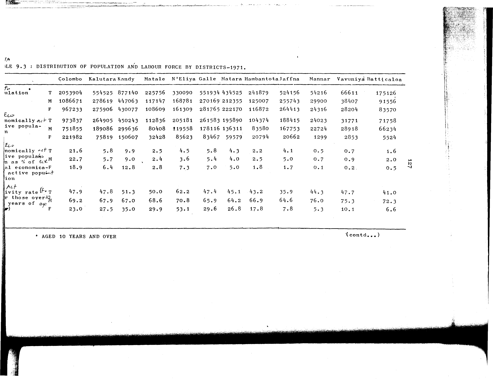

# 9.3: Distribution of population and labour force by districts - 1971


- 📜 Original Table PDF - [data/tables/table-9/table-9-03/original.pdf (49.6 kB)](../../../../data/tables/table-9/table-9-03/original.pdf)
- 📜 Original Table Image - [data/tables/table-9/table-9-03/original.images/image-01.png (119.4 kB)](../../../../data/tables/table-9/table-9-03/original.images/image-01.png)
- 📄 Extracted JSON Data - [data/tables/table-9/table-9-03/data.json (5.5 kB)](../../../../data/tables/table-9/table-9-03/data.json)

## Extracted [JSON Data](../../../../data/tables/table-9/table-9-03/data.json)

```json
{
    "found": true,
    "table_no": "9.3",
    "table_name": "Distribution of population and labour force by districts - 1971",
    "primary_keys": [
        "Category",
        "Sex"
    ],
    "field_keys": [
        "Colombo",
        "Kalutara",
        "Kandy",
        "Matale",
        "N'Eliya",
        "Galle",
        "Matara",
        "Hambantota",
        "Jaffna",
        "Mannar",
        "Vavuniya",
        "Batticaloa"
    ],
    "rows": [
        {
            "Category": "Population",
            "Sex": "T",
            "values": {
                "Colombo": 2053904,
                "Kalutara": 554525,
                "Kandy": 877140,
                "Matale": 225756,
                "N'Eliya": 330090,
                "Galle": 551934,
                "Matara": 434525,
                "Hambantota": 241879,
                "Jaffna": 524156,
                "Mannar": 54216,
                "Vavuniya": 66611,
                "Batticaloa": 175126
            }
        },
        {
            "Category": "Population",
            "Sex": "M",
            "values": {
                "Colombo": 1086671,
                "Kalutara": 278619,
                "Kandy": 447063,
                "Matale": 117147,
                "N'Eliya": 168781,
                "Galle": 270169,
                "Matara": 212355,
                "Hambantota": 125007,
                "Jaffna": 255743,
                "Mannar": 29900,
                "Vavuniya": 38407,
                "Batticaloa": 91556
            }
        },
        {
            "Category": "Population",
            "Sex": "F",
            "values": {
                "Colombo": 967233,
                "Kalutara": 275906,
                "Kandy": 430077,
                "Matale": 108609,
                "N'Eliya": 161309,
                "Galle": 281765,
                "Matara": 222170,
                "Hambantota": 116872,
                "Jaffna": 264413,
                "Mannar": 24316,
                "Vavuniya": 28204,
                "Batticaloa": 83570
            }
        },
        {
            "Category": "Economically active population",
            "Sex": "T",
            "values": {
                "Colombo": 973837,
                "Kalutara": 264905,
                "Kandy": 450243,
                "Matale": 112836,
                "N'Eliya": 205181,
                "Galle": 261583,
                "Matara": 195890,
                "Hambantota": 104374,
                "Jaffna": 188415,
                "Mannar": 24023,
                "Vavuniya": 31771,
                "Batticaloa": 71758
            }
        },
        {
            "Category": "Economically active population",
            "Sex": "M",
            "values": {
                "Colombo": 751855,
                "Kalutara": 189086,
                "Kandy": 299636,
                "Matale": 80408,
                "N'Eliya": 119558,
                "Galle": 178116,
                "Matara": 136311,
                "Hambantota": 83580,
                "Jaffna": 167753,
                "Mannar": 22724,
                "Vavuniya": 28918,
                "Batticaloa": 66234
            }
        },
        {
            "Category": "Economically active population",
            "Sex": "F",
            "values": {
                "Colombo": 221982,
                "Kalutara": 75819,
                "Kandy": 150607,
                "Matale": 32428,
                "N'Eliya": 85623,
                "Galle": 83467,
                "Matara": 59579,
                "Hambantota": 20794,
                "Jaffna": 20662,
                "Mannar": 1299,
                "Vavuniya": 2853,
                "Batticaloa": 5524
            }
        },
        {
            "Category": "Economically active population as % of total economical active population",
            "Sex": "T",
            "values": {
                "Colombo": 21.6,
                "Kalutara": 5.8,
                "Kandy": 9.9,
                "Matale": 2.5,
                "N'Eliya": 4.5,
                "Galle": 5.8,
                "Matara": 4.3,
                "Hambantota": 2.2,
                "Jaffna": 4.1,
                "Mannar": 0.5,
                "Vavuniya": 0.7,
                "Batticaloa": 1.6
            }
        },
        {
            "Category": "Economically active population as % of total economical active population",
            "Sex": "M",
            "values": {
                "Colombo": 22.7,
                "Kalutara": 5.7,
                "Kandy": 9.0,
                "Matale": 2.4,
                "N'Eliya": 3.6,
                "Galle": 5.4,
                "Matara": 4.0,
                "Hambantota": 2.5,
                "Jaffna": 5.0,
                "Mannar": 0.7,
                "Vavuniya": 0.9,
                "Batticaloa": 2.0
            }
        },
        {
            "Category": "Economically active population as % of total economical active population",
            "Sex": "F",
            "values": {
                "Colombo": 18.9,
                "Kalutara": 6.4,
                "Kandy": 12.8,
                "Matale": 2.8,
                "N'Eliya": 7.3,
                "Galle": 7.0,
                "Matara": 5.0,
                "Hambantota": 1.8,
                "Jaffna": 1.7,
                "Mannar": 0.1,
                "Vavuniya": 0.2,
                "Batticaloa": 0.5
            }
        },
        {
            "Category": "Activity rate (For those over 10 years of age)",
            "Sex": "T",
            "values": {
                "Colombo": 47.9,
                "Kalutara": 47.8,
                "Kandy": 51.3,
                "Matale": 50.0,
                "N'Eliya": 62.2,
                "Galle": 47.4,
                "Matara": 45.1,
                "Hambantota": 43.2,
                "Jaffna": 35.9,
                "Mannar": 44.3,
                "Vavuniya": 47.7,
                "Batticaloa": 41.0
            }
        },
        {
            "Category": "Activity rate (For those over 10 years of age)",
            "Sex": "M",
            "values": {
                "Colombo": 69.2,
                "Kalutara": 67.9,
                "Kandy": 67.0,
                "Matale": 68.6,
                "N'Eliya": 70.8,
                "Galle": 65.9,
                "Matara": 64.2,
                "Hambantota": 66.9,
                "Jaffna": 64.6,
                "Mannar": 76.0,
                "Vavuniya": 75.3,
                "Batticaloa": 72.3
            }
        },
        {
            "Category": "Activity rate (For those over 10 years of age)",
            "Sex": "F",
            "values": {
                "Colombo": 23.0,
                "Kalutara": 27.5,
                "Kandy": 35.0,
                "Matale": 29.9,
                "N'Eliya": 53.1,
                "Galle": 29.6,
                "Matara": 26.8,
                "Hambantota": 17.8,
                "Jaffna": 7.8,
                "Mannar": 5.3,
                "Vavuniya": 10.1,
                "Batticaloa": 6.6
            }
        }
    ],
    "notes": [
        "* AGED 10 YEARS AND OVER"
    ]
}
```

## Original Table [Image](../../../../data/tables/table-9/table-9-03/original.images/image-01.png)




[](https://opensource.org/licenses/MIT)
