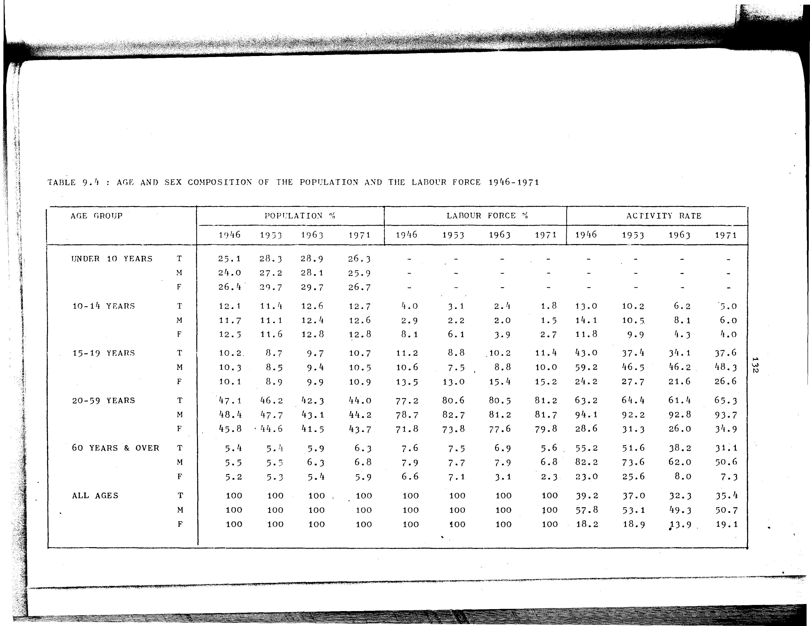

# 9.4: Age and sex composition of the population and the labour force 1946-1971


- 📜 Original Table PDF - [data/tables/table-9/table-9-04/original.pdf (74.7 kB)](../../../../data/tables/table-9/table-9-04/original.pdf)
- 📜 Original Table Image - [data/tables/table-9/table-9-04/original.images/image-01.png (159.3 kB)](../../../../data/tables/table-9/table-9-04/original.images/image-01.png)
- 📄 Extracted JSON Data - [data/tables/table-9/table-9-04/data.json (10.4 kB)](../../../../data/tables/table-9/table-9-04/data.json)
- 📄 Extracted Normalized JSON Data - [data/tables/table-9/table-9-04/normalized_data.json (9.1 kB)](../../../../data/tables/table-9/table-9-04/normalized_data.json)
- 📄 Extracted TSV Data - [data/tables/table-9/table-9-04/data.tsv (1.6 kB)](../../../../data/tables/table-9/table-9-04/data.tsv)

## Original Table [Image](../../../../data/tables/table-9/table-9-04/original.images/image-01.png)



## Extracted [TSV Data](../../../../data/tables/table-9/table-9-04/data.tsv)

| AGE GROUP | SEX | POPULATION % - 1946 | POPULATION % - 1953 | POPULATION % - 1963 | POPULATION % - 1971 | LABOUR FORCE % - 1946 | LABOUR FORCE % - 1953 | LABOUR FORCE % - 1963 | LABOUR FORCE % - 1971 | ACTIVITY RATE - 1946 | ACTIVITY RATE - 1953 | ACTIVITY RATE - 1963 | ACTIVITY RATE - 1971 |
| --- | --- | --- | --- | --- | --- | --- | --- | --- | --- | --- | --- | --- | --- |
| UNDER 10 YEARS | T | 25.1 | 28.3 | 28.9 | 26.3 | False | False | False | False | False | False | False | False |
| UNDER 10 YEARS | M | 24.0 | 27.2 | 28.1 | 25.9 | False | False | False | False | False | False | False | False |
| UNDER 10 YEARS | F | 26.4 | 29.7 | 29.7 | 26.7 | False | False | False | False | False | False | False | False |
| 10-14 YEARS | T | 12.1 | 11.4 | 12.6 | 12.7 | 4.0 | 3.1 | 2.4 | 1.8 | 13.0 | 10.2 | 6.2 | 5.0 |
| 10-14 YEARS | M | 11.7 | 11.1 | 12.4 | 12.6 | 2.9 | 2.2 | 2.0 | 1.5 | 14.1 | 10.5 | 8.1 | 6.0 |
| 10-14 YEARS | F | 12.5 | 11.6 | 12.8 | 12.8 | 8.1 | 6.1 | 3.9 | 2.7 | 11.8 | 9.9 | 4.3 | 4.0 |
| 15-19 YEARS | T | 10.2 | 8.7 | 9.7 | 10.7 | 11.2 | 8.8 | 10.2 | 11.4 | 43.0 | 37.4 | 34.1 | 37.6 |
| 15-19 YEARS | M | 10.3 | 8.5 | 9.4 | 10.5 | 10.6 | 7.5 | 8.8 | 10.0 | 59.2 | 46.5 | 46.2 | 48.3 |
| 15-19 YEARS | F | 10.1 | 8.9 | 9.9 | 10.9 | 13.5 | 13.0 | 15.4 | 15.2 | 24.2 | 27.7 | 21.6 | 26.6 |
| 20-59 YEARS | T | 47.1 | 46.2 | 42.3 | 44.0 | 77.2 | 80.6 | 80.5 | 81.2 | 63.2 | 64.4 | 61.4 | 65.3 |
| 20-59 YEARS | M | 48.4 | 47.7 | 43.1 | 44.2 | 78.7 | 82.7 | 81.2 | 81.7 | 94.1 | 92.2 | 92.8 | 93.7 |
| 20-59 YEARS | F | 45.8 | 44.6 | 41.5 | 43.7 | 71.8 | 73.8 | 77.6 | 79.8 | 28.6 | 31.3 | 26.0 | 34.9 |
| 60 YEARS & OVER | T | 5.4 | 5.4 | 5.9 | 6.3 | 7.6 | 7.5 | 6.9 | 5.6 | 55.2 | 51.6 | 38.2 | 31.1 |
| 60 YEARS & OVER | M | 5.5 | 5.5 | 6.3 | 6.8 | 7.9 | 7.7 | 7.9 | 6.8 | 82.2 | 73.6 | 62.0 | 50.6 |
| 60 YEARS & OVER | F | 5.2 | 5.3 | 5.4 | 5.9 | 6.6 | 7.1 | 3.1 | 2.3 | 23.0 | 25.6 | 8.0 | 7.3 |
| ALL AGES | T | 100 | 100 | 100 | 100 | 100 | 100 | 100 | 100 | 39.2 | 37.0 | 32.3 | 35.4 |
| ALL AGES | M | 100 | 100 | 100 | 100 | 100 | 100 | 100 | 100 | 57.8 | 53.1 | 49.3 | 50.7 |
| ALL AGES | F | 100 | 100 | 100 | 100 | 100 | 100 | 100 | 100 | 18.2 | 18.9 | 13.9 | 19.1 |

## Extracted [JSON Data](../../../../data/tables/table-9/table-9-04/data.json)

```json
{
    "found": true,
    "table_no": "9.4",
    "table_name": "Age and sex composition of the population and the labour force 1946-1971",
    "primary_keys": [
        "AGE GROUP",
        "SEX"
    ],
    "field_keys": [
        "POPULATION % - 1946",
        "POPULATION % - 1953",
        "POPULATION % - 1963",
        "POPULATION % - 1971",
        "LABOUR FORCE % - 1946",
        "LABOUR FORCE % - 1953",
        "LABOUR FORCE % - 1963",
        "LABOUR FORCE % - 1971",
        "ACTIVITY RATE - 1946",
        "ACTIVITY RATE - 1953",
        "ACTIVITY RATE - 1963",
        "ACTIVITY RATE - 1971"
    ],
    "rows": [
        {
            "AGE GROUP": "UNDER 10 YEARS",
            "SEX": "T",
            "values": {
                "POPULATION % - 1946": 25.1,
                "POPULATION % - 1953": 28.3,
                "POPULATION % - 1963": 28.9,
                "POPULATION % - 1971": 26.3,
                "LABOUR FORCE % - 1946": false,
                "LABOUR FORCE % - 1953": false,
                "LABOUR FORCE % - 1963": false,
                "LABOUR FORCE % - 1971": false,
                "ACTIVITY RATE - 1946": false,
                "ACTIVITY RATE - 1953": false,
                "ACTIVITY RATE - 1963": false,
                "ACTIVITY RATE - 1971": false
            }
        },
        {
            "AGE GROUP": "UNDER 10 YEARS",
            "SEX": "M",
            "values": {
                "POPULATION % - 1946": 24.0,
                "POPULATION % - 1953": 27.2,
                "POPULATION % - 1963": 28.1,
                "POPULATION % - 1971": 25.9,
                "LABOUR FORCE % - 1946": false,
                "LABOUR FORCE % - 1953": false,
                "LABOUR FORCE % - 1963": false,
                "LABOUR FORCE % - 1971": false,
                "ACTIVITY RATE - 1946": false,
                "ACTIVITY RATE - 1953": false,
                "ACTIVITY RATE - 1963": false,
                "ACTIVITY RATE - 1971": false
            }
        },
        {
            "AGE GROUP": "UNDER 10 YEARS",
            "SEX": "F",
            "values": {
                "POPULATION % - 1946": 26.4,
                "POPULATION % - 1953": 29.7,
                "POPULATION % - 1963": 29.7,
                "POPULATION % - 1971": 26.7,
                "LABOUR FORCE % - 1946": false,
                "LABOUR FORCE % - 1953": false,
                "LABOUR FORCE % - 1963": false,
                "LABOUR FORCE % - 1971": false,
                "ACTIVITY RATE - 1946": false,
                "ACTIVITY RATE - 1953": false,
                "ACTIVITY RATE - 1963": false,
                "ACTIVITY RATE - 1971": false
            }
        },
        {
            "AGE GROUP": "10-14 YEARS",
            "SEX": "T",
            "values": {
                "POPULATION % - 1946": 12.1,
                "POPULATION % - 1953": 11.4,
                "POPULATION % - 1963": 12.6,
                "POPULATION % - 1971": 12.7,
                "LABOUR FORCE % - 1946": 4.0,
                "LABOUR FORCE % - 1953": 3.1,
                "LABOUR FORCE % - 1963": 2.4,
                "LABOUR FORCE % - 1971": 1.8,
                "ACTIVITY RATE - 1946": 13.0,
                "ACTIVITY RATE - 1953": 10.2,
                "ACTIVITY RATE - 1963": 6.2,
                "ACTIVITY RATE - 1971": 5.0
            }
        },
        {
            "AGE GROUP": "10-14 YEARS",
            "SEX": "M",
            "values": {
                "POPULATION % - 1946": 11.7,
                "POPULATION % - 1953": 11.1,
                "POPULATION % - 1963": 12.4,
                "POPULATION % - 1971": 12.6,
                "LABOUR FORCE % - 1946": 2.9,
                "LABOUR FORCE % - 1953": 2.2,
                "LABOUR FORCE % - 1963": 2.0,
                "LABOUR FORCE % - 1971": 1.5,
                "ACTIVITY RATE - 1946": 14.1,
                "ACTIVITY RATE - 1953": 10.5,
                "ACTIVITY RATE - 1963": 8.1,
                "ACTIVITY RATE - 1971": 6.0
            }
        },
        {
            "AGE GROUP": "10-14 YEARS",
            "SEX": "F",
            "values": {
                "POPULATION % - 1946": 12.5,
                "POPULATION % - 1953": 11.6,
                "POPULATION % - 1963": 12.8,
                "POPULATION % - 1971": 12.8,
                "LABOUR FORCE % - 1946": 8.1,
                "LABOUR FORCE % - 1953": 6.1,
                "LABOUR FORCE % - 1963": 3.9,
                "LABOUR FORCE % - 1971": 2.7,
                "ACTIVITY RATE - 1946": 11.8,
                "ACTIVITY RATE - 1953": 9.9,
                "ACTIVITY RATE - 1963": 4.3,
                "ACTIVITY RATE - 1971": 4.0
            }
        },
        {
            "AGE GROUP": "15-19 YEARS",
            "SEX": "T",
            "values": {
                "POPULATION % - 1946": 10.2,
                "POPULATION % - 1953": 8.7,
                "POPULATION % - 1963": 9.7,
                "POPULATION % - 1971": 10.7,
                "LABOUR FORCE % - 1946": 11.2,
                "LABOUR FORCE % - 1953": 8.8,
                "LABOUR FORCE % - 1963": 10.2,
                "LABOUR FORCE % - 1971": 11.4,
                "ACTIVITY RATE - 1946": 43.0,
                "ACTIVITY RATE - 1953": 37.4,
                "ACTIVITY RATE - 1963": 34.1,
                "ACTIVITY RATE - 1971": 37.6
            }
        },
        {
            "AGE GROUP": "15-19 YEARS",
            "SEX": "M",
            "values": {
                "POPULATION % - 1946": 10.3,
                "POPULATION % - 1953": 8.5,
                "POPULATION % - 1963": 9.4,
                "POPULATION % - 1971": 10.5,
                "LABOUR FORCE % - 1946": 10.6,
                "LABOUR FORCE % - 1953": 7.5,
                "LABOUR FORCE % - 1963": 8.8,
                "LABOUR FORCE % - 1971": 10.0,
                "ACTIVITY RATE - 1946": 59.2,
                "ACTIVITY RATE - 1953": 46.5,
                "ACTIVITY RATE - 1963": 46.2,
                "ACTIVITY RATE - 1971": 48.3
            }
        },
        {
            "AGE GROUP": "15-19 YEARS",
            "SEX": "F",
            "values": {
                "POPULATION % - 1946": 10.1,
                "POPULATION % - 1953": 8.9,
                "POPULATION % - 1963": 9.9,
                "POPULATION % - 1971": 10.9,
                "LABOUR FORCE % - 1946": 13.5,
                "LABOUR FORCE % - 1953": 13.0,
                "LABOUR FORCE % - 1963": 15.4,
                "LABOUR FORCE % - 1971": 15.2,
                "ACTIVITY RATE - 1946": 24.2,
                "ACTIVITY RATE - 1953": 27.7,
                "ACTIVITY RATE - 1963": 21.6,
                "ACTIVITY RATE - 1971": 26.6
            }
        },
        {
            "AGE GROUP": "20-59 YEARS",
            "SEX": "T",
            "values": {
                "POPULATION % - 1946": 47.1,
                "POPULATION % - 1953": 46.2,
                "POPULATION % - 1963": 42.3,
                "POPULATION % - 1971": 44.0,
                "LABOUR FORCE % - 1946": 77.2,
                "LABOUR FORCE % - 1953": 80.6,
                "LABOUR FORCE % - 1963": 80.5,
                "LABOUR FORCE % - 1971": 81.2,
                "ACTIVITY RATE - 1946": 63.2,
                "ACTIVITY RATE - 1953": 64.4,
                "ACTIVITY RATE - 1963": 61.4,
                "ACTIVITY RATE - 1971": 65.3
            }
        },
        {
            "AGE GROUP": "20-59 YEARS",
            "SEX": "M",
            "values": {
                "POPULATION % - 1946": 48.4,
                "POPULATION % - 1953": 47.7,
                "POPULATION % - 1963": 43.1,
                "POPULATION % - 1971": 44.2,
                "LABOUR FORCE % - 1946": 78.7,
                "LABOUR FORCE % - 1953": 82.7,
                "LABOUR FORCE % - 1963": 81.2,
                "LABOUR FORCE % - 1971": 81.7,
                "ACTIVITY RATE - 1946": 94.1,
                "ACTIVITY RATE - 1953": 92.2,
                "ACTIVITY RATE - 1963": 92.8,
                "ACTIVITY RATE - 1971": 93.7
            }
        },
        {
            "AGE GROUP": "20-59 YEARS",
            "SEX": "F",
            "values": {
                "POPULATION % - 1946": 45.8,
                "POPULATION % - 1953": 44.6,
                "POPULATION % - 1963": 41.5,
                "POPULATION % - 1971": 43.7,
                "LABOUR FORCE % - 1946": 71.8,
                "LABOUR FORCE % - 1953": 73.8,
                "LABOUR FORCE % - 1963": 77.6,
                "LABOUR FORCE % - 1971": 79.8,
                "ACTIVITY RATE - 1946": 28.6,
                "ACTIVITY RATE - 1953": 31.3,
                "ACTIVITY RATE - 1963": 26.0,
                "ACTIVITY RATE - 1971": 34.9
            }
        },
        {
            "AGE GROUP": "60 YEARS & OVER",
            "SEX": "T",
            "values": {
                "POPULATION % - 1946": 5.4,
                "POPULATION % - 1953": 5.4,
                "POPULATION % - 1963": 5.9,
                "POPULATION % - 1971": 6.3,
                "LABOUR FORCE % - 1946": 7.6,
                "LABOUR FORCE % - 1953": 7.5,
                "LABOUR FORCE % - 1963": 6.9,
                "LABOUR FORCE % - 1971": 5.6,
                "ACTIVITY RATE - 1946": 55.2,
                "ACTIVITY RATE - 1953": 51.6,
                "ACTIVITY RATE - 1963": 38.2,
                "ACTIVITY RATE - 1971": 31.1
            }
        },
        {
            "AGE GROUP": "60 YEARS & OVER",
            "SEX": "M",
            "values": {
                "POPULATION % - 1946": 5.5,
                "POPULATION % - 1953": 5.5,
                "POPULATION % - 1963": 6.3,
                "POPULATION % - 1971": 6.8,
                "LABOUR FORCE % - 1946": 7.9,
                "LABOUR FORCE % - 1953": 7.7,
                "LABOUR FORCE % - 1963": 7.9,
                "LABOUR FORCE % - 1971": 6.8,
                "ACTIVITY RATE - 1946": 82.2,
                "ACTIVITY RATE - 1953": 73.6,
                "ACTIVITY RATE - 1963": 62.0,
                "ACTIVITY RATE - 1971": 50.6
            }
        },
        {
            "AGE GROUP": "60 YEARS & OVER",
            "SEX": "F",
            "values": {
                "POPULATION % - 1946": 5.2,
                "POPULATION % - 1953": 5.3,
                "POPULATION % - 1963": 5.4,
                "POPULATION % - 1971": 5.9,
                "LABOUR FORCE % - 1946": 6.6,
                "LABOUR FORCE % - 1953": 7.1,
                "LABOUR FORCE % - 1963": 3.1,
                "LABOUR FORCE % - 1971": 2.3,
                "ACTIVITY RATE - 1946": 23.0,
                "ACTIVITY RATE - 1953": 25.6,
                "ACTIVITY RATE - 1963": 8.0,
                "ACTIVITY RATE - 1971": 7.3
            }
        },
        {
            "AGE GROUP": "ALL AGES",
            "SEX": "T",
            "values": {
                "POPULATION % - 1946": 100,
                "POPULATION % - 1953": 100,
                "POPULATION % - 1963": 100,
                "POPULATION % - 1971": 100,
                "LABOUR FORCE % - 1946": 100,
                "LABOUR FORCE % - 1953": 100,
                "LABOUR FORCE % - 1963": 100,
                "LABOUR FORCE % - 1971": 100,
                "ACTIVITY RATE - 1946": 39.2,
                "ACTIVITY RATE - 1953": 37.0,
                "ACTIVITY RATE - 1963": 32.3,
                "ACTIVITY RATE - 1971": 35.4
            }
        },
        {
            "AGE GROUP": "ALL AGES",
            "SEX": "M",
            "values": {
                "POPULATION % - 1946": 100,
                "POPULATION % - 1953": 100,
                "POPULATION % - 1963": 100,
                "POPULATION % - 1971": 100,
                "LABOUR FORCE % - 1946": 100,
                "LABOUR FORCE % - 1953": 100,
                "LABOUR FORCE % - 1963": 100,
                "LABOUR FORCE % - 1971": 100,
                "ACTIVITY RATE - 1946": 57.8,
                "ACTIVITY RATE - 1953": 53.1,
                "ACTIVITY RATE - 1963": 49.3,
                "ACTIVITY RATE - 1971": 50.7
            }
        },
        {
            "AGE GROUP": "ALL AGES",
            "SEX": "F",
            "values": {
                "POPULATION % - 1946": 100,
                "POPULATION % - 1953": 100,
                "POPULATION % - 1963": 100,
                "POPULATION % - 1971": 100,
                "LABOUR FORCE % - 1946": 100,
                "LABOUR FORCE % - 1953": 100,
                "LABOUR FORCE % - 1963": 100,
                "LABOUR FORCE % - 1971": 100,
                "ACTIVITY RATE - 1946": 18.2,
                "ACTIVITY RATE - 1953": 18.9,
                "ACTIVITY RATE - 1963": 13.9,
                "ACTIVITY RATE - 1971": 19.1
            }
        }
    ],
    "notes": []
}
```

## Extracted [Normalized JSON Data](../../../../data/tables/table-9/table-9-04/normalized_data.json)

```json
[
    {
        "AGE GROUP": "UNDER 10 YEARS",
        "SEX": "T",
        "values": {
            "POPULATION % - 1946": 25.1,
            "POPULATION % - 1953": 28.3,
            "POPULATION % - 1963": 28.9,
            "POPULATION % - 1971": 26.3,
            "LABOUR FORCE % - 1946": false,
            "LABOUR FORCE % - 1953": false,
            "LABOUR FORCE % - 1963": false,
            "LABOUR FORCE % - 1971": false,
            "ACTIVITY RATE - 1946": false,
            "ACTIVITY RATE - 1953": false,
            "ACTIVITY RATE - 1963": false,
            "ACTIVITY RATE - 1971": false
        }
    },
    {
        "AGE GROUP": "UNDER 10 YEARS",
        "SEX": "M",
        "values": {
            "POPULATION % - 1946": 24.0,
            "POPULATION % - 1953": 27.2,
            "POPULATION % - 1963": 28.1,
            "POPULATION % - 1971": 25.9,
            "LABOUR FORCE % - 1946": false,
            "LABOUR FORCE % - 1953": false,
            "LABOUR FORCE % - 1963": false,
            "LABOUR FORCE % - 1971": false,
            "ACTIVITY RATE - 1946": false,
            "ACTIVITY RATE - 1953": false,
            "ACTIVITY RATE - 1963": false,
            "ACTIVITY RATE - 1971": false
        }
    },
    {
        "AGE GROUP": "UNDER 10 YEARS",
        "SEX": "F",
        "values": {
            "POPULATION % - 1946": 26.4,
            "POPULATION % - 1953": 29.7,
            "POPULATION % - 1963": 29.7,
            "POPULATION % - 1971": 26.7,
            "LABOUR FORCE % - 1946": false,
            "LABOUR FORCE % - 1953": false,
            "LABOUR FORCE % - 1963": false,
            "LABOUR FORCE % - 1971": false,
            "ACTIVITY RATE - 1946": false,
            "ACTIVITY RATE - 1953": false,
            "ACTIVITY RATE - 1963": false,
            "ACTIVITY RATE - 1971": false
        }
    },
    {
        "AGE GROUP": "10-14 YEARS",
        "SEX": "T",
        "values": {
            "POPULATION % - 1946": 12.1,
            "POPULATION % - 1953": 11.4,
            "POPULATION % - 1963": 12.6,
            "POPULATION % - 1971": 12.7,
            "LABOUR FORCE % - 1946": 4.0,
            "LABOUR FORCE % - 1953": 3.1,
            "LABOUR FORCE % - 1963": 2.4,
            "LABOUR FORCE % - 1971": 1.8,
            "ACTIVITY RATE - 1946": 13.0,
            "ACTIVITY RATE - 1953": 10.2,
            "ACTIVITY RATE - 1963": 6.2,
            "ACTIVITY RATE - 1971": 5.0
        }
    },
    {
        "AGE GROUP": "10-14 YEARS",
        "SEX": "M",
        "values": {
            "POPULATION % - 1946": 11.7,
            "POPULATION % - 1953": 11.1,
            "POPULATION % - 1963": 12.4,
            "POPULATION % - 1971": 12.6,
            "LABOUR FORCE % - 1946": 2.9,
            "LABOUR FORCE % - 1953": 2.2,
            "LABOUR FORCE % - 1963": 2.0,
            "LABOUR FORCE % - 1971": 1.5,
            "ACTIVITY RATE - 1946": 14.1,
            "ACTIVITY RATE - 1953": 10.5,
            "ACTIVITY RATE - 1963": 8.1,
            "ACTIVITY RATE - 1971": 6.0
        }
    },
    {
        "AGE GROUP": "10-14 YEARS",
        "SEX": "F",
        "values": {
            "POPULATION % - 1946": 12.5,
            "POPULATION % - 1953": 11.6,
            "POPULATION % - 1963": 12.8,
            "POPULATION % - 1971": 12.8,
            "LABOUR FORCE % - 1946": 8.1,
            "LABOUR FORCE % - 1953": 6.1,
            "LABOUR FORCE % - 1963": 3.9,
            "LABOUR FORCE % - 1971": 2.7,
            "ACTIVITY RATE - 1946": 11.8,
            "ACTIVITY RATE - 1953": 9.9,
            "ACTIVITY RATE - 1963": 4.3,
            "ACTIVITY RATE - 1971": 4.0
        }
    },
    {
        "AGE GROUP": "15-19 YEARS",
        "SEX": "T",
        "values": {
            "POPULATION % - 1946": 10.2,
            "POPULATION % - 1953": 8.7,
            "POPULATION % - 1963": 9.7,
            "POPULATION % - 1971": 10.7,
            "LABOUR FORCE % - 1946": 11.2,
            "LABOUR FORCE % - 1953": 8.8,
            "LABOUR FORCE % - 1963": 10.2,
            "LABOUR FORCE % - 1971": 11.4,
            "ACTIVITY RATE - 1946": 43.0,
            "ACTIVITY RATE - 1953": 37.4,
            "ACTIVITY RATE - 1963": 34.1,
            "ACTIVITY RATE - 1971": 37.6
        }
    },
    {
        "AGE GROUP": "15-19 YEARS",
        "SEX": "M",
        "values": {
            "POPULATION % - 1946": 10.3,
            "POPULATION % - 1953": 8.5,
            "POPULATION % - 1963": 9.4,
            "POPULATION % - 1971": 10.5,
            "LABOUR FORCE % - 1946": 10.6,
            "LABOUR FORCE % - 1953": 7.5,
            "LABOUR FORCE % - 1963": 8.8,
            "LABOUR FORCE % - 1971": 10.0,
            "ACTIVITY RATE - 1946": 59.2,
            "ACTIVITY RATE - 1953": 46.5,
            "ACTIVITY RATE - 1963": 46.2,
            "ACTIVITY RATE - 1971": 48.3
        }
    },
    {
        "AGE GROUP": "15-19 YEARS",
        "SEX": "F",
        "values": {
            "POPULATION % - 1946": 10.1,
            "POPULATION % - 1953": 8.9,
            "POPULATION % - 1963": 9.9,
            "POPULATION % - 1971": 10.9,
            "LABOUR FORCE % - 1946": 13.5,
            "LABOUR FORCE % - 1953": 13.0,
            "LABOUR FORCE % - 1963": 15.4,
            "LABOUR FORCE % - 1971": 15.2,
            "ACTIVITY RATE - 1946": 24.2,
            "ACTIVITY RATE - 1953": 27.7,
            "ACTIVITY RATE - 1963": 21.6,
            "ACTIVITY RATE - 1971": 26.6
        }
    },
    {
        "AGE GROUP": "20-59 YEARS",
        "SEX": "T",
        "values": {
            "POPULATION % - 1946": 47.1,
            "POPULATION % - 1953": 46.2,
            "POPULATION % - 1963": 42.3,
            "POPULATION % - 1971": 44.0,
            "LABOUR FORCE % - 1946": 77.2,
            "LABOUR FORCE % - 1953": 80.6,
            "LABOUR FORCE % - 1963": 80.5,
            "LABOUR FORCE % - 1971": 81.2,
            "ACTIVITY RATE - 1946": 63.2,
            "ACTIVITY RATE - 1953": 64.4,
            "ACTIVITY RATE - 1963": 61.4,
            "ACTIVITY RATE - 1971": 65.3
        }
    },
    {
        "AGE GROUP": "20-59 YEARS",
        "SEX": "M",
        "values": {
            "POPULATION % - 1946": 48.4,
            "POPULATION % - 1953": 47.7,
            "POPULATION % - 1963": 43.1,
            "POPULATION % - 1971": 44.2,
            "LABOUR FORCE % - 1946": 78.7,
            "LABOUR FORCE % - 1953": 82.7,
            "LABOUR FORCE % - 1963": 81.2,
            "LABOUR FORCE % - 1971": 81.7,
            "ACTIVITY RATE - 1946": 94.1,
            "ACTIVITY RATE - 1953": 92.2,
            "ACTIVITY RATE - 1963": 92.8,
            "ACTIVITY RATE - 1971": 93.7
        }
    },
    {
        "AGE GROUP": "20-59 YEARS",
        "SEX": "F",
        "values": {
            "POPULATION % - 1946": 45.8,
            "POPULATION % - 1953": 44.6,
            "POPULATION % - 1963": 41.5,
            "POPULATION % - 1971": 43.7,
            "LABOUR FORCE % - 1946": 71.8,
            "LABOUR FORCE % - 1953": 73.8,
            "LABOUR FORCE % - 1963": 77.6,
            "LABOUR FORCE % - 1971": 79.8,
            "ACTIVITY RATE - 1946": 28.6,
            "ACTIVITY RATE - 1953": 31.3,
            "ACTIVITY RATE - 1963": 26.0,
            "ACTIVITY RATE - 1971": 34.9
        }
    },
    {
        "AGE GROUP": "60 YEARS & OVER",
        "SEX": "T",
        "values": {
            "POPULATION % - 1946": 5.4,
            "POPULATION % - 1953": 5.4,
            "POPULATION % - 1963": 5.9,
            "POPULATION % - 1971": 6.3,
            "LABOUR FORCE % - 1946": 7.6,
            "LABOUR FORCE % - 1953": 7.5,
            "LABOUR FORCE % - 1963": 6.9,
            "LABOUR FORCE % - 1971": 5.6,
            "ACTIVITY RATE - 1946": 55.2,
            "ACTIVITY RATE - 1953": 51.6,
            "ACTIVITY RATE - 1963": 38.2,
            "ACTIVITY RATE - 1971": 31.1
        }
    },
    {
        "AGE GROUP": "60 YEARS & OVER",
        "SEX": "M",
        "values": {
            "POPULATION % - 1946": 5.5,
            "POPULATION % - 1953": 5.5,
            "POPULATION % - 1963": 6.3,
            "POPULATION % - 1971": 6.8,
            "LABOUR FORCE % - 1946": 7.9,
            "LABOUR FORCE % - 1953": 7.7,
            "LABOUR FORCE % - 1963": 7.9,
            "LABOUR FORCE % - 1971": 6.8,
            "ACTIVITY RATE - 1946": 82.2,
            "ACTIVITY RATE - 1953": 73.6,
            "ACTIVITY RATE - 1963": 62.0,
            "ACTIVITY RATE - 1971": 50.6
        }
    },
    {
        "AGE GROUP": "60 YEARS & OVER",
        "SEX": "F",
        "values": {
            "POPULATION % - 1946": 5.2,
            "POPULATION % - 1953": 5.3,
            "POPULATION % - 1963": 5.4,
            "POPULATION % - 1971": 5.9,
            "LABOUR FORCE % - 1946": 6.6,
            "LABOUR FORCE % - 1953": 7.1,
            "LABOUR FORCE % - 1963": 3.1,
            "LABOUR FORCE % - 1971": 2.3,
            "ACTIVITY RATE - 1946": 23.0,
            "ACTIVITY RATE - 1953": 25.6,
            "ACTIVITY RATE - 1963": 8.0,
            "ACTIVITY RATE - 1971": 7.3
        }
    },
    {
        "AGE GROUP": "ALL AGES",
        "SEX": "T",
        "values": {
            "POPULATION % - 1946": 100,
            "POPULATION % - 1953": 100,
            "POPULATION % - 1963": 100,
            "POPULATION % - 1971": 100,
            "LABOUR FORCE % - 1946": 100,
            "LABOUR FORCE % - 1953": 100,
            "LABOUR FORCE % - 1963": 100,
            "LABOUR FORCE % - 1971": 100,
            "ACTIVITY RATE - 1946": 39.2,
            "ACTIVITY RATE - 1953": 37.0,
            "ACTIVITY RATE - 1963": 32.3,
            "ACTIVITY RATE - 1971": 35.4
        }
    },
    {
        "AGE GROUP": "ALL AGES",
        "SEX": "M",
        "values": {
            "POPULATION % - 1946": 100,
            "POPULATION % - 1953": 100,
            "POPULATION % - 1963": 100,
            "POPULATION % - 1971": 100,
            "LABOUR FORCE % - 1946": 100,
            "LABOUR FORCE % - 1953": 100,
            "LABOUR FORCE % - 1963": 100,
            "LABOUR FORCE % - 1971": 100,
            "ACTIVITY RATE - 1946": 57.8,
            "ACTIVITY RATE - 1953": 53.1,
            "ACTIVITY RATE - 1963": 49.3,
            "ACTIVITY RATE - 1971": 50.7
        }
    },
    {
        "AGE GROUP": "ALL AGES",
        "SEX": "F",
        "values": {
            "POPULATION % - 1946": 100,
            "POPULATION % - 1953": 100,
            "POPULATION % - 1963": 100,
            "POPULATION % - 1971": 100,
            "LABOUR FORCE % - 1946": 100,
            "LABOUR FORCE % - 1953": 100,
            "LABOUR FORCE % - 1963": 100,
            "LABOUR FORCE % - 1971": 100,
            "ACTIVITY RATE - 1946": 18.2,
            "ACTIVITY RATE - 1953": 18.9,
            "ACTIVITY RATE - 1963": 13.9,
            "ACTIVITY RATE - 1971": 19.1
        }
    }
]
```


[](https://opensource.org/licenses/MIT)
