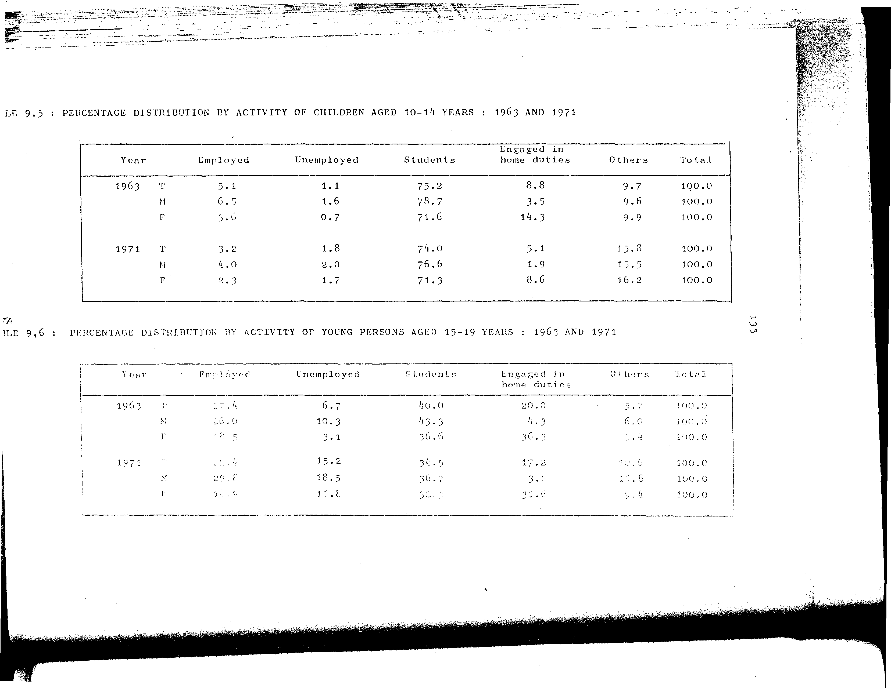

# 9.5: Percentage distribution by activity of children aged 10-14 years: 1963 and 1971


- 📜 Original Table PDF - [data/tables/table-9/table-9-05/original.pdf (53.0 kB)](../../../../data/tables/table-9/table-9-05/original.pdf)
- 📜 Original Table Image - [data/tables/table-9/table-9-05/original.images/image-01.png (114.4 kB)](../../../../data/tables/table-9/table-9-05/original.images/image-01.png)
- 📄 Extracted JSON Data - [data/tables/table-9/table-9-05/data.json (1.8 kB)](../../../../data/tables/table-9/table-9-05/data.json)
- 📄 Extracted TSV Data - [data/tables/table-9/table-9-05/data.tsv (289 B)](../../../../data/tables/table-9/table-9-05/data.tsv)

## Original Table [Image](../../../../data/tables/table-9/table-9-05/original.images/image-01.png)



## Extracted [JSON Data](../../../../data/tables/table-9/table-9-05/data.json)

```json
{
    "found": true,
    "table_no": "9.5",
    "table_name": "Percentage distribution by activity of children aged 10-14 years: 1963 and 1971",
    "primary_keys": [
        "Year",
        "Sex"
    ],
    "field_keys": [
        "Employed",
        "Unemployed",
        "Students",
        "Engaged in home duties",
        "Others",
        "Total"
    ],
    "rows": [
        {
            "Year": 1963,
            "Sex": "T",
            "values": {
                "Employed": 5.1,
                "Unemployed": 1.1,
                "Students": 75.2,
                "Engaged in home duties": 8.8,
                "Others": 9.7,
                "Total": 100.0
            }
        },
        {
            "Year": 1963,
            "Sex": "M",
            "values": {
                "Employed": 6.5,
                "Unemployed": 1.6,
                "Students": 78.7,
                "Engaged in home duties": 3.5,
                "Others": 9.6,
                "Total": 100.0
            }
        },
        {
            "Year": 1963,
            "Sex": "F",
            "values": {
                "Employed": 3.6,
                "Unemployed": 0.7,
                "Students": 71.6,
                "Engaged in home duties": 14.3,
                "Others": 9.9,
                "Total": 100.0
            }
        },
        {
            "Year": 1971,
            "Sex": "T",
            "values": {
                "Employed": 3.2,
                "Unemployed": 1.8,
                "Students": 74.0,
                "Engaged in home duties": 5.1,
                "Others": 15.8,
                "Total": 100.0
            }
        },
        {
            "Year": 1971,
            "Sex": "M",
            "values": {
                "Employed": 4.0,
                "Unemployed": 2.0,
                "Students": 76.6,
                "Engaged in home duties": 1.9,
                "Others": 15.5,
                "Total": 100.0
            }
        },
        {
            "Year": 1971,
            "Sex": "F",
            "values": {
                "Employed": 2.3,
                "Unemployed": 1.7,
                "Students": 71.3,
                "Engaged in home duties": 8.6,
                "Others": 16.2,
                "Total": 100.0
            }
        }
    ],
    "notes": []
}
```

## Extracted [TSV Data](../../../../data/tables/table-9/table-9-05/data.tsv)

| Year | Sex | Employed | Unemployed | Students | Engaged in home duties | Others | Total |
| --- | --- | --- | --- | --- | --- | --- | --- |
| 1963 | T | 5.1 | 1.1 | 75.2 | 8.8 | 9.7 | 100.0 |
| 1963 | M | 6.5 | 1.6 | 78.7 | 3.5 | 9.6 | 100.0 |
| 1963 | F | 3.6 | 0.7 | 71.6 | 14.3 | 9.9 | 100.0 |
| 1971 | T | 3.2 | 1.8 | 74.0 | 5.1 | 15.8 | 100.0 |
| 1971 | M | 4.0 | 2.0 | 76.6 | 1.9 | 15.5 | 100.0 |
| 1971 | F | 2.3 | 1.7 | 71.3 | 8.6 | 16.2 | 100.0 |


[](https://opensource.org/licenses/MIT)
