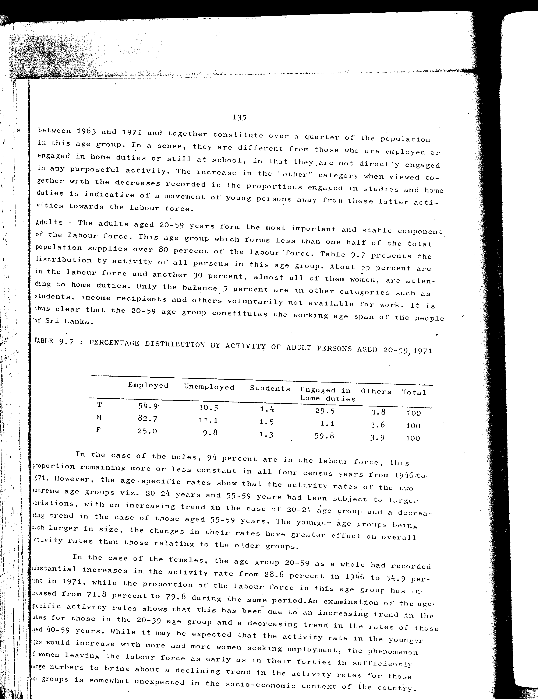

# 9.7: Percentage distribution by activity of adult persons aged 20-59, 1971


- 📜 Original Table PDF - [data/tables/table-9/table-9-07/original.pdf (92.6 kB)](../../../../data/tables/table-9/table-9-07/original.pdf)
- 📜 Original Table Image - [data/tables/table-9/table-9-07/original.images/image-01.png (220.7 kB)](../../../../data/tables/table-9/table-9-07/original.images/image-01.png)
- 📄 Extracted JSON Data - [data/tables/table-9/table-9-07/data.json (970 B)](../../../../data/tables/table-9/table-9-07/data.json)
- 📄 Extracted TSV Data - [data/tables/table-9/table-9-07/data.tsv (155 B)](../../../../data/tables/table-9/table-9-07/data.tsv)

## Extracted [JSON Data](../../../../data/tables/table-9/table-9-07/data.json)

```json
{
    "found": true,
    "table_no": "9.7",
    "table_name": "Percentage distribution by activity of adult persons aged 20-59, 1971",
    "primary_keys": [
        ""
    ],
    "field_keys": [
        "Employed",
        "Unemployed",
        "Students",
        "Engaged in home duties",
        "Others",
        "Total"
    ],
    "rows": [
        {
            "": "T",
            "values": {
                "Employed": 54.9,
                "Unemployed": 10.5,
                "Students": 1.4,
                "Engaged in home duties": 29.5,
                "Others": 3.8,
                "Total": 100
            }
        },
        {
            "": "M",
            "values": {
                "Employed": 82.7,
                "Unemployed": 11.1,
                "Students": 1.5,
                "Engaged in home duties": 1.1,
                "Others": 3.6,
                "Total": 100
            }
        },
        {
            "": "F",
            "values": {
                "Employed": 25.0,
                "Unemployed": 9.8,
                "Students": 1.3,
                "Engaged in home duties": 59.8,
                "Others": 3.9,
                "Total": 100
            }
        }
    ],
    "notes": []
}
```

## Original Table [Image](../../../../data/tables/table-9/table-9-07/original.images/image-01.png)




[](https://opensource.org/licenses/MIT)
