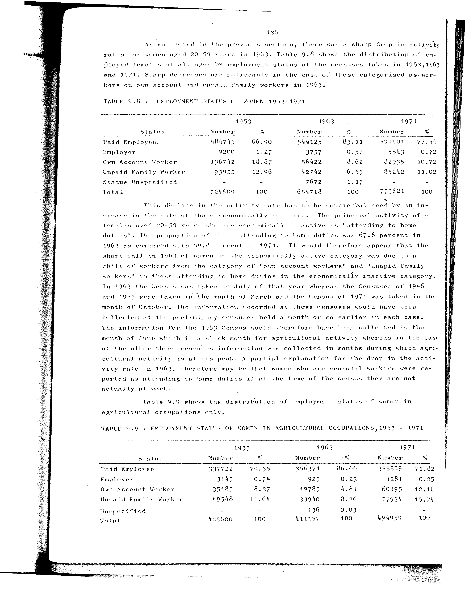

# 9.9: Employment status of women in agricultural occupations, 1953-1971


- 📜 Original Table PDF - [data/tables/table-9/table-9-09/original.pdf (94.1 kB)](../../../../data/tables/table-9/table-9-09/original.pdf)
- 📜 Original Table Image - [data/tables/table-9/table-9-09/original.images/image-01.png (215.0 kB)](../../../../data/tables/table-9/table-9-09/original.images/image-01.png)
- 📄 Extracted JSON Data - [data/tables/table-9/table-9-09/data.json (1.8 kB)](../../../../data/tables/table-9/table-9-09/data.json)
- 📄 Extracted TSV Data - [data/tables/table-9/table-9-09/data.tsv (347 B)](../../../../data/tables/table-9/table-9-09/data.tsv)

## Original Table [Image](../../../../data/tables/table-9/table-9-09/original.images/image-01.png)



## Extracted [JSON Data](../../../../data/tables/table-9/table-9-09/data.json)

```json
{
    "found": true,
    "table_no": "9.9",
    "table_name": "Employment status of women in agricultural occupations, 1953-1971",
    "primary_keys": [
        "Status"
    ],
    "field_keys": [
        "1953 - Number",
        "1953 - %",
        "1963 - Number",
        "1963 - %",
        "1971 - Number",
        "1971 - %"
    ],
    "rows": [
        {
            "Status": "Paid Employee",
            "values": {
                "1953 - Number": 337722,
                "1953 - %": 79.35,
                "1963 - Number": 356371,
                "1963 - %": 86.66,
                "1971 - Number": 355529,
                "1971 - %": 71.82
            }
        },
        {
            "Status": "Employer",
            "values": {
                "1953 - Number": 3145,
                "1953 - %": 0.74,
                "1963 - Number": 925,
                "1963 - %": 0.23,
                "1971 - Number": 1281,
                "1971 - %": 0.25
            }
        },
        {
            "Status": "Own Account Worker",
            "values": {
                "1953 - Number": 35185,
                "1953 - %": 8.27,
                "1963 - Number": 19785,
                "1963 - %": 4.81,
                "1971 - Number": 60195,
                "1971 - %": 12.16
            }
        },
        {
            "Status": "Unpaid Family Worker",
            "values": {
                "1953 - Number": 49548,
                "1953 - %": 11.64,
                "1963 - Number": 33940,
                "1963 - %": 8.26,
                "1971 - Number": 77954,
                "1971 - %": 15.74
            }
        },
        {
            "Status": "Unspecified",
            "values": {
                "1953 - Number": null,
                "1953 - %": null,
                "1963 - Number": 136,
                "1963 - %": 0.03,
                "1971 - Number": null,
                "1971 - %": null
            }
        },
        {
            "Status": "Total",
            "values": {
                "1953 - Number": 425600,
                "1953 - %": 100,
                "1963 - Number": 411157,
                "1963 - %": 100,
                "1971 - Number": 494959,
                "1971 - %": 100
            }
        }
    ],
    "notes": []
}
```

## Extracted [TSV Data](../../../../data/tables/table-9/table-9-09/data.tsv)

| Status | 1953 - Number | 1953 - % | 1963 - Number | 1963 - % | 1971 - Number | 1971 - % |
| --- | --- | --- | --- | --- | --- | --- |
| Paid Employee | 337722 | 79.35 | 356371 | 86.66 | 355529 | 71.82 |
| Employer | 3145 | 0.74 | 925 | 0.23 | 1281 | 0.25 |
| Own Account Worker | 35185 | 8.27 | 19785 | 4.81 | 60195 | 12.16 |
| Unpaid Family Worker | 49548 | 11.64 | 33940 | 8.26 | 77954 | 15.74 |
| Unspecified |  |  | 136 | 0.03 |  |  |
| Total | 425600 | 100 | 411157 | 100 | 494959 | 100 |


[](https://opensource.org/licenses/MIT)
