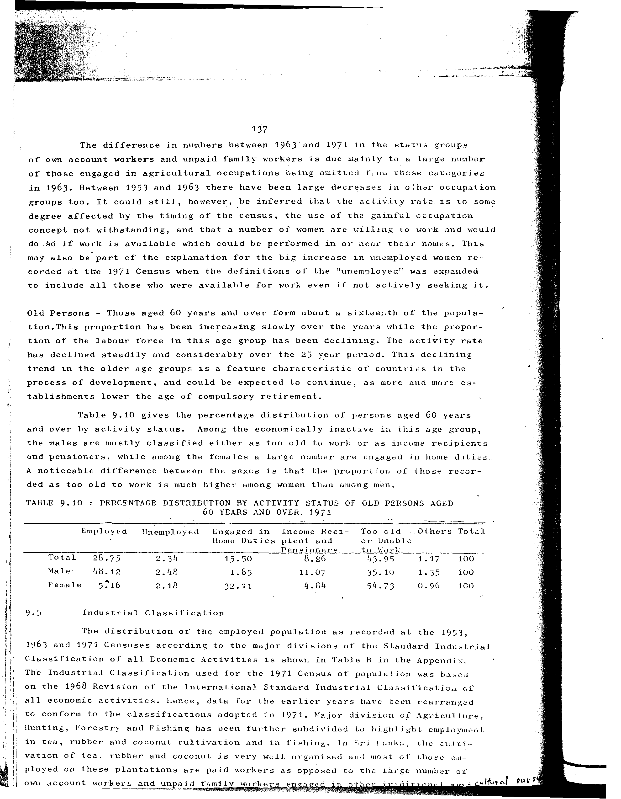

# 9.10: Percentage distribution by activity status of old persons aged 60 years and over, 1971


- 📜 Original Table PDF - [data/tables/table-9/table-9-10/original.pdf (94.8 kB)](../../../../data/tables/table-9/table-9-10/original.pdf)
- 📜 Original Table Image - [data/tables/table-9/table-9-10/original.images/image-01.png (218.7 kB)](../../../../data/tables/table-9/table-9-10/original.images/image-01.png)
- 📄 Extracted JSON Data - [data/tables/table-9/table-9-10/data.json (1.2 kB)](../../../../data/tables/table-9/table-9-10/data.json)

## Extracted [JSON Data](../../../../data/tables/table-9/table-9-10/data.json)

```json
{
    "found": true,
    "table_no": "9.10",
    "table_name": "Percentage distribution by activity status of old persons aged 60 years and over, 1971",
    "primary_keys": [
        ""
    ],
    "field_keys": [
        "Employed",
        "Unemployed",
        "Engaged in",
        "Income Reci-pient and Pensioners",
        "Too old or Unable to Work",
        "Others Total"
    ],
    "rows": [
        {
            "": "Total",
            "values": {
                "Employed": 28.75,
                "Unemployed": 2.34,
                "Engaged in": 15.5,
                "Income Reci-pient and Pensioners": 8.26,
                "Too old or Unable to Work": 43.95,
                "Others Total": 1.17
            }
        },
        {
            "": "Male",
            "values": {
                "Employed": 48.12,
                "Unemployed": 2.48,
                "Engaged in": 1.85,
                "Income Reci-pient and Pensioners": 11.07,
                "Too old or Unable to Work": 35.1,
                "Others Total": 1.35
            }
        },
        {
            "": "Female",
            "values": {
                "Employed": 5.16,
                "Unemployed": 2.18,
                "Engaged in": 32.11,
                "Income Reci-pient and Pensioners": 4.84,
                "Too old or Unable to Work": 54.73,
                "Others Total": 0.96
            }
        }
    ],
    "notes": []
}
```

## Original Table [Image](../../../../data/tables/table-9/table-9-10/original.images/image-01.png)




[](https://opensource.org/licenses/MIT)
