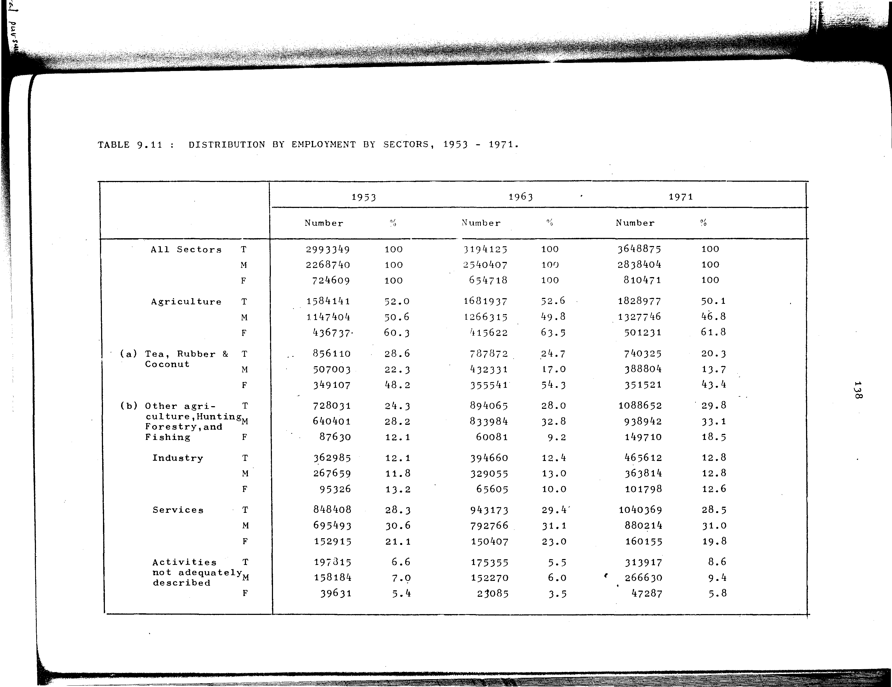

# 9.11: Distribution of employment by sectors, 1953-1971


- 📜 Original Table PDF - [data/tables/table-9/table-9-11/original.pdf (65.3 kB)](../../../../data/tables/table-9/table-9-11/original.pdf)
- 📜 Original Table Image - [data/tables/table-9/table-9-11/original.images/image-01.png (148.1 kB)](../../../../data/tables/table-9/table-9-11/original.images/image-01.png)
- 📄 Extracted JSON Data - [data/tables/table-9/table-9-11/data.json (6.1 kB)](../../../../data/tables/table-9/table-9-11/data.json)
- 📄 Extracted TSV Data - [data/tables/table-9/table-9-11/data.tsv (1.4 kB)](../../../../data/tables/table-9/table-9-11/data.tsv)

## Original Table [Image](../../../../data/tables/table-9/table-9-11/original.images/image-01.png)



## Extracted [JSON Data](../../../../data/tables/table-9/table-9-11/data.json)

```json
{
    "found": true,
    "table_no": "9.11",
    "table_name": "Distribution of employment by sectors, 1953-1971",
    "primary_keys": [
        "Sector",
        "Gender"
    ],
    "field_keys": [
        "1953 - Number",
        "1953 - %",
        "1963 - Number",
        "1963 - %",
        "1971 - Number",
        "1971 - %"
    ],
    "rows": [
        {
            "Sector": "All Sectors",
            "Gender": "T",
            "values": {
                "1953 - Number": 2993349,
                "1953 - %": 100,
                "1963 - Number": 3194125,
                "1963 - %": 100,
                "1971 - Number": 3648875,
                "1971 - %": 100
            }
        },
        {
            "Sector": "All Sectors",
            "Gender": "M",
            "values": {
                "1953 - Number": 2268740,
                "1953 - %": 100,
                "1963 - Number": 2540407,
                "1963 - %": 100,
                "1971 - Number": 2838404,
                "1971 - %": 100
            }
        },
        {
            "Sector": "All Sectors",
            "Gender": "F",
            "values": {
                "1953 - Number": 724609,
                "1953 - %": 100,
                "1963 - Number": 654718,
                "1963 - %": 100,
                "1971 - Number": 810471,
                "1971 - %": 100
            }
        },
        {
            "Sector": "Agriculture",
            "Gender": "T",
            "values": {
                "1953 - Number": 1584141,
                "1953 - %": 52.0,
                "1963 - Number": 1681937,
                "1963 - %": 52.6,
                "1971 - Number": 1828977,
                "1971 - %": 50.1
            }
        },
        {
            "Sector": "Agriculture",
            "Gender": "M",
            "values": {
                "1953 - Number": 1147404,
                "1953 - %": 50.6,
                "1963 - Number": 1266315,
                "1963 - %": 49.8,
                "1971 - Number": 1327746,
                "1971 - %": 46.8
            }
        },
        {
            "Sector": "Agriculture",
            "Gender": "F",
            "values": {
                "1953 - Number": 436737,
                "1953 - %": 60.3,
                "1963 - Number": 415622,
                "1963 - %": 63.5,
                "1971 - Number": 501231,
                "1971 - %": 61.8
            }
        },
        {
            "Sector": "(a) Tea, Rubber & Coconut",
            "Gender": "T",
            "values": {
                "1953 - Number": 856110,
                "1953 - %": 28.6,
                "1963 - Number": 787872,
                "1963 - %": 24.7,
                "1971 - Number": 740325,
                "1971 - %": 20.3
            }
        },
        {
            "Sector": "(a) Tea, Rubber & Coconut",
            "Gender": "M",
            "values": {
                "1953 - Number": 507003,
                "1953 - %": 22.3,
                "1963 - Number": 432331,
                "1963 - %": 17.0,
                "1971 - Number": 388804,
                "1971 - %": 13.7
            }
        },
        {
            "Sector": "(a) Tea, Rubber & Coconut",
            "Gender": "F",
            "values": {
                "1953 - Number": 349107,
                "1953 - %": 48.2,
                "1963 - Number": 355541,
                "1963 - %": 54.3,
                "1971 - Number": 351521,
                "1971 - %": 43.4
            }
        },
        {
            "Sector": "(b) Other agriculture, Hunting, Forestry, and Fishing",
            "Gender": "T",
            "values": {
                "1953 - Number": 728031,
                "1953 - %": 24.3,
                "1963 - Number": 894065,
                "1963 - %": 28.0,
                "1971 - Number": 1088652,
                "1971 - %": 29.8
            }
        },
        {
            "Sector": "(b) Other agriculture, Hunting, Forestry, and Fishing",
            "Gender": "M",
            "values": {
                "1953 - Number": 640401,
                "1953 - %": 28.2,
                "1963 - Number": 833984,
                "1963 - %": 32.8,
                "1971 - Number": 938942,
                "1971 - %": 33.1
            }
        },
        {
            "Sector": "(b) Other agriculture, Hunting, Forestry, and Fishing",
            "Gender": "F",
            "values": {
                "1953 - Number": 87630,
                "1953 - %": 12.1,
                "1963 - Number": 60081,
                "1963 - %": 9.2,
                "1971 - Number": 149710,
                "1971 - %": 18.5
            }
        },
        {
            "Sector": "Industry",
            "Gender": "T",
            "values": {
                "1953 - Number": 362985,
                "1953 - %": 12.1,
                "1963 - Number": 394660,
                "1963 - %": 12.4,
                "1971 - Number": 465612,
                "1971 - %": 12.8
            }
        },
        {
            "Sector": "Industry",
            "Gender": "M",
            "values": {
                "1953 - Number": 267659,
                "1953 - %": 11.8,
                "1963 - Number": 329055,
                "1963 - %": 13.0,
                "1971 - Number": 363814,
                "1971 - %": 12.8
            }
        },
        {
            "Sector": "Industry",
            "Gender": "F",
            "values": {
                "1953 - Number": 95326,
                "1953 - %": 13.2,
                "1963 - Number": 65605,
                "1963 - %": 10.0,
                "1971 - Number": 101798,
                "1971 - %": 12.6
            }
        },
        {
            "Sector": "Services",
            "Gender": "T",
            "values": {
                "1953 - Number": 848408,
                "1953 - %": 28.3,
                "1963 - Number": 943173,
                "1963 - %": 29.4,
                "1971 - Number": 1040369,
                "1971 - %": 28.5
            }
        },
        {
            "Sector": "Services",
            "Gender": "M",
            "values": {
                "1953 - Number": 695493,
                "1953 - %": 30.6,
                "1963 - Number": 792766,
                "1963 - %": 31.1,
                "1971 - Number": 880214,
                "1971 - %": 31.0
            }
        },
        {
            "Sector": "Services",
            "Gender": "F",
            "values": {
                "1953 - Number": 152915,
                "1953 - %": 21.1,
                "1963 - Number": 150407,
                "1963 - %": 23.0,
                "1971 - Number": 160155,
                "1971 - %": 19.8
            }
        },
        {
            "Sector": "Activities not adequately described",
            "Gender": "T",
            "values": {
                "1953 - Number": 197315,
                "1953 - %": 6.6,
                "1963 - Number": 175355,
                "1963 - %": 5.5,
                "1971 - Number": 313917,
                "1971 - %": 8.6
            }
        },
        {
            "Sector": "Activities not adequately described",
            "Gender": "M",
            "values": {
                "1953 - Number": 158184,
                "1953 - %": 7.0,
                "1963 - Number": 152270,
                "1963 - %": 6.0,
                "1971 - Number": 266630,
                "1971 - %": 9.4
            }
        },
        {
            "Sector": "Activities not adequately described",
            "Gender": "F",
            "values": {
                "1953 - Number": 39631,
                "1953 - %": 5.4,
                "1963 - Number": 23085,
                "1963 - %": 3.5,
                "1971 - Number": 47287,
                "1971 - %": 5.8
            }
        }
    ],
    "notes": []
}
```

## Extracted [TSV Data](../../../../data/tables/table-9/table-9-11/data.tsv)

| Sector | Gender | 1953 - Number | 1953 - % | 1963 - Number | 1963 - % | 1971 - Number | 1971 - % |
| --- | --- | --- | --- | --- | --- | --- | --- |
| All Sectors | T | 2993349 | 100 | 3194125 | 100 | 3648875 | 100 |
| All Sectors | M | 2268740 | 100 | 2540407 | 100 | 2838404 | 100 |
| All Sectors | F | 724609 | 100 | 654718 | 100 | 810471 | 100 |
| Agriculture | T | 1584141 | 52.0 | 1681937 | 52.6 | 1828977 | 50.1 |
| Agriculture | M | 1147404 | 50.6 | 1266315 | 49.8 | 1327746 | 46.8 |
| Agriculture | F | 436737 | 60.3 | 415622 | 63.5 | 501231 | 61.8 |
| (a) Tea, Rubber & Coconut | T | 856110 | 28.6 | 787872 | 24.7 | 740325 | 20.3 |
| (a) Tea, Rubber & Coconut | M | 507003 | 22.3 | 432331 | 17.0 | 388804 | 13.7 |
| (a) Tea, Rubber & Coconut | F | 349107 | 48.2 | 355541 | 54.3 | 351521 | 43.4 |
| (b) Other agriculture, Hunting, Forestry, and Fishing | T | 728031 | 24.3 | 894065 | 28.0 | 1088652 | 29.8 |
| (b) Other agriculture, Hunting, Forestry, and Fishing | M | 640401 | 28.2 | 833984 | 32.8 | 938942 | 33.1 |
| (b) Other agriculture, Hunting, Forestry, and Fishing | F | 87630 | 12.1 | 60081 | 9.2 | 149710 | 18.5 |
| Industry | T | 362985 | 12.1 | 394660 | 12.4 | 465612 | 12.8 |
| Industry | M | 267659 | 11.8 | 329055 | 13.0 | 363814 | 12.8 |
| Industry | F | 95326 | 13.2 | 65605 | 10.0 | 101798 | 12.6 |
| Services | T | 848408 | 28.3 | 943173 | 29.4 | 1040369 | 28.5 |
| Services | M | 695493 | 30.6 | 792766 | 31.1 | 880214 | 31.0 |
| Services | F | 152915 | 21.1 | 150407 | 23.0 | 160155 | 19.8 |
| Activities not adequately described | T | 197315 | 6.6 | 175355 | 5.5 | 313917 | 8.6 |
| Activities not adequately described | M | 158184 | 7.0 | 152270 | 6.0 | 266630 | 9.4 |
| Activities not adequately described | F | 39631 | 5.4 | 23085 | 3.5 | 47287 | 5.8 |


[](https://opensource.org/licenses/MIT)
