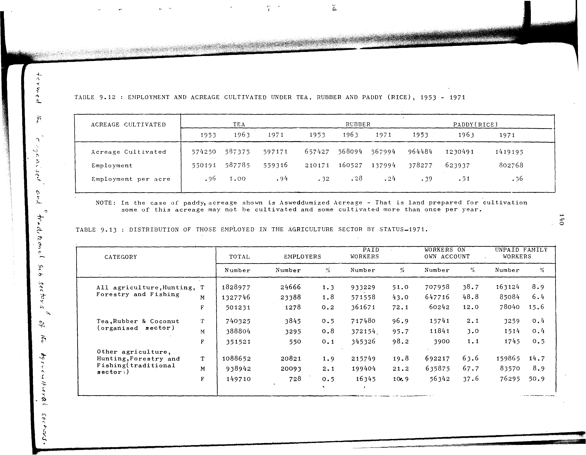

# 9.12: Employment and acreage cultivated under tea, rubber and paddy (rice), 1953-1971


- 📜 Original Table PDF - [data/tables/table-9/table-9-12/original.pdf (69.0 kB)](../../../../data/tables/table-9/table-9-12/original.pdf)
- 📜 Original Table Image - [data/tables/table-9/table-9-12/original.images/image-01.png (161.4 kB)](../../../../data/tables/table-9/table-9-12/original.images/image-01.png)
- 📄 Extracted JSON Data - [data/tables/table-9/table-9-12/data.json (1.8 kB)](../../../../data/tables/table-9/table-9-12/data.json)
- 📄 Extracted Normalized JSON Data - [data/tables/table-9/table-9-12/normalized_data.json (1.1 kB)](../../../../data/tables/table-9/table-9-12/normalized_data.json)
- 📄 Extracted TSV Data - [data/tables/table-9/table-9-12/data.tsv (377 B)](../../../../data/tables/table-9/table-9-12/data.tsv)

## Original Table [Image](../../../../data/tables/table-9/table-9-12/original.images/image-01.png)



## Extracted [JSON Data](../../../../data/tables/table-9/table-9-12/data.json)

```json
{
    "found": true,
    "table_no": "9.12",
    "table_name": "Employment and acreage cultivated under tea, rubber and paddy (rice), 1953-1971",
    "primary_keys": [
        "ACREAGE CULTIVATED"
    ],
    "field_keys": [
        "TEA - 1953",
        "TEA - 1963",
        "TEA - 1971",
        "RUBBER - 1953",
        "RUBBER - 1963",
        "RUBBER - 1971",
        "PADDY(RICE) - 1953",
        "PADDY(RICE) - 1963",
        "PADDY(RICE) - 1971"
    ],
    "rows": [
        {
            "ACREAGE CULTIVATED": "Acreage Cultivated",
            "values": {
                "TEA - 1953": 574250,
                "TEA - 1963": 587375,
                "TEA - 1971": 597171,
                "RUBBER - 1953": 657427,
                "RUBBER - 1963": 568094,
                "RUBBER - 1971": 567994,
                "PADDY(RICE) - 1953": 964484,
                "PADDY(RICE) - 1963": 1230491,
                "PADDY(RICE) - 1971": 1419195
            }
        },
        {
            "ACREAGE CULTIVATED": "Employment",
            "values": {
                "TEA - 1953": 550191,
                "TEA - 1963": 587785,
                "TEA - 1971": 559316,
                "RUBBER - 1953": 210171,
                "RUBBER - 1963": 160527,
                "RUBBER - 1971": 137994,
                "PADDY(RICE) - 1953": 378277,
                "PADDY(RICE) - 1963": 623937,
                "PADDY(RICE) - 1971": 802768
            }
        },
        {
            "ACREAGE CULTIVATED": "Employment per acre",
            "values": {
                "TEA - 1953": 0.96,
                "TEA - 1963": 1.0,
                "TEA - 1971": 0.94,
                "RUBBER - 1953": 0.32,
                "RUBBER - 1963": 0.28,
                "RUBBER - 1971": 0.24,
                "PADDY(RICE) - 1953": 0.39,
                "PADDY(RICE) - 1963": 0.51,
                "PADDY(RICE) - 1971": 0.56
            }
        }
    ],
    "notes": [
        "In the case of paddy, acreage shown is Asweddumized Acreage - That is land prepared for cultivation some of this acreage may not be cultivated and some cultivated more than once per year."
    ]
}
```

## Extracted [Normalized JSON Data](../../../../data/tables/table-9/table-9-12/normalized_data.json)

```json
[
    {
        "ACREAGE CULTIVATED": "Acreage Cultivated",
        "values": {
            "TEA - 1953": 574250,
            "TEA - 1963": 587375,
            "TEA - 1971": 597171,
            "RUBBER - 1953": 657427,
            "RUBBER - 1963": 568094,
            "RUBBER - 1971": 567994,
            "PADDY(RICE) - 1953": 964484,
            "PADDY(RICE) - 1963": 1230491,
            "PADDY(RICE) - 1971": 1419195
        }
    },
    {
        "ACREAGE CULTIVATED": "Employment",
        "values": {
            "TEA - 1953": 550191,
            "TEA - 1963": 587785,
            "TEA - 1971": 559316,
            "RUBBER - 1953": 210171,
            "RUBBER - 1963": 160527,
            "RUBBER - 1971": 137994,
            "PADDY(RICE) - 1953": 378277,
            "PADDY(RICE) - 1963": 623937,
            "PADDY(RICE) - 1971": 802768
        }
    },
    {
        "ACREAGE CULTIVATED": "Employment per acre",
        "values": {
            "TEA - 1953": 0.96,
            "TEA - 1963": 1.0,
            "TEA - 1971": 0.94,
            "RUBBER - 1953": 0.32,
            "RUBBER - 1963": 0.28,
            "RUBBER - 1971": 0.24,
            "PADDY(RICE) - 1953": 0.39,
            "PADDY(RICE) - 1963": 0.51,
            "PADDY(RICE) - 1971": 0.56
        }
    }
]
```

## Extracted [TSV Data](../../../../data/tables/table-9/table-9-12/data.tsv)

| ACREAGE CULTIVATED | TEA - 1953 | TEA - 1963 | TEA - 1971 | RUBBER - 1953 | RUBBER - 1963 | RUBBER - 1971 | PADDY(RICE) - 1953 | PADDY(RICE) - 1963 | PADDY(RICE) - 1971 |
| --- | --- | --- | --- | --- | --- | --- | --- | --- | --- |
| Acreage Cultivated | 574250 | 587375 | 597171 | 657427 | 568094 | 567994 | 964484 | 1230491 | 1419195 |
| Employment | 550191 | 587785 | 559316 | 210171 | 160527 | 137994 | 378277 | 623937 | 802768 |
| Employment per acre | 0.96 | 1.0 | 0.94 | 0.32 | 0.28 | 0.24 | 0.39 | 0.51 | 0.56 |


[](https://opensource.org/licenses/MIT)
