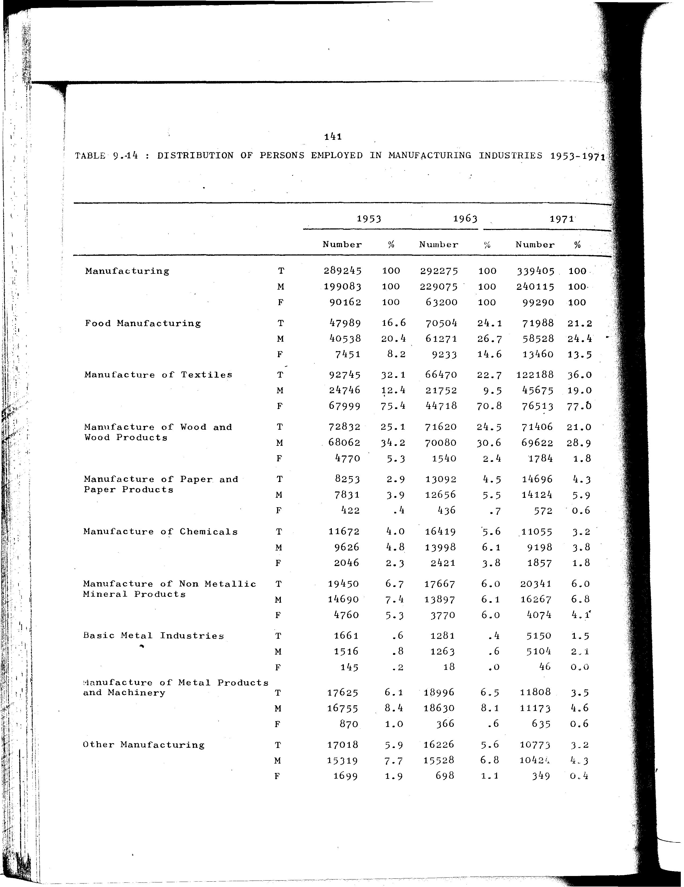

# 9.14: Distribution of persons employed in manufacturing industries 1953-1971


- 📜 Original Table PDF - [data/tables/table-9/table-9-14/original.pdf (60.9 kB)](../../../../data/tables/table-9/table-9-14/original.pdf)
- 📜 Original Table Image - [data/tables/table-9/table-9-14/original.images/image-01.png (157.1 kB)](../../../../data/tables/table-9/table-9-14/original.images/image-01.png)
- 📄 Extracted JSON Data - [data/tables/table-9/table-9-14/data.json (8.6 kB)](../../../../data/tables/table-9/table-9-14/data.json)
- 📄 Extracted Normalized JSON Data - [data/tables/table-9/table-9-14/normalized_data.json (7.6 kB)](../../../../data/tables/table-9/table-9-14/normalized_data.json)
- 📄 Extracted TSV Data - [data/tables/table-9/table-9-14/data.tsv (1.9 kB)](../../../../data/tables/table-9/table-9-14/data.tsv)

## Original Table [Image](../../../../data/tables/table-9/table-9-14/original.images/image-01.png)



## Extracted [TSV Data](../../../../data/tables/table-9/table-9-14/data.tsv)

| Industry | Sex | 1953 - Number | 1953 - % | 1963 - Number | 1963 - % | 1971 - Number | 1971 - % |
| --- | --- | --- | --- | --- | --- | --- | --- |
| Manufacturing | T | 289245 | 100 | 292275 | 100 | 339405 | 100 |
| Manufacturing | M | 199083 | 100 | 229075 | 100 | 240115 | 100 |
| Manufacturing | F | 90162 | 100 | 63200 | 100 | 99290 | 100 |
| Food Manufacturing | T | 47989 | 16.6 | 70504 | 24.1 | 71988 | 21.2 |
| Food Manufacturing | M | 40538 | 20.4 | 61271 | 26.7 | 58528 | 24.4 |
| Food Manufacturing | F | 7451 | 8.2 | 9233 | 14.6 | 13460 | 13.5 |
| Manufacture of Textiles | T | 92745 | 32.1 | 66470 | 22.7 | 122188 | 36.0 |
| Manufacture of Textiles | M | 24746 | 12.4 | 21752 | 9.5 | 45675 | 19.0 |
| Manufacture of Textiles | F | 67999 | 75.4 | 44718 | 70.8 | 76513 | 77.0 |
| Manufacture of Wood and Wood Products | T | 72832 | 25.1 | 71620 | 24.5 | 71406 | 21.0 |
| Manufacture of Wood and Wood Products | M | 68062 | 34.2 | 70080 | 30.6 | 69622 | 28.9 |
| Manufacture of Wood and Wood Products | F | 4770 | 5.3 | 1540 | 2.4 | 1784 | 1.8 |
| Manufacture of Paper and Paper Products | T | 8253 | 2.9 | 13092 | 4.5 | 14696 | 4.3 |
| Manufacture of Paper and Paper Products | M | 7831 | 3.9 | 12656 | 5.5 | 14124 | 5.9 |
| Manufacture of Paper and Paper Products | F | 422 | 0.4 | 436 | 0.7 | 572 | 0.6 |
| Manufacture of Chemicals | T | 11672 | 4.0 | 16419 | 5.6 | 11055 | 3.2 |
| Manufacture of Chemicals | M | 9626 | 4.8 | 13998 | 6.1 | 9198 | 3.8 |
| Manufacture of Chemicals | F | 2046 | 2.3 | 2421 | 3.8 | 1857 | 1.8 |
| Manufacture of Non Metallic Mineral Products | T | 19450 | 6.7 | 17667 | 6.0 | 20341 | 6.0 |
| Manufacture of Non Metallic Mineral Products | M | 14690 | 7.4 | 13897 | 6.1 | 16267 | 6.8 |
| Manufacture of Non Metallic Mineral Products | F | 4760 | 5.3 | 3770 | 6.0 | 4074 | 4.1 |
| Basic Metal Industries | T | 1661 | 0.6 | 1281 | 0.4 | 5150 | 1.5 |
| Basic Metal Industries | M | 1516 | 0.8 | 1263 | 0.6 | 5104 | 2.1 |
| Basic Metal Industries | F | 145 | 0.2 | 18 | 0.0 | 46 | 0.0 |
| Manufacture of Metal Products and Machinery | T | 17625 | 6.1 | 18996 | 6.5 | 11808 | 3.5 |
| Manufacture of Metal Products and Machinery | M | 16755 | 8.4 | 18630 | 8.1 | 11173 | 4.6 |
| Manufacture of Metal Products and Machinery | F | 870 | 1.0 | 366 | 0.6 | 635 | 0.6 |
| Other Manufacturing | T | 17018 | 5.9 | 16226 | 5.6 | 10773 | 3.2 |
| Other Manufacturing | M | 15319 | 7.7 | 15528 | 6.8 | 10424 | 4.3 |
| Other Manufacturing | F | 1699 | 1.9 | 698 | 1.1 | 349 | 0.4 |

## Extracted [JSON Data](../../../../data/tables/table-9/table-9-14/data.json)

```json
{
    "found": true,
    "table_no": "9.14",
    "table_name": "Distribution of persons employed in manufacturing industries 1953-1971",
    "primary_keys": [
        "Industry",
        "Sex"
    ],
    "field_keys": [
        "1953 - Number",
        "1953 - %",
        "1963 - Number",
        "1963 - %",
        "1971 - Number",
        "1971 - %"
    ],
    "rows": [
        {
            "Industry": "Manufacturing",
            "Sex": "T",
            "values": {
                "1953 - Number": 289245,
                "1953 - %": 100,
                "1963 - Number": 292275,
                "1963 - %": 100,
                "1971 - Number": 339405,
                "1971 - %": 100
            }
        },
        {
            "Industry": "Manufacturing",
            "Sex": "M",
            "values": {
                "1953 - Number": 199083,
                "1953 - %": 100,
                "1963 - Number": 229075,
                "1963 - %": 100,
                "1971 - Number": 240115,
                "1971 - %": 100
            }
        },
        {
            "Industry": "Manufacturing",
            "Sex": "F",
            "values": {
                "1953 - Number": 90162,
                "1953 - %": 100,
                "1963 - Number": 63200,
                "1963 - %": 100,
                "1971 - Number": 99290,
                "1971 - %": 100
            }
        },
        {
            "Industry": "Food Manufacturing",
            "Sex": "T",
            "values": {
                "1953 - Number": 47989,
                "1953 - %": 16.6,
                "1963 - Number": 70504,
                "1963 - %": 24.1,
                "1971 - Number": 71988,
                "1971 - %": 21.2
            }
        },
        {
            "Industry": "Food Manufacturing",
            "Sex": "M",
            "values": {
                "1953 - Number": 40538,
                "1953 - %": 20.4,
                "1963 - Number": 61271,
                "1963 - %": 26.7,
                "1971 - Number": 58528,
                "1971 - %": 24.4
            }
        },
        {
            "Industry": "Food Manufacturing",
            "Sex": "F",
            "values": {
                "1953 - Number": 7451,
                "1953 - %": 8.2,
                "1963 - Number": 9233,
                "1963 - %": 14.6,
                "1971 - Number": 13460,
                "1971 - %": 13.5
            }
        },
        {
            "Industry": "Manufacture of Textiles",
            "Sex": "T",
            "values": {
                "1953 - Number": 92745,
                "1953 - %": 32.1,
                "1963 - Number": 66470,
                "1963 - %": 22.7,
                "1971 - Number": 122188,
                "1971 - %": 36.0
            }
        },
        {
            "Industry": "Manufacture of Textiles",
            "Sex": "M",
            "values": {
                "1953 - Number": 24746,
                "1953 - %": 12.4,
                "1963 - Number": 21752,
                "1963 - %": 9.5,
                "1971 - Number": 45675,
                "1971 - %": 19.0
            }
        },
        {
            "Industry": "Manufacture of Textiles",
            "Sex": "F",
            "values": {
                "1953 - Number": 67999,
                "1953 - %": 75.4,
                "1963 - Number": 44718,
                "1963 - %": 70.8,
                "1971 - Number": 76513,
                "1971 - %": 77.0
            }
        },
        {
            "Industry": "Manufacture of Wood and Wood Products",
            "Sex": "T",
            "values": {
                "1953 - Number": 72832,
                "1953 - %": 25.1,
                "1963 - Number": 71620,
                "1963 - %": 24.5,
                "1971 - Number": 71406,
                "1971 - %": 21.0
            }
        },
        {
            "Industry": "Manufacture of Wood and Wood Products",
            "Sex": "M",
            "values": {
                "1953 - Number": 68062,
                "1953 - %": 34.2,
                "1963 - Number": 70080,
                "1963 - %": 30.6,
                "1971 - Number": 69622,
                "1971 - %": 28.9
            }
        },
        {
            "Industry": "Manufacture of Wood and Wood Products",
            "Sex": "F",
            "values": {
                "1953 - Number": 4770,
                "1953 - %": 5.3,
                "1963 - Number": 1540,
                "1963 - %": 2.4,
                "1971 - Number": 1784,
                "1971 - %": 1.8
            }
        },
        {
            "Industry": "Manufacture of Paper and Paper Products",
            "Sex": "T",
            "values": {
                "1953 - Number": 8253,
                "1953 - %": 2.9,
                "1963 - Number": 13092,
                "1963 - %": 4.5,
                "1971 - Number": 14696,
                "1971 - %": 4.3
            }
        },
        {
            "Industry": "Manufacture of Paper and Paper Products",
            "Sex": "M",
            "values": {
                "1953 - Number": 7831,
                "1953 - %": 3.9,
                "1963 - Number": 12656,
                "1963 - %": 5.5,
                "1971 - Number": 14124,
                "1971 - %": 5.9
            }
        },
        {
            "Industry": "Manufacture of Paper and Paper Products",
            "Sex": "F",
            "values": {
                "1953 - Number": 422,
                "1953 - %": 0.4,
                "1963 - Number": 436,
                "1963 - %": 0.7,
                "1971 - Number": 572,
                "1971 - %": 0.6
            }
        },
        {
            "Industry": "Manufacture of Chemicals",
            "Sex": "T",
            "values": {
                "1953 - Number": 11672,
                "1953 - %": 4.0,
                "1963 - Number": 16419,
                "1963 - %": 5.6,
                "1971 - Number": 11055,
                "1971 - %": 3.2
            }
        },
        {
            "Industry": "Manufacture of Chemicals",
            "Sex": "M",
            "values": {
                "1953 - Number": 9626,
                "1953 - %": 4.8,
                "1963 - Number": 13998,
                "1963 - %": 6.1,
                "1971 - Number": 9198,
                "1971 - %": 3.8
            }
        },
        {
            "Industry": "Manufacture of Chemicals",
            "Sex": "F",
            "values": {
                "1953 - Number": 2046,
                "1953 - %": 2.3,
                "1963 - Number": 2421,
                "1963 - %": 3.8,
                "1971 - Number": 1857,
                "1971 - %": 1.8
            }
        },
        {
            "Industry": "Manufacture of Non Metallic Mineral Products",
            "Sex": "T",
            "values": {
                "1953 - Number": 19450,
                "1953 - %": 6.7,
                "1963 - Number": 17667,
                "1963 - %": 6.0,
                "1971 - Number": 20341,
                "1971 - %": 6.0
            }
        },
        {
            "Industry": "Manufacture of Non Metallic Mineral Products",
            "Sex": "M",
            "values": {
                "1953 - Number": 14690,
                "1953 - %": 7.4,
                "1963 - Number": 13897,
                "1963 - %": 6.1,
                "1971 - Number": 16267,
                "1971 - %": 6.8
            }
        },
        {
            "Industry": "Manufacture of Non Metallic Mineral Products",
            "Sex": "F",
            "values": {
                "1953 - Number": 4760,
                "1953 - %": 5.3,
                "1963 - Number": 3770,
                "1963 - %": 6.0,
                "1971 - Number": 4074,
                "1971 - %": 4.1
            }
        },
        {
            "Industry": "Basic Metal Industries",
            "Sex": "T",
            "values": {
                "1953 - Number": 1661,
                "1953 - %": 0.6,
                "1963 - Number": 1281,
                "1963 - %": 0.4,
                "1971 - Number": 5150,
                "1971 - %": 1.5
            }
        },
        {
            "Industry": "Basic Metal Industries",
            "Sex": "M",
            "values": {
                "1953 - Number": 1516,
                "1953 - %": 0.8,
                "1963 - Number": 1263,
                "1963 - %": 0.6,
                "1971 - Number": 5104,
                "1971 - %": 2.1
            }
        },
        {
            "Industry": "Basic Metal Industries",
            "Sex": "F",
            "values": {
                "1953 - Number": 145,
                "1953 - %": 0.2,
                "1963 - Number": 18,
                "1963 - %": 0.0,
                "1971 - Number": 46,
                "1971 - %": 0.0
            }
        },
        {
            "Industry": "Manufacture of Metal Products and Machinery",
            "Sex": "T",
            "values": {
                "1953 - Number": 17625,
                "1953 - %": 6.1,
                "1963 - Number": 18996,
                "1963 - %": 6.5,
                "1971 - Number": 11808,
                "1971 - %": 3.5
            }
        },
        {
            "Industry": "Manufacture of Metal Products and Machinery",
            "Sex": "M",
            "values": {
                "1953 - Number": 16755,
                "1953 - %": 8.4,
                "1963 - Number": 18630,
                "1963 - %": 8.1,
                "1971 - Number": 11173,
                "1971 - %": 4.6
            }
        },
        {
            "Industry": "Manufacture of Metal Products and Machinery",
            "Sex": "F",
            "values": {
                "1953 - Number": 870,
                "1953 - %": 1.0,
                "1963 - Number": 366,
                "1963 - %": 0.6,
                "1971 - Number": 635,
                "1971 - %": 0.6
            }
        },
        {
            "Industry": "Other Manufacturing",
            "Sex": "T",
            "values": {
                "1953 - Number": 17018,
                "1953 - %": 5.9,
                "1963 - Number": 16226,
                "1963 - %": 5.6,
                "1971 - Number": 10773,
                "1971 - %": 3.2
            }
        },
        {
            "Industry": "Other Manufacturing",
            "Sex": "M",
            "values": {
                "1953 - Number": 15319,
                "1953 - %": 7.7,
                "1963 - Number": 15528,
                "1963 - %": 6.8,
                "1971 - Number": 10424,
                "1971 - %": 4.3
            }
        },
        {
            "Industry": "Other Manufacturing",
            "Sex": "F",
            "values": {
                "1953 - Number": 1699,
                "1953 - %": 1.9,
                "1963 - Number": 698,
                "1963 - %": 1.1,
                "1971 - Number": 349,
                "1971 - %": 0.4
            }
        }
    ],
    "notes": []
}
```

## Extracted [Normalized JSON Data](../../../../data/tables/table-9/table-9-14/normalized_data.json)

```json
[
    {
        "Industry": "Manufacturing",
        "Sex": "T",
        "values": {
            "1953 - Number": 289245,
            "1953 - %": 100,
            "1963 - Number": 292275,
            "1963 - %": 100,
            "1971 - Number": 339405,
            "1971 - %": 100
        }
    },
    {
        "Industry": "Manufacturing",
        "Sex": "M",
        "values": {
            "1953 - Number": 199083,
            "1953 - %": 100,
            "1963 - Number": 229075,
            "1963 - %": 100,
            "1971 - Number": 240115,
            "1971 - %": 100
        }
    },
    {
        "Industry": "Manufacturing",
        "Sex": "F",
        "values": {
            "1953 - Number": 90162,
            "1953 - %": 100,
            "1963 - Number": 63200,
            "1963 - %": 100,
            "1971 - Number": 99290,
            "1971 - %": 100
        }
    },
    {
        "Industry": "Food Manufacturing",
        "Sex": "T",
        "values": {
            "1953 - Number": 47989,
            "1953 - %": 16.6,
            "1963 - Number": 70504,
            "1963 - %": 24.1,
            "1971 - Number": 71988,
            "1971 - %": 21.2
        }
    },
    {
        "Industry": "Food Manufacturing",
        "Sex": "M",
        "values": {
            "1953 - Number": 40538,
            "1953 - %": 20.4,
            "1963 - Number": 61271,
            "1963 - %": 26.7,
            "1971 - Number": 58528,
            "1971 - %": 24.4
        }
    },
    {
        "Industry": "Food Manufacturing",
        "Sex": "F",
        "values": {
            "1953 - Number": 7451,
            "1953 - %": 8.2,
            "1963 - Number": 9233,
            "1963 - %": 14.6,
            "1971 - Number": 13460,
            "1971 - %": 13.5
        }
    },
    {
        "Industry": "Manufacture of Textiles",
        "Sex": "T",
        "values": {
            "1953 - Number": 92745,
            "1953 - %": 32.1,
            "1963 - Number": 66470,
            "1963 - %": 22.7,
            "1971 - Number": 122188,
            "1971 - %": 36.0
        }
    },
    {
        "Industry": "Manufacture of Textiles",
        "Sex": "M",
        "values": {
            "1953 - Number": 24746,
            "1953 - %": 12.4,
            "1963 - Number": 21752,
            "1963 - %": 9.5,
            "1971 - Number": 45675,
            "1971 - %": 19.0
        }
    },
    {
        "Industry": "Manufacture of Textiles",
        "Sex": "F",
        "values": {
            "1953 - Number": 67999,
            "1953 - %": 75.4,
            "1963 - Number": 44718,
            "1963 - %": 70.8,
            "1971 - Number": 76513,
            "1971 - %": 77.0
        }
    },
    {
        "Industry": "Manufacture of Wood and Wood Products",
        "Sex": "T",
        "values": {
            "1953 - Number": 72832,
            "1953 - %": 25.1,
            "1963 - Number": 71620,
            "1963 - %": 24.5,
            "1971 - Number": 71406,
            "1971 - %": 21.0
        }
    },
    {
        "Industry": "Manufacture of Wood and Wood Products",
        "Sex": "M",
        "values": {
            "1953 - Number": 68062,
            "1953 - %": 34.2,
            "1963 - Number": 70080,
            "1963 - %": 30.6,
            "1971 - Number": 69622,
            "1971 - %": 28.9
        }
    },
    {
        "Industry": "Manufacture of Wood and Wood Products",
        "Sex": "F",
        "values": {
            "1953 - Number": 4770,
            "1953 - %": 5.3,
            "1963 - Number": 1540,
            "1963 - %": 2.4,
            "1971 - Number": 1784,
            "1971 - %": 1.8
        }
    },
    {
        "Industry": "Manufacture of Paper and Paper Products",
        "Sex": "T",
        "values": {
            "1953 - Number": 8253,
            "1953 - %": 2.9,
            "1963 - Number": 13092,
            "1963 - %": 4.5,
            "1971 - Number": 14696,
            "1971 - %": 4.3
        }
    },
    {
        "Industry": "Manufacture of Paper and Paper Products",
        "Sex": "M",
        "values": {
            "1953 - Number": 7831,
            "1953 - %": 3.9,
            "1963 - Number": 12656,
            "1963 - %": 5.5,
            "1971 - Number": 14124,
            "1971 - %": 5.9
        }
    },
    {
        "Industry": "Manufacture of Paper and Paper Products",
        "Sex": "F",
        "values": {
            "1953 - Number": 422,
            "1953 - %": 0.4,
            "1963 - Number": 436,
            "1963 - %": 0.7,
            "1971 - Number": 572,
            "1971 - %": 0.6
        }
    },
    {
        "Industry": "Manufacture of Chemicals",
        "Sex": "T",
        "values": {
            "1953 - Number": 11672,
            "1953 - %": 4.0,
            "1963 - Number": 16419,
            "1963 - %": 5.6,
            "1971 - Number": 11055,
            "1971 - %": 3.2
        }
    },
    {
        "Industry": "Manufacture of Chemicals",
        "Sex": "M",
        "values": {
            "1953 - Number": 9626,
            "1953 - %": 4.8,
            "1963 - Number": 13998,
            "1963 - %": 6.1,
            "1971 - Number": 9198,
            "1971 - %": 3.8
        }
    },
    {
        "Industry": "Manufacture of Chemicals",
        "Sex": "F",
        "values": {
            "1953 - Number": 2046,
            "1953 - %": 2.3,
            "1963 - Number": 2421,
            "1963 - %": 3.8,
            "1971 - Number": 1857,
            "1971 - %": 1.8
        }
    },
    {
        "Industry": "Manufacture of Non Metallic Mineral Products",
        "Sex": "T",
        "values": {
            "1953 - Number": 19450,
            "1953 - %": 6.7,
            "1963 - Number": 17667,
            "1963 - %": 6.0,
            "1971 - Number": 20341,
            "1971 - %": 6.0
        }
    },
    {
        "Industry": "Manufacture of Non Metallic Mineral Products",
        "Sex": "M",
        "values": {
            "1953 - Number": 14690,
            "1953 - %": 7.4,
            "1963 - Number": 13897,
            "1963 - %": 6.1,
            "1971 - Number": 16267,
            "1971 - %": 6.8
        }
    },
    {
        "Industry": "Manufacture of Non Metallic Mineral Products",
        "Sex": "F",
        "values": {
            "1953 - Number": 4760,
            "1953 - %": 5.3,
            "1963 - Number": 3770,
            "1963 - %": 6.0,
            "1971 - Number": 4074,
            "1971 - %": 4.1
        }
    },
    {
        "Industry": "Basic Metal Industries",
        "Sex": "T",
        "values": {
            "1953 - Number": 1661,
            "1953 - %": 0.6,
            "1963 - Number": 1281,
            "1963 - %": 0.4,
            "1971 - Number": 5150,
            "1971 - %": 1.5
        }
    },
    {
        "Industry": "Basic Metal Industries",
        "Sex": "M",
        "values": {
            "1953 - Number": 1516,
            "1953 - %": 0.8,
            "1963 - Number": 1263,
            "1963 - %": 0.6,
            "1971 - Number": 5104,
            "1971 - %": 2.1
        }
    },
    {
        "Industry": "Basic Metal Industries",
        "Sex": "F",
        "values": {
            "1953 - Number": 145,
            "1953 - %": 0.2,
            "1963 - Number": 18,
            "1963 - %": 0.0,
            "1971 - Number": 46,
            "1971 - %": 0.0
        }
    },
    {
        "Industry": "Manufacture of Metal Products and Machinery",
        "Sex": "T",
        "values": {
            "1953 - Number": 17625,
            "1953 - %": 6.1,
            "1963 - Number": 18996,
            "1963 - %": 6.5,
            "1971 - Number": 11808,
            "1971 - %": 3.5
        }
    },
    {
        "Industry": "Manufacture of Metal Products and Machinery",
        "Sex": "M",
        "values": {
            "1953 - Number": 16755,
            "1953 - %": 8.4,
            "1963 - Number": 18630,
            "1963 - %": 8.1,
            "1971 - Number": 11173,
            "1971 - %": 4.6
        }
    },
    {
        "Industry": "Manufacture of Metal Products and Machinery",
        "Sex": "F",
        "values": {
            "1953 - Number": 870,
            "1953 - %": 1.0,
            "1963 - Number": 366,
            "1963 - %": 0.6,
            "1971 - Number": 635,
            "1971 - %": 0.6
        }
    },
    {
        "Industry": "Other Manufacturing",
        "Sex": "T",
        "values": {
            "1953 - Number": 17018,
            "1953 - %": 5.9,
            "1963 - Number": 16226,
            "1963 - %": 5.6,
            "1971 - Number": 10773,
            "1971 - %": 3.2
        }
    },
    {
        "Industry": "Other Manufacturing",
        "Sex": "M",
        "values": {
            "1953 - Number": 15319,
            "1953 - %": 7.7,
            "1963 - Number": 15528,
            "1963 - %": 6.8,
            "1971 - Number": 10424,
            "1971 - %": 4.3
        }
    },
    {
        "Industry": "Other Manufacturing",
        "Sex": "F",
        "values": {
            "1953 - Number": 1699,
            "1953 - %": 1.9,
            "1963 - Number": 698,
            "1963 - %": 1.1,
            "1971 - Number": 349,
            "1971 - %": 0.4
        }
    }
]
```


[](https://opensource.org/licenses/MIT)
