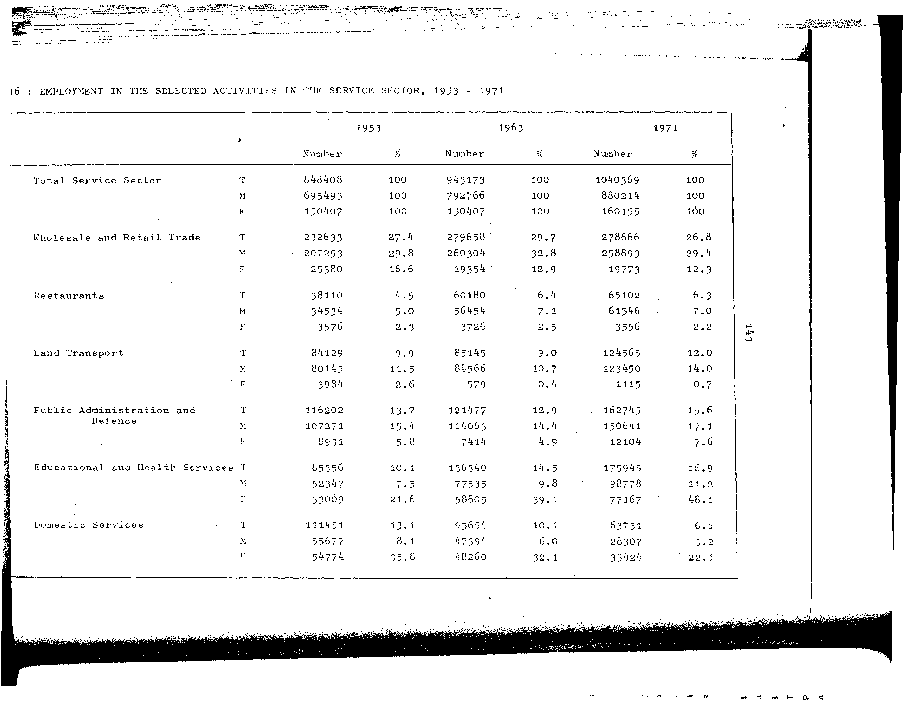

# 9.16: Employment in the selected activities in the service sector, 1953-1971


- 📜 Original Table PDF - [data/tables/table-9/table-9-16/original.pdf (50.0 kB)](../../../../data/tables/table-9/table-9-16/original.pdf)
- 📜 Original Table Image - [data/tables/table-9/table-9-16/original.images/image-01.png (129.6 kB)](../../../../data/tables/table-9/table-9-16/original.images/image-01.png)
- 📄 Extracted JSON Data - [data/tables/table-9/table-9-16/data.json (6.1 kB)](../../../../data/tables/table-9/table-9-16/data.json)
- 📄 Extracted Normalized JSON Data - [data/tables/table-9/table-9-16/normalized_data.json (5.3 kB)](../../../../data/tables/table-9/table-9-16/normalized_data.json)
- 📄 Extracted TSV Data - [data/tables/table-9/table-9-16/data.tsv (1.3 kB)](../../../../data/tables/table-9/table-9-16/data.tsv)

## Original Table [Image](../../../../data/tables/table-9/table-9-16/original.images/image-01.png)



## Extracted [JSON Data](../../../../data/tables/table-9/table-9-16/data.json)

```json
{
    "found": true,
    "table_no": "9.16",
    "table_name": "Employment in the selected activities in the service sector, 1953-1971",
    "primary_keys": [
        "Activity",
        "Gender"
    ],
    "field_keys": [
        "1953 - Number",
        "1953 - %",
        "1963 - Number",
        "1963 - %",
        "1971 - Number",
        "1971 - %"
    ],
    "rows": [
        {
            "Activity": "Total Service Sector",
            "Gender": "T",
            "values": {
                "1953 - Number": 848408,
                "1953 - %": 100,
                "1963 - Number": 943173,
                "1963 - %": 100,
                "1971 - Number": 1040369,
                "1971 - %": 100
            }
        },
        {
            "Activity": "Total Service Sector",
            "Gender": "M",
            "values": {
                "1953 - Number": 695493,
                "1953 - %": 100,
                "1963 - Number": 792766,
                "1963 - %": 100,
                "1971 - Number": 880214,
                "1971 - %": 100
            }
        },
        {
            "Activity": "Total Service Sector",
            "Gender": "F",
            "values": {
                "1953 - Number": 150407,
                "1953 - %": 100,
                "1963 - Number": 150407,
                "1963 - %": 100,
                "1971 - Number": 160155,
                "1971 - %": 100
            }
        },
        {
            "Activity": "Wholesale and Retail Trade",
            "Gender": "T",
            "values": {
                "1953 - Number": 232633,
                "1953 - %": 27.4,
                "1963 - Number": 279658,
                "1963 - %": 29.7,
                "1971 - Number": 278666,
                "1971 - %": 26.8
            }
        },
        {
            "Activity": "Wholesale and Retail Trade",
            "Gender": "M",
            "values": {
                "1953 - Number": 207253,
                "1953 - %": 29.8,
                "1963 - Number": 260304,
                "1963 - %": 32.8,
                "1971 - Number": 258893,
                "1971 - %": 29.4
            }
        },
        {
            "Activity": "Wholesale and Retail Trade",
            "Gender": "F",
            "values": {
                "1953 - Number": 25380,
                "1953 - %": 16.6,
                "1963 - Number": 19354,
                "1963 - %": 12.9,
                "1971 - Number": 19773,
                "1971 - %": 12.3
            }
        },
        {
            "Activity": "Restaurants",
            "Gender": "T",
            "values": {
                "1953 - Number": 38110,
                "1953 - %": 4.5,
                "1963 - Number": 60180,
                "1963 - %": 6.4,
                "1971 - Number": 65102,
                "1971 - %": 6.3
            }
        },
        {
            "Activity": "Restaurants",
            "Gender": "M",
            "values": {
                "1953 - Number": 34534,
                "1953 - %": 5.0,
                "1963 - Number": 56454,
                "1963 - %": 7.1,
                "1971 - Number": 61546,
                "1971 - %": 7.0
            }
        },
        {
            "Activity": "Restaurants",
            "Gender": "F",
            "values": {
                "1953 - Number": 3576,
                "1953 - %": 2.3,
                "1963 - Number": 3726,
                "1963 - %": 2.5,
                "1971 - Number": 3556,
                "1971 - %": 2.2
            }
        },
        {
            "Activity": "Land Transport",
            "Gender": "T",
            "values": {
                "1953 - Number": 84129,
                "1953 - %": 9.9,
                "1963 - Number": 85145,
                "1963 - %": 9.0,
                "1971 - Number": 124565,
                "1971 - %": 12.0
            }
        },
        {
            "Activity": "Land Transport",
            "Gender": "M",
            "values": {
                "1953 - Number": 80145,
                "1953 - %": 11.5,
                "1963 - Number": 84566,
                "1963 - %": 10.7,
                "1971 - Number": 123450,
                "1971 - %": 14.0
            }
        },
        {
            "Activity": "Land Transport",
            "Gender": "F",
            "values": {
                "1953 - Number": 3984,
                "1953 - %": 2.6,
                "1963 - Number": 579,
                "1963 - %": 0.4,
                "1971 - Number": 1115,
                "1971 - %": 0.7
            }
        },
        {
            "Activity": "Public Administration and Defence",
            "Gender": "T",
            "values": {
                "1953 - Number": 116202,
                "1953 - %": 13.7,
                "1963 - Number": 121477,
                "1963 - %": 12.9,
                "1971 - Number": 162745,
                "1971 - %": 15.6
            }
        },
        {
            "Activity": "Public Administration and Defence",
            "Gender": "M",
            "values": {
                "1953 - Number": 107271,
                "1953 - %": 15.4,
                "1963 - Number": 114063,
                "1963 - %": 14.4,
                "1971 - Number": 150641,
                "1971 - %": 17.1
            }
        },
        {
            "Activity": "Public Administration and Defence",
            "Gender": "F",
            "values": {
                "1953 - Number": 8931,
                "1953 - %": 5.8,
                "1963 - Number": 7414,
                "1963 - %": 4.9,
                "1971 - Number": 12104,
                "1971 - %": 7.6
            }
        },
        {
            "Activity": "Educational and Health Services",
            "Gender": "T",
            "values": {
                "1953 - Number": 85356,
                "1953 - %": 10.1,
                "1963 - Number": 136340,
                "1963 - %": 14.5,
                "1971 - Number": 175945,
                "1971 - %": 16.9
            }
        },
        {
            "Activity": "Educational and Health Services",
            "Gender": "M",
            "values": {
                "1953 - Number": 52347,
                "1953 - %": 7.5,
                "1963 - Number": 77535,
                "1963 - %": 9.8,
                "1971 - Number": 98778,
                "1971 - %": 11.2
            }
        },
        {
            "Activity": "Educational and Health Services",
            "Gender": "F",
            "values": {
                "1953 - Number": 33009,
                "1953 - %": 21.6,
                "1963 - Number": 58805,
                "1963 - %": 39.1,
                "1971 - Number": 77167,
                "1971 - %": 48.1
            }
        },
        {
            "Activity": "Domestic Services",
            "Gender": "T",
            "values": {
                "1953 - Number": 111451,
                "1953 - %": 13.1,
                "1963 - Number": 95654,
                "1963 - %": 10.1,
                "1971 - Number": 63731,
                "1971 - %": 6.1
            }
        },
        {
            "Activity": "Domestic Services",
            "Gender": "M",
            "values": {
                "1953 - Number": 55677,
                "1953 - %": 8.1,
                "1963 - Number": 47394,
                "1963 - %": 6.0,
                "1971 - Number": 28307,
                "1971 - %": 3.2
            }
        },
        {
            "Activity": "Domestic Services",
            "Gender": "F",
            "values": {
                "1953 - Number": 54774,
                "1953 - %": 35.8,
                "1963 - Number": 48260,
                "1963 - %": 32.1,
                "1971 - Number": 35424,
                "1971 - %": 22.1
            }
        }
    ],
    "notes": []
}
```

## Extracted [Normalized JSON Data](../../../../data/tables/table-9/table-9-16/normalized_data.json)

```json
[
    {
        "Activity": "Total Service Sector",
        "Gender": "T",
        "values": {
            "1953 - Number": 848408,
            "1953 - %": 100,
            "1963 - Number": 943173,
            "1963 - %": 100,
            "1971 - Number": 1040369,
            "1971 - %": 100
        }
    },
    {
        "Activity": "Total Service Sector",
        "Gender": "M",
        "values": {
            "1953 - Number": 695493,
            "1953 - %": 100,
            "1963 - Number": 792766,
            "1963 - %": 100,
            "1971 - Number": 880214,
            "1971 - %": 100
        }
    },
    {
        "Activity": "Total Service Sector",
        "Gender": "F",
        "values": {
            "1953 - Number": 150407,
            "1953 - %": 100,
            "1963 - Number": 150407,
            "1963 - %": 100,
            "1971 - Number": 160155,
            "1971 - %": 100
        }
    },
    {
        "Activity": "Wholesale and Retail Trade",
        "Gender": "T",
        "values": {
            "1953 - Number": 232633,
            "1953 - %": 27.4,
            "1963 - Number": 279658,
            "1963 - %": 29.7,
            "1971 - Number": 278666,
            "1971 - %": 26.8
        }
    },
    {
        "Activity": "Wholesale and Retail Trade",
        "Gender": "M",
        "values": {
            "1953 - Number": 207253,
            "1953 - %": 29.8,
            "1963 - Number": 260304,
            "1963 - %": 32.8,
            "1971 - Number": 258893,
            "1971 - %": 29.4
        }
    },
    {
        "Activity": "Wholesale and Retail Trade",
        "Gender": "F",
        "values": {
            "1953 - Number": 25380,
            "1953 - %": 16.6,
            "1963 - Number": 19354,
            "1963 - %": 12.9,
            "1971 - Number": 19773,
            "1971 - %": 12.3
        }
    },
    {
        "Activity": "Restaurants",
        "Gender": "T",
        "values": {
            "1953 - Number": 38110,
            "1953 - %": 4.5,
            "1963 - Number": 60180,
            "1963 - %": 6.4,
            "1971 - Number": 65102,
            "1971 - %": 6.3
        }
    },
    {
        "Activity": "Restaurants",
        "Gender": "M",
        "values": {
            "1953 - Number": 34534,
            "1953 - %": 5.0,
            "1963 - Number": 56454,
            "1963 - %": 7.1,
            "1971 - Number": 61546,
            "1971 - %": 7.0
        }
    },
    {
        "Activity": "Restaurants",
        "Gender": "F",
        "values": {
            "1953 - Number": 3576,
            "1953 - %": 2.3,
            "1963 - Number": 3726,
            "1963 - %": 2.5,
            "1971 - Number": 3556,
            "1971 - %": 2.2
        }
    },
    {
        "Activity": "Land Transport",
        "Gender": "T",
        "values": {
            "1953 - Number": 84129,
            "1953 - %": 9.9,
            "1963 - Number": 85145,
            "1963 - %": 9.0,
            "1971 - Number": 124565,
            "1971 - %": 12.0
        }
    },
    {
        "Activity": "Land Transport",
        "Gender": "M",
        "values": {
            "1953 - Number": 80145,
            "1953 - %": 11.5,
            "1963 - Number": 84566,
            "1963 - %": 10.7,
            "1971 - Number": 123450,
            "1971 - %": 14.0
        }
    },
    {
        "Activity": "Land Transport",
        "Gender": "F",
        "values": {
            "1953 - Number": 3984,
            "1953 - %": 2.6,
            "1963 - Number": 579,
            "1963 - %": 0.4,
            "1971 - Number": 1115,
            "1971 - %": 0.7
        }
    },
    {
        "Activity": "Public Administration and Defence",
        "Gender": "T",
        "values": {
            "1953 - Number": 116202,
            "1953 - %": 13.7,
            "1963 - Number": 121477,
            "1963 - %": 12.9,
            "1971 - Number": 162745,
            "1971 - %": 15.6
        }
    },
    {
        "Activity": "Public Administration and Defence",
        "Gender": "M",
        "values": {
            "1953 - Number": 107271,
            "1953 - %": 15.4,
            "1963 - Number": 114063,
            "1963 - %": 14.4,
            "1971 - Number": 150641,
            "1971 - %": 17.1
        }
    },
    {
        "Activity": "Public Administration and Defence",
        "Gender": "F",
        "values": {
            "1953 - Number": 8931,
            "1953 - %": 5.8,
            "1963 - Number": 7414,
            "1963 - %": 4.9,
            "1971 - Number": 12104,
            "1971 - %": 7.6
        }
    },
    {
        "Activity": "Educational and Health Services",
        "Gender": "T",
        "values": {
            "1953 - Number": 85356,
            "1953 - %": 10.1,
            "1963 - Number": 136340,
            "1963 - %": 14.5,
            "1971 - Number": 175945,
            "1971 - %": 16.9
        }
    },
    {
        "Activity": "Educational and Health Services",
        "Gender": "M",
        "values": {
            "1953 - Number": 52347,
            "1953 - %": 7.5,
            "1963 - Number": 77535,
            "1963 - %": 9.8,
            "1971 - Number": 98778,
            "1971 - %": 11.2
        }
    },
    {
        "Activity": "Educational and Health Services",
        "Gender": "F",
        "values": {
            "1953 - Number": 33009,
            "1953 - %": 21.6,
            "1963 - Number": 58805,
            "1963 - %": 39.1,
            "1971 - Number": 77167,
            "1971 - %": 48.1
        }
    },
    {
        "Activity": "Domestic Services",
        "Gender": "T",
        "values": {
            "1953 - Number": 111451,
            "1953 - %": 13.1,
            "1963 - Number": 95654,
            "1963 - %": 10.1,
            "1971 - Number": 63731,
            "1971 - %": 6.1
        }
    },
    {
        "Activity": "Domestic Services",
        "Gender": "M",
        "values": {
            "1953 - Number": 55677,
            "1953 - %": 8.1,
            "1963 - Number": 47394,
            "1963 - %": 6.0,
            "1971 - Number": 28307,
            "1971 - %": 3.2
        }
    },
    {
        "Activity": "Domestic Services",
        "Gender": "F",
        "values": {
            "1953 - Number": 54774,
            "1953 - %": 35.8,
            "1963 - Number": 48260,
            "1963 - %": 32.1,
            "1971 - Number": 35424,
            "1971 - %": 22.1
        }
    }
]
```

## Extracted [TSV Data](../../../../data/tables/table-9/table-9-16/data.tsv)

| Activity | Gender | 1953 - Number | 1953 - % | 1963 - Number | 1963 - % | 1971 - Number | 1971 - % |
| --- | --- | --- | --- | --- | --- | --- | --- |
| Total Service Sector | T | 848408 | 100 | 943173 | 100 | 1040369 | 100 |
| Total Service Sector | M | 695493 | 100 | 792766 | 100 | 880214 | 100 |
| Total Service Sector | F | 150407 | 100 | 150407 | 100 | 160155 | 100 |
| Wholesale and Retail Trade | T | 232633 | 27.4 | 279658 | 29.7 | 278666 | 26.8 |
| Wholesale and Retail Trade | M | 207253 | 29.8 | 260304 | 32.8 | 258893 | 29.4 |
| Wholesale and Retail Trade | F | 25380 | 16.6 | 19354 | 12.9 | 19773 | 12.3 |
| Restaurants | T | 38110 | 4.5 | 60180 | 6.4 | 65102 | 6.3 |
| Restaurants | M | 34534 | 5.0 | 56454 | 7.1 | 61546 | 7.0 |
| Restaurants | F | 3576 | 2.3 | 3726 | 2.5 | 3556 | 2.2 |
| Land Transport | T | 84129 | 9.9 | 85145 | 9.0 | 124565 | 12.0 |
| Land Transport | M | 80145 | 11.5 | 84566 | 10.7 | 123450 | 14.0 |
| Land Transport | F | 3984 | 2.6 | 579 | 0.4 | 1115 | 0.7 |
| Public Administration and Defence | T | 116202 | 13.7 | 121477 | 12.9 | 162745 | 15.6 |
| Public Administration and Defence | M | 107271 | 15.4 | 114063 | 14.4 | 150641 | 17.1 |
| Public Administration and Defence | F | 8931 | 5.8 | 7414 | 4.9 | 12104 | 7.6 |
| Educational and Health Services | T | 85356 | 10.1 | 136340 | 14.5 | 175945 | 16.9 |
| Educational and Health Services | M | 52347 | 7.5 | 77535 | 9.8 | 98778 | 11.2 |
| Educational and Health Services | F | 33009 | 21.6 | 58805 | 39.1 | 77167 | 48.1 |
| Domestic Services | T | 111451 | 13.1 | 95654 | 10.1 | 63731 | 6.1 |
| Domestic Services | M | 55677 | 8.1 | 47394 | 6.0 | 28307 | 3.2 |
| Domestic Services | F | 54774 | 35.8 | 48260 | 32.1 | 35424 | 22.1 |


[](https://opensource.org/licenses/MIT)
