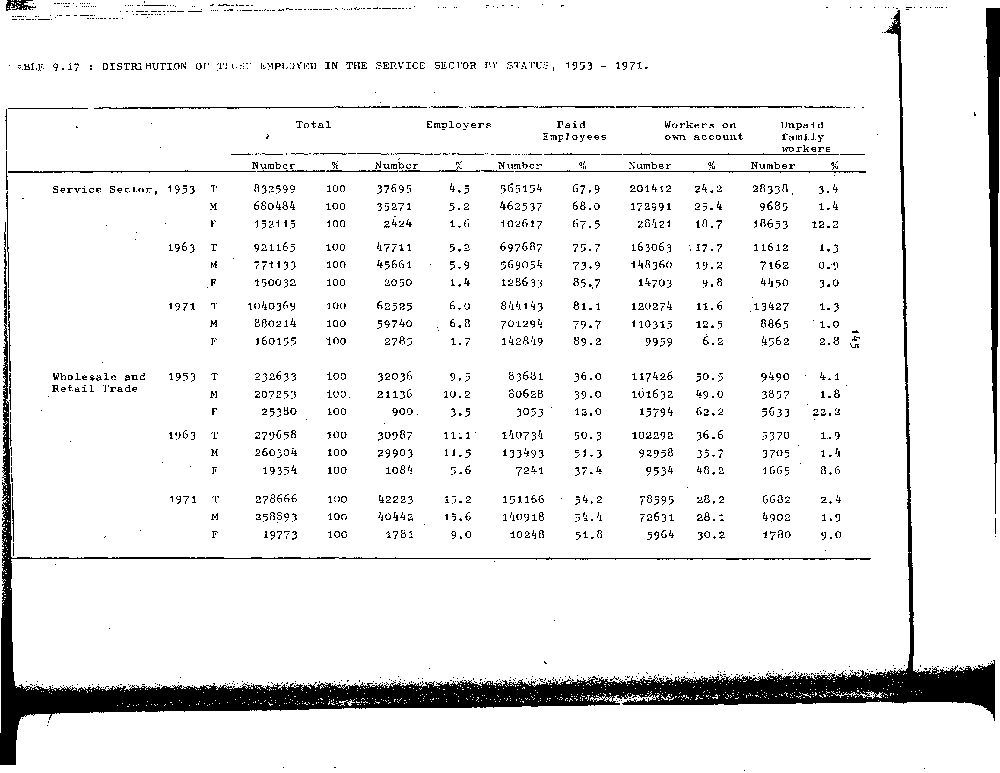

# 9.17: Distribution of those employed in the service sector by status, 1953-1971


- 📜 Original Table PDF - [data/tables/table-9/table-9-17/original.pdf (55.4 kB)](../../../../data/tables/table-9/table-9-17/original.pdf)
- 📜 Original Table Image - [data/tables/table-9/table-9-17/original.images/image-01.png (139.4 kB)](../../../../data/tables/table-9/table-9-17/original.images/image-01.png)
- 📄 Extracted JSON Data - [data/tables/table-9/table-9-17/data.json (9.7 kB)](../../../../data/tables/table-9/table-9-17/data.json)
- 📄 Extracted TSV Data - [data/tables/table-9/table-9-17/data.tsv (1.7 kB)](../../../../data/tables/table-9/table-9-17/data.tsv)

## Original Table [Image](../../../../data/tables/table-9/table-9-17/original.images/image-01.png)



## Extracted [JSON Data](../../../../data/tables/table-9/table-9-17/data.json)

```json
{
    "found": true,
    "table_no": "9.17",
    "table_name": "Distribution of those employed in the service sector by status, 1953-1971",
    "primary_keys": [
        "Sector",
        "Year",
        "Gender"
    ],
    "field_keys": [
        "Total - Number",
        "Total - %",
        "Employers - Number",
        "Employers - %",
        "Paid Employees - Number",
        "Paid Employees - %",
        "Workers on own account - Number",
        "Workers on own account - %",
        "Unpaid family workers - Number",
        "Unpaid family workers - %"
    ],
    "rows": [
        {
            "Sector": "Service Sector",
            "Year": 1953,
            "Gender": "T",
            "values": {
                "Total - Number": 832599,
                "Total - %": 100,
                "Employers - Number": 37695,
                "Employers - %": 4.5,
                "Paid Employees - Number": 565154,
                "Paid Employees - %": 67.9,
                "Workers on own account - Number": 201412,
                "Workers on own account - %": 24.2,
                "Unpaid family workers - Number": 28338,
                "Unpaid family workers - %": 3.4
            }
        },
        {
            "Sector": "Service Sector",
            "Year": 1953,
            "Gender": "M",
            "values": {
                "Total - Number": 680484,
                "Total - %": 100,
                "Employers - Number": 35271,
                "Employers - %": 5.2,
                "Paid Employees - Number": 462537,
                "Paid Employees - %": 68.0,
                "Workers on own account - Number": 172991,
                "Workers on own account - %": 25.4,
                "Unpaid family workers - Number": 9685,
                "Unpaid family workers - %": 1.4
            }
        },
        {
            "Sector": "Service Sector",
            "Year": 1953,
            "Gender": "F",
            "values": {
                "Total - Number": 152115,
                "Total - %": 100,
                "Employers - Number": 2424,
                "Employers - %": 1.6,
                "Paid Employees - Number": 102617,
                "Paid Employees - %": 67.5,
                "Workers on own account - Number": 28421,
                "Workers on own account - %": 18.7,
                "Unpaid family workers - Number": 18653,
                "Unpaid family workers - %": 12.2
            }
        },
        {
            "Sector": "Service Sector",
            "Year": 1963,
            "Gender": "T",
            "values": {
                "Total - Number": 921165,
                "Total - %": 100,
                "Employers - Number": 47711,
                "Employers - %": 5.2,
                "Paid Employees - Number": 697687,
                "Paid Employees - %": 75.7,
                "Workers on own account - Number": 163063,
                "Workers on own account - %": 17.7,
                "Unpaid family workers - Number": 11612,
                "Unpaid family workers - %": 1.3
            }
        },
        {
            "Sector": "Service Sector",
            "Year": 1963,
            "Gender": "M",
            "values": {
                "Total - Number": 771133,
                "Total - %": 100,
                "Employers - Number": 45661,
                "Employers - %": 5.9,
                "Paid Employees - Number": 569054,
                "Paid Employees - %": 73.9,
                "Workers on own account - Number": 148360,
                "Workers on own account - %": 19.2,
                "Unpaid family workers - Number": 7162,
                "Unpaid family workers - %": 0.9
            }
        },
        {
            "Sector": "Service Sector",
            "Year": 1963,
            "Gender": "F",
            "values": {
                "Total - Number": 150032,
                "Total - %": 100,
                "Employers - Number": 2050,
                "Employers - %": 1.4,
                "Paid Employees - Number": 128633,
                "Paid Employees - %": 85.7,
                "Workers on own account - Number": 14703,
                "Workers on own account - %": 9.8,
                "Unpaid family workers - Number": 4450,
                "Unpaid family workers - %": 3.0
            }
        },
        {
            "Sector": "Service Sector",
            "Year": 1971,
            "Gender": "T",
            "values": {
                "Total - Number": 1040369,
                "Total - %": 100,
                "Employers - Number": 62525,
                "Employers - %": 6.0,
                "Paid Employees - Number": 844143,
                "Paid Employees - %": 81.1,
                "Workers on own account - Number": 120274,
                "Workers on own account - %": 11.6,
                "Unpaid family workers - Number": 13427,
                "Unpaid family workers - %": 1.3
            }
        },
        {
            "Sector": "Service Sector",
            "Year": 1971,
            "Gender": "M",
            "values": {
                "Total - Number": 880214,
                "Total - %": 100,
                "Employers - Number": 59740,
                "Employers - %": 6.8,
                "Paid Employees - Number": 701294,
                "Paid Employees - %": 79.7,
                "Workers on own account - Number": 110315,
                "Workers on own account - %": 12.5,
                "Unpaid family workers - Number": 8865,
                "Unpaid family workers - %": 1.0
            }
        },
        {
            "Sector": "Service Sector",
            "Year": 1971,
            "Gender": "F",
            "values": {
                "Total - Number": 160155,
                "Total - %": 100,
                "Employers - Number": 2785,
                "Employers - %": 1.7,
                "Paid Employees - Number": 142849,
                "Paid Employees - %": 89.2,
                "Workers on own account - Number": 9959,
                "Workers on own account - %": 6.2,
                "Unpaid family workers - Number": 4562,
                "Unpaid family workers - %": 2.8
            }
        },
        {
            "Sector": "Wholesale and Retail Trade",
            "Year": 1953,
            "Gender": "T",
            "values": {
                "Total - Number": 232633,
                "Total - %": 100,
                "Employers - Number": 32036,
                "Employers - %": 9.5,
                "Paid Employees - Number": 83681,
                "Paid Employees - %": 36.0,
                "Workers on own account - Number": 117426,
                "Workers on own account - %": 50.5,
                "Unpaid family workers - Number": 9490,
                "Unpaid family workers - %": 4.1
            }
        },
        {
            "Sector": "Wholesale and Retail Trade",
            "Year": 1953,
            "Gender": "M",
            "values": {
                "Total - Number": 207253,
                "Total - %": 100,
                "Employers - Number": 21136,
                "Employers - %": 10.2,
                "Paid Employees - Number": 80628,
                "Paid Employees - %": 39.0,
                "Workers on own account - Number": 101632,
                "Workers on own account - %": 49.0,
                "Unpaid family workers - Number": 3857,
                "Unpaid family workers - %": 1.8
            }
        },
        {
            "Sector": "Wholesale and Retail Trade",
            "Year": 1953,
            "Gender": "F",
            "values": {
                "Total - Number": 25380,
                "Total - %": 100,
                "Employers - Number": 900,
                "Employers - %": 3.5,
                "Paid Employees - Number": 3053,
                "Paid Employees - %": 12.0,
                "Workers on own account - Number": 15794,
                "Workers on own account - %": 62.2,
                "Unpaid family workers - Number": 5633,
                "Unpaid family workers - %": 22.2
            }
        },
        {
            "Sector": "Wholesale and Retail Trade",
            "Year": 1963,
            "Gender": "T",
            "values": {
                "Total - Number": 279658,
                "Total - %": 100,
                "Employers - Number": 30987,
                "Employers - %": 11.1,
                "Paid Employees - Number": 140734,
                "Paid Employees - %": 50.3,
                "Workers on own account - Number": 102292,
                "Workers on own account - %": 36.6,
                "Unpaid family workers - Number": 5370,
                "Unpaid family workers - %": 1.9
            }
        },
        {
            "Sector": "Wholesale and Retail Trade",
            "Year": 1963,
            "Gender": "M",
            "values": {
                "Total - Number": 260304,
                "Total - %": 100,
                "Employers - Number": 29903,
                "Employers - %": 11.5,
                "Paid Employees - Number": 133493,
                "Paid Employees - %": 51.3,
                "Workers on own account - Number": 92958,
                "Workers on own account - %": 35.7,
                "Unpaid family workers - Number": 3705,
                "Unpaid family workers - %": 1.4
            }
        },
        {
            "Sector": "Wholesale and Retail Trade",
            "Year": 1963,
            "Gender": "F",
            "values": {
                "Total - Number": 19354,
                "Total - %": 100,
                "Employers - Number": 1084,
                "Employers - %": 5.6,
                "Paid Employees - Number": 7241,
                "Paid Employees - %": 37.4,
                "Workers on own account - Number": 9534,
                "Workers on own account - %": 48.2,
                "Unpaid family workers - Number": 1665,
                "Unpaid family workers - %": 8.6
            }
        },
        {
            "Sector": "Wholesale and Retail Trade",
            "Year": 1971,
            "Gender": "T",
            "values": {
                "Total - Number": 278666,
                "Total - %": 100,
                "Employers - Number": 42223,
                "Employers - %": 15.2,
                "Paid Employees - Number": 151166,
                "Paid Employees - %": 54.2,
                "Workers on own account - Number": 78595,
                "Workers on own account - %": 28.2,
                "Unpaid family workers - Number": 6682,
                "Unpaid family workers - %": 2.4
            }
        },
        {
            "Sector": "Wholesale and Retail Trade",
            "Year": 1971,
            "Gender": "M",
            "values": {
                "Total - Number": 258893,
                "Total - %": 100,
                "Employers - Number": 40442,
                "Employers - %": 15.6,
                "Paid Employees - Number": 140918,
                "Paid Employees - %": 54.4,
                "Workers on own account - Number": 72631,
                "Workers on own account - %": 28.1,
                "Unpaid family workers - Number": 4902,
                "Unpaid family workers - %": 1.9
            }
        },
        {
            "Sector": "Wholesale and Retail Trade",
            "Year": 1971,
            "Gender": "F",
            "values": {
                "Total - Number": 19773,
                "Total - %": 100,
                "Employers - Number": 1781,
                "Employers - %": 9.0,
                "Paid Employees - Number": 10248,
                "Paid Employees - %": 51.8,
                "Workers on own account - Number": 5964,
                "Workers on own account - %": 30.2,
                "Unpaid family workers - Number": 1780,
                "Unpaid family workers - %": 9.0
            }
        }
    ],
    "notes": []
}
```

## Extracted [TSV Data](../../../../data/tables/table-9/table-9-17/data.tsv)

| Sector | Year | Gender | Total - Number | Total - % | Employers - Number | Employers - % | Paid Employees - Number | Paid Employees - % | Workers on own account - Number | Workers on own account - % | Unpaid family workers - Number | Unpaid family workers - % |
| --- | --- | --- | --- | --- | --- | --- | --- | --- | --- | --- | --- | --- |
| Service Sector | 1953 | T | 832599 | 100 | 37695 | 4.5 | 565154 | 67.9 | 201412 | 24.2 | 28338 | 3.4 |
| Service Sector | 1953 | M | 680484 | 100 | 35271 | 5.2 | 462537 | 68.0 | 172991 | 25.4 | 9685 | 1.4 |
| Service Sector | 1953 | F | 152115 | 100 | 2424 | 1.6 | 102617 | 67.5 | 28421 | 18.7 | 18653 | 12.2 |
| Service Sector | 1963 | T | 921165 | 100 | 47711 | 5.2 | 697687 | 75.7 | 163063 | 17.7 | 11612 | 1.3 |
| Service Sector | 1963 | M | 771133 | 100 | 45661 | 5.9 | 569054 | 73.9 | 148360 | 19.2 | 7162 | 0.9 |
| Service Sector | 1963 | F | 150032 | 100 | 2050 | 1.4 | 128633 | 85.7 | 14703 | 9.8 | 4450 | 3.0 |
| Service Sector | 1971 | T | 1040369 | 100 | 62525 | 6.0 | 844143 | 81.1 | 120274 | 11.6 | 13427 | 1.3 |
| Service Sector | 1971 | M | 880214 | 100 | 59740 | 6.8 | 701294 | 79.7 | 110315 | 12.5 | 8865 | 1.0 |
| Service Sector | 1971 | F | 160155 | 100 | 2785 | 1.7 | 142849 | 89.2 | 9959 | 6.2 | 4562 | 2.8 |
| Wholesale and Retail Trade | 1953 | T | 232633 | 100 | 32036 | 9.5 | 83681 | 36.0 | 117426 | 50.5 | 9490 | 4.1 |
| Wholesale and Retail Trade | 1953 | M | 207253 | 100 | 21136 | 10.2 | 80628 | 39.0 | 101632 | 49.0 | 3857 | 1.8 |
| Wholesale and Retail Trade | 1953 | F | 25380 | 100 | 900 | 3.5 | 3053 | 12.0 | 15794 | 62.2 | 5633 | 22.2 |
| Wholesale and Retail Trade | 1963 | T | 279658 | 100 | 30987 | 11.1 | 140734 | 50.3 | 102292 | 36.6 | 5370 | 1.9 |
| Wholesale and Retail Trade | 1963 | M | 260304 | 100 | 29903 | 11.5 | 133493 | 51.3 | 92958 | 35.7 | 3705 | 1.4 |
| Wholesale and Retail Trade | 1963 | F | 19354 | 100 | 1084 | 5.6 | 7241 | 37.4 | 9534 | 48.2 | 1665 | 8.6 |
| Wholesale and Retail Trade | 1971 | T | 278666 | 100 | 42223 | 15.2 | 151166 | 54.2 | 78595 | 28.2 | 6682 | 2.4 |
| Wholesale and Retail Trade | 1971 | M | 258893 | 100 | 40442 | 15.6 | 140918 | 54.4 | 72631 | 28.1 | 4902 | 1.9 |
| Wholesale and Retail Trade | 1971 | F | 19773 | 100 | 1781 | 9.0 | 10248 | 51.8 | 5964 | 30.2 | 1780 | 9.0 |


[](https://opensource.org/licenses/MIT)
