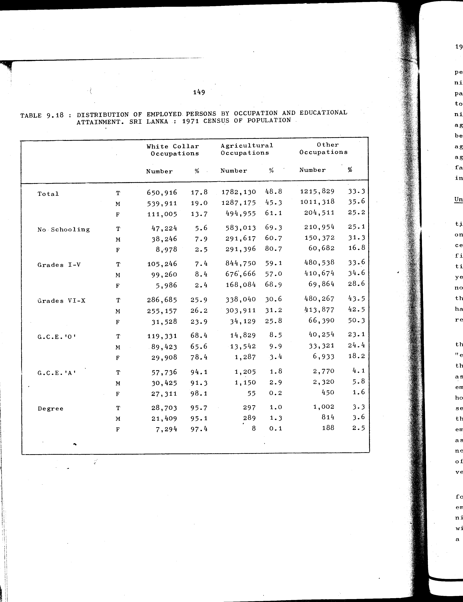

# 9.18: Distribution of employed persons by occupation and educational attainment, Sri Lanka: 1971 census of population


- 📜 Original Table PDF - [data/tables/table-9/table-9-18/original.pdf (58.6 kB)](../../../../data/tables/table-9/table-9-18/original.pdf)
- 📜 Original Table Image - [data/tables/table-9/table-9-18/original.images/image-01.png (152.6 kB)](../../../../data/tables/table-9/table-9-18/original.images/image-01.png)
- 📄 Extracted JSON Data - [data/tables/table-9/table-9-18/data.json (8.5 kB)](../../../../data/tables/table-9/table-9-18/data.json)
- 📄 Extracted TSV Data - [data/tables/table-9/table-9-18/data.tsv (1.1 kB)](../../../../data/tables/table-9/table-9-18/data.tsv)

## Original Table [Image](../../../../data/tables/table-9/table-9-18/original.images/image-01.png)



## Extracted [JSON Data](../../../../data/tables/table-9/table-9-18/data.json)

```json
{
    "found": true,
    "table_no": "9.18",
    "table_name": "Distribution of employed persons by occupation and educational attainment, Sri Lanka: 1971 census of population",
    "primary_keys": [
        "Educational Attainment",
        "Sex"
    ],
    "field_keys": [
        "White Collar Occupations - Number",
        "White Collar Occupations - %",
        "Agricultural Occupations - Number",
        "Agricultural Occupations - %",
        "Other Occupations - Number",
        "Other Occupations - %"
    ],
    "rows": [
        {
            "Educational Attainment": "Total",
            "Sex": "T",
            "values": {
                "White Collar Occupations - Number": 650916,
                "White Collar Occupations - %": 17.8,
                "Agricultural Occupations - Number": 1782130,
                "Agricultural Occupations - %": 48.8,
                "Other Occupations - Number": 1215829,
                "Other Occupations - %": 33.3
            }
        },
        {
            "Educational Attainment": "Total",
            "Sex": "M",
            "values": {
                "White Collar Occupations - Number": 539911,
                "White Collar Occupations - %": 19.0,
                "Agricultural Occupations - Number": 1287175,
                "Agricultural Occupations - %": 45.3,
                "Other Occupations - Number": 1011318,
                "Other Occupations - %": 35.6
            }
        },
        {
            "Educational Attainment": "Total",
            "Sex": "F",
            "values": {
                "White Collar Occupations - Number": 111005,
                "White Collar Occupations - %": 13.7,
                "Agricultural Occupations - Number": 494955,
                "Agricultural Occupations - %": 61.1,
                "Other Occupations - Number": 204511,
                "Other Occupations - %": 25.2
            }
        },
        {
            "Educational Attainment": "No Schooling",
            "Sex": "T",
            "values": {
                "White Collar Occupations - Number": 47224,
                "White Collar Occupations - %": 5.6,
                "Agricultural Occupations - Number": 583013,
                "Agricultural Occupations - %": 69.3,
                "Other Occupations - Number": 210954,
                "Other Occupations - %": 25.1
            }
        },
        {
            "Educational Attainment": "No Schooling",
            "Sex": "M",
            "values": {
                "White Collar Occupations - Number": 38246,
                "White Collar Occupations - %": 7.9,
                "Agricultural Occupations - Number": 291617,
                "Agricultural Occupations - %": 60.7,
                "Other Occupations - Number": 150372,
                "Other Occupations - %": 31.3
            }
        },
        {
            "Educational Attainment": "No Schooling",
            "Sex": "F",
            "values": {
                "White Collar Occupations - Number": 8978,
                "White Collar Occupations - %": 2.5,
                "Agricultural Occupations - Number": 291396,
                "Agricultural Occupations - %": 80.7,
                "Other Occupations - Number": 60682,
                "Other Occupations - %": 16.8
            }
        },
        {
            "Educational Attainment": "Grades I-V",
            "Sex": "T",
            "values": {
                "White Collar Occupations - Number": 105246,
                "White Collar Occupations - %": 7.4,
                "Agricultural Occupations - Number": 844750,
                "Agricultural Occupations - %": 59.1,
                "Other Occupations - Number": 480538,
                "Other Occupations - %": 33.6
            }
        },
        {
            "Educational Attainment": "Grades I-V",
            "Sex": "M",
            "values": {
                "White Collar Occupations - Number": 99260,
                "White Collar Occupations - %": 8.4,
                "Agricultural Occupations - Number": 676666,
                "Agricultural Occupations - %": 57.0,
                "Other Occupations - Number": 410674,
                "Other Occupations - %": 34.6
            }
        },
        {
            "Educational Attainment": "Grades I-V",
            "Sex": "F",
            "values": {
                "White Collar Occupations - Number": 5986,
                "White Collar Occupations - %": 2.4,
                "Agricultural Occupations - Number": 168084,
                "Agricultural Occupations - %": 68.9,
                "Other Occupations - Number": 69864,
                "Other Occupations - %": 28.6
            }
        },
        {
            "Educational Attainment": "Grades VI-X",
            "Sex": "T",
            "values": {
                "White Collar Occupations - Number": 286685,
                "White Collar Occupations - %": 25.9,
                "Agricultural Occupations - Number": 338040,
                "Agricultural Occupations - %": 30.6,
                "Other Occupations - Number": 480267,
                "Other Occupations - %": 43.5
            }
        },
        {
            "Educational Attainment": "Grades VI-X",
            "Sex": "M",
            "values": {
                "White Collar Occupations - Number": 255157,
                "White Collar Occupations - %": 26.2,
                "Agricultural Occupations - Number": 303911,
                "Agricultural Occupations - %": 31.2,
                "Other Occupations - Number": 413877,
                "Other Occupations - %": 42.5
            }
        },
        {
            "Educational Attainment": "Grades VI-X",
            "Sex": "F",
            "values": {
                "White Collar Occupations - Number": 31528,
                "White Collar Occupations - %": 23.9,
                "Agricultural Occupations - Number": 34129,
                "Agricultural Occupations - %": 25.8,
                "Other Occupations - Number": 66390,
                "Other Occupations - %": 50.3
            }
        },
        {
            "Educational Attainment": "G.C.E.'O'",
            "Sex": "T",
            "values": {
                "White Collar Occupations - Number": 119331,
                "White Collar Occupations - %": 68.4,
                "Agricultural Occupations - Number": 14829,
                "Agricultural Occupations - %": 8.5,
                "Other Occupations - Number": 40254,
                "Other Occupations - %": 23.1
            }
        },
        {
            "Educational Attainment": "G.C.E.'O'",
            "Sex": "M",
            "values": {
                "White Collar Occupations - Number": 89423,
                "White Collar Occupations - %": 65.6,
                "Agricultural Occupations - Number": 13542,
                "Agricultural Occupations - %": 9.9,
                "Other Occupations - Number": 33321,
                "Other Occupations - %": 24.4
            }
        },
        {
            "Educational Attainment": "G.C.E.'O'",
            "Sex": "F",
            "values": {
                "White Collar Occupations - Number": 29908,
                "White Collar Occupations - %": 78.4,
                "Agricultural Occupations - Number": 1287,
                "Agricultural Occupations - %": 3.4,
                "Other Occupations - Number": 6933,
                "Other Occupations - %": 18.2
            }
        },
        {
            "Educational Attainment": "G.C.E.'A'",
            "Sex": "T",
            "values": {
                "White Collar Occupations - Number": 57736,
                "White Collar Occupations - %": 94.1,
                "Agricultural Occupations - Number": 1205,
                "Agricultural Occupations - %": 1.8,
                "Other Occupations - Number": 2770,
                "Other Occupations - %": 4.1
            }
        },
        {
            "Educational Attainment": "G.C.E.'A'",
            "Sex": "M",
            "values": {
                "White Collar Occupations - Number": 30425,
                "White Collar Occupations - %": 91.3,
                "Agricultural Occupations - Number": 1150,
                "Agricultural Occupations - %": 2.9,
                "Other Occupations - Number": 2320,
                "Other Occupations - %": 5.8
            }
        },
        {
            "Educational Attainment": "G.C.E.'A'",
            "Sex": "F",
            "values": {
                "White Collar Occupations - Number": 27311,
                "White Collar Occupations - %": 98.1,
                "Agricultural Occupations - Number": 55,
                "Agricultural Occupations - %": 0.2,
                "Other Occupations - Number": 450,
                "Other Occupations - %": 1.6
            }
        },
        {
            "Educational Attainment": "Degree",
            "Sex": "T",
            "values": {
                "White Collar Occupations - Number": 28703,
                "White Collar Occupations - %": 95.7,
                "Agricultural Occupations - Number": 297,
                "Agricultural Occupations - %": 1.0,
                "Other Occupations - Number": 1002,
                "Other Occupations - %": 3.3
            }
        },
        {
            "Educational Attainment": "Degree",
            "Sex": "M",
            "values": {
                "White Collar Occupations - Number": 21409,
                "White Collar Occupations - %": 95.1,
                "Agricultural Occupations - Number": 289,
                "Agricultural Occupations - %": 1.3,
                "Other Occupations - Number": 814,
                "Other Occupations - %": 3.6
            }
        },
        {
            "Educational Attainment": "Degree",
            "Sex": "F",
            "values": {
                "White Collar Occupations - Number": 7294,
                "White Collar Occupations - %": 97.4,
                "Agricultural Occupations - Number": 8,
                "Agricultural Occupations - %": 0.1,
                "Other Occupations - Number": 188,
                "Other Occupations - %": 2.5
            }
        }
    ],
    "notes": []
}
```

## Extracted [TSV Data](../../../../data/tables/table-9/table-9-18/data.tsv)

| Educational Attainment | Sex | White Collar Occupations - Number | White Collar Occupations - % | Agricultural Occupations - Number | Agricultural Occupations - % | Other Occupations - Number | Other Occupations - % |
| --- | --- | --- | --- | --- | --- | --- | --- |
| Total | T | 650916 | 17.8 | 1782130 | 48.8 | 1215829 | 33.3 |
| Total | M | 539911 | 19.0 | 1287175 | 45.3 | 1011318 | 35.6 |
| Total | F | 111005 | 13.7 | 494955 | 61.1 | 204511 | 25.2 |
| No Schooling | T | 47224 | 5.6 | 583013 | 69.3 | 210954 | 25.1 |
| No Schooling | M | 38246 | 7.9 | 291617 | 60.7 | 150372 | 31.3 |
| No Schooling | F | 8978 | 2.5 | 291396 | 80.7 | 60682 | 16.8 |
| Grades I-V | T | 105246 | 7.4 | 844750 | 59.1 | 480538 | 33.6 |
| Grades I-V | M | 99260 | 8.4 | 676666 | 57.0 | 410674 | 34.6 |
| Grades I-V | F | 5986 | 2.4 | 168084 | 68.9 | 69864 | 28.6 |
| Grades VI-X | T | 286685 | 25.9 | 338040 | 30.6 | 480267 | 43.5 |
| Grades VI-X | M | 255157 | 26.2 | 303911 | 31.2 | 413877 | 42.5 |
| Grades VI-X | F | 31528 | 23.9 | 34129 | 25.8 | 66390 | 50.3 |
| G.C.E.'O' | T | 119331 | 68.4 | 14829 | 8.5 | 40254 | 23.1 |
| G.C.E.'O' | M | 89423 | 65.6 | 13542 | 9.9 | 33321 | 24.4 |
| G.C.E.'O' | F | 29908 | 78.4 | 1287 | 3.4 | 6933 | 18.2 |
| G.C.E.'A' | T | 57736 | 94.1 | 1205 | 1.8 | 2770 | 4.1 |
| G.C.E.'A' | M | 30425 | 91.3 | 1150 | 2.9 | 2320 | 5.8 |
| G.C.E.'A' | F | 27311 | 98.1 | 55 | 0.2 | 450 | 1.6 |
| Degree | T | 28703 | 95.7 | 297 | 1.0 | 1002 | 3.3 |
| Degree | M | 21409 | 95.1 | 289 | 1.3 | 814 | 3.6 |
| Degree | F | 7294 | 97.4 | 8 | 0.1 | 188 | 2.5 |


[](https://opensource.org/licenses/MIT)
