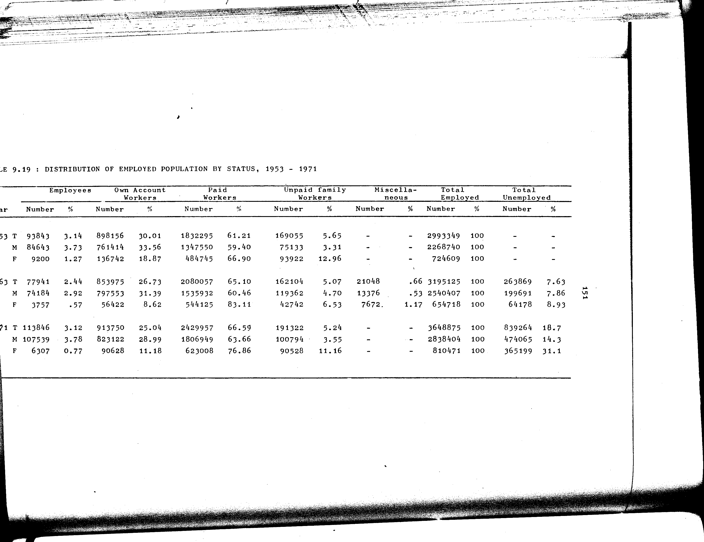

# 9.19: Distribution of employed population by status, 1953-1971


- 📜 Original Table PDF - [data/tables/table-9/table-9-19/original.pdf (66.5 kB)](../../../../data/tables/table-9/table-9-19/original.pdf)
- 📜 Original Table Image - [data/tables/table-9/table-9-19/original.images/image-01.png (136.7 kB)](../../../../data/tables/table-9/table-9-19/original.images/image-01.png)
- 📄 Extracted JSON Data - [data/tables/table-9/table-9-19/data.json (6.4 kB)](../../../../data/tables/table-9/table-9-19/data.json)

## Extracted [JSON Data](../../../../data/tables/table-9/table-9-19/data.json)

```json
{
    "found": true,
    "table_no": "9.19",
    "table_name": "Distribution of employed population by status, 1953-1971",
    "primary_keys": [
        "Year",
        "Category"
    ],
    "field_keys": [
        "Employees - Number",
        "Employees - %",
        "Own Account Workers - Number",
        "Own Account Workers - %",
        "Paid Workers - Number",
        "Paid Workers - %",
        "Unpaid Family Workers - Number",
        "Unpaid Family Workers - %",
        "Miscellaneous - Number",
        "Miscellaneous - %",
        "Total Employed - Number",
        "Total Employed - %",
        "Total Unemployed - Number",
        "Total Unemployed - %"
    ],
    "rows": [
        {
            "Year": 1953,
            "Category": "T",
            "values": {
                "Employees - Number": 93843,
                "Employees - %": 3.14,
                "Own Account Workers - Number": 898156,
                "Own Account Workers - %": 30.01,
                "Paid Workers - Number": 1832295,
                "Paid Workers - %": 61.21,
                "Unpaid Family Workers - Number": 169055,
                "Unpaid Family Workers - %": 5.65,
                "Miscellaneous - Number": null,
                "Miscellaneous - %": null,
                "Total Employed - Number": 2993349,
                "Total Employed - %": 100,
                "Total Unemployed - Number": null,
                "Total Unemployed - %": null
            }
        },
        {
            "Year": 1953,
            "Category": "M",
            "values": {
                "Employees - Number": 84643,
                "Employees - %": 3.73,
                "Own Account Workers - Number": 761414,
                "Own Account Workers - %": 33.56,
                "Paid Workers - Number": 1347550,
                "Paid Workers - %": 59.4,
                "Unpaid Family Workers - Number": 75133,
                "Unpaid Family Workers - %": 3.31,
                "Miscellaneous - Number": null,
                "Miscellaneous - %": null,
                "Total Employed - Number": 2268740,
                "Total Employed - %": 100,
                "Total Unemployed - Number": null,
                "Total Unemployed - %": null
            }
        },
        {
            "Year": 1953,
            "Category": "F",
            "values": {
                "Employees - Number": 9200,
                "Employees - %": 1.27,
                "Own Account Workers - Number": 136742,
                "Own Account Workers - %": 18.87,
                "Paid Workers - Number": 484745,
                "Paid Workers - %": 66.9,
                "Unpaid Family Workers - Number": 93922,
                "Unpaid Family Workers - %": 12.96,
                "Miscellaneous - Number": null,
                "Miscellaneous - %": null,
                "Total Employed - Number": 724609,
                "Total Employed - %": 100,
                "Total Unemployed - Number": null,
                "Total Unemployed - %": null
            }
        },
        {
            "Year": 1963,
            "Category": "T",
            "values": {
                "Employees - Number": 77941,
                "Employees - %": 2.44,
                "Own Account Workers - Number": 853975,
                "Own Account Workers - %": 26.73,
                "Paid Workers - Number": 2080057,
                "Paid Workers - %": 65.1,
                "Unpaid Family Workers - Number": 162104,
                "Unpaid Family Workers - %": 5.07,
                "Miscellaneous - Number": 21048,
                "Miscellaneous - %": 0.66,
                "Total Employed - Number": 3195125,
                "Total Employed - %": 100,
                "Total Unemployed - Number": 263869,
                "Total Unemployed - %": 7.63
            }
        },
        {
            "Year": 1963,
            "Category": "M",
            "values": {
                "Employees - Number": 74184,
                "Employees - %": 2.92,
                "Own Account Workers - Number": 797553,
                "Own Account Workers - %": 31.39,
                "Paid Workers - Number": 1535932,
                "Paid Workers - %": 60.46,
                "Unpaid Family Workers - Number": 119362,
                "Unpaid Family Workers - %": 4.7,
                "Miscellaneous - Number": 13376,
                "Miscellaneous - %": 0.53,
                "Total Employed - Number": 2540407,
                "Total Employed - %": 100,
                "Total Unemployed - Number": 199691,
                "Total Unemployed - %": 7.86
            }
        },
        {
            "Year": 1963,
            "Category": "F",
            "values": {
                "Employees - Number": 3757,
                "Employees - %": 0.57,
                "Own Account Workers - Number": 56422,
                "Own Account Workers - %": 8.62,
                "Paid Workers - Number": 544125,
                "Paid Workers - %": 83.11,
                "Unpaid Family Workers - Number": 42742,
                "Unpaid Family Workers - %": 6.53,
                "Miscellaneous - Number": 7672,
                "Miscellaneous - %": 1.17,
                "Total Employed - Number": 654718,
                "Total Employed - %": 100,
                "Total Unemployed - Number": 64178,
                "Total Unemployed - %": 8.93
            }
        },
        {
            "Year": 1971,
            "Category": "T",
            "values": {
                "Employees - Number": 113846,
                "Employees - %": 3.12,
                "Own Account Workers - Number": 913750,
                "Own Account Workers - %": 25.04,
                "Paid Workers - Number": 2429957,
                "Paid Workers - %": 66.59,
                "Unpaid Family Workers - Number": 191322,
                "Unpaid Family Workers - %": 5.24,
                "Miscellaneous - Number": null,
                "Miscellaneous - %": null,
                "Total Employed - Number": 3648875,
                "Total Employed - %": 100,
                "Total Unemployed - Number": 839264,
                "Total Unemployed - %": 18.7
            }
        },
        {
            "Year": 1971,
            "Category": "M",
            "values": {
                "Employees - Number": 107539,
                "Employees - %": 3.78,
                "Own Account Workers - Number": 823122,
                "Own Account Workers - %": 28.99,
                "Paid Workers - Number": 1806949,
                "Paid Workers - %": 63.66,
                "Unpaid Family Workers - Number": 100794,
                "Unpaid Family Workers - %": 3.55,
                "Miscellaneous - Number": null,
                "Miscellaneous - %": null,
                "Total Employed - Number": 2838404,
                "Total Employed - %": 100,
                "Total Unemployed - Number": 474065,
                "Total Unemployed - %": 14.3
            }
        },
        {
            "Year": 1971,
            "Category": "F",
            "values": {
                "Employees - Number": 6307,
                "Employees - %": 0.77,
                "Own Account Workers - Number": 90628,
                "Own Account Workers - %": 11.18,
                "Paid Workers - Number": 623008,
                "Paid Workers - %": 76.86,
                "Unpaid Family Workers - Number": 90528,
                "Unpaid Family Workers - %": 11.16,
                "Miscellaneous - Number": null,
                "Miscellaneous - %": null,
                "Total Employed - Number": 810471,
                "Total Employed - %": 100,
                "Total Unemployed - Number": 365199,
                "Total Unemployed - %": 31.1
            }
        }
    ],
    "notes": []
}
```

## Original Table [Image](../../../../data/tables/table-9/table-9-19/original.images/image-01.png)




[](https://opensource.org/licenses/MIT)
